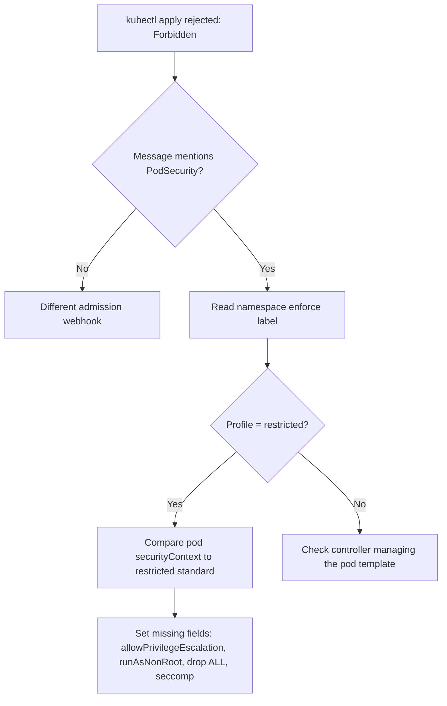

# PodSecurity Restricted Violation

> **Severity:** High · **Typical recovery time:** 5–20 min · **Affected versions:** 1.22+

## Error Message

```text
Error from server (Forbidden): error when creating "deploy.yaml": pods "web-7c9d" is forbidden:
violates PodSecurity "restricted:latest": allowPrivilegeEscalation != false (container "web" must set
securityContext.allowPrivilegeEscalation=false), unrestricted capabilities (container "web" must set
securityContext.capabilities.drop=["ALL"]), runAsNonRoot != true, seccompProfile (pod or container "web"
must set securityContext.seccompProfile.type to "RuntimeDefault" or "Localhost")
```

## Description

The built-in Pod Security Admission (PSA) controller enforces the Pod Security Standards at admission time. When a namespace is labelled with the `restricted` profile in `enforce` mode, the API server rejects any pod whose `securityContext` does not meet the hardened baseline. The message above is the most common one we see: the workload never set `allowPrivilegeEscalation=false`, so the pod is refused before it is ever scheduled.

This is an admission failure, not a runtime failure — there is no Pod object to inspect, no events, and no logs. From an SRE perspective that is actually good news: nothing fragile is running. The fix is to bring the pod spec up to the `restricted` standard, which usually means setting four fields the application probably never needed to omit in the first place.

## Affected Kubernetes Versions

- PSA graduated to **stable in 1.25** and is enabled by default. It was beta (on by default) from **1.23** and alpha in **1.22**.
- The deprecated PodSecurityPolicy (PSP) was removed in **1.25**; PSA is its replacement.
- The `:latest` suffix in the error pins enforcement to whatever Pod Security Standard ships with the running control plane, so the exact required fields can tighten across minor versions.

## Likely Root Causes

- The pod spec omits `securityContext.allowPrivilegeEscalation: false`.
- The namespace carries `pod-security.kubernetes.io/enforce: restricted` but the workloads were authored for the looser `baseline` or no profile.
- A Helm chart or operator renders a pod template without a hardened `securityContext`.
- Containers also miss `runAsNonRoot`, `capabilities.drop: ["ALL"]`, or a `seccompProfile` — the message lists every violation at once.

## Diagnostic Flow



## Verification Steps

Confirm the failure is PSA `restricted` enforcement and identify exactly which fields are missing, since the error enumerates all of them in one line.

## kubectl Commands

```bash
# Read-only: what profile is enforced on the namespace?
kubectl get namespace <namespace> -o jsonpath='{.metadata.labels}' | tr ',' '\n'

# Inspect the rendered pod template that is being rejected
kubectl get deployment <deploy> -n <namespace> -o yaml | grep -A20 securityContext

# Inspect the offending field across every container in the template
kubectl get deployment <deploy> -n <namespace> \
  -o jsonpath='{range .spec.template.spec.containers[*]}{.name}{": "}{.securityContext.allowPrivilegeEscalation}{"\n"}{end}'

# Confirm you can even create pods here
kubectl auth can-i create pods -n <namespace>

# See recent admission rejections recorded as warnings
kubectl get events -n <namespace> --sort-by=.lastTimestamp
```

## Expected Output

```text
{"kubernetes.io/metadata.name":"payments"
"pod-security.kubernetes.io/enforce":"restricted"
"pod-security.kubernetes.io/enforce-version":"latest"
"pod-security.kubernetes.io/warn":"restricted"}
```

## Common Fixes

1. Add to each container's `securityContext`: `allowPrivilegeEscalation: false`, `runAsNonRoot: true`, and `capabilities: { drop: ["ALL"] }`.
2. Add `seccompProfile: { type: RuntimeDefault }` at the pod or container level.
3. If the workload legitimately cannot meet `restricted`, relabel the namespace to `baseline` (a real security downgrade — see trade-offs below) or move it to a dedicated namespace.
4. For Helm charts, set the chart's `securityContext` / `podSecurityContext` values rather than editing rendered output.

## Recovery Procedures

1. Reproduce the full violation list with `--dry-run=server` so you fix every field in one pass.
2. Patch the pod template in source (Deployment/StatefulSet/chart values) with the four hardened fields.
3. Re-apply. The controller creates a new ReplicaSet and rolls pods normally.
4. **Disruptive — blast radius: the single workload being rolled.** A rollout replaces pods; for a singleton or stateful workload this is a brief outage. Use a PodDisruptionBudget and surge settings to stay within SLO.
5. **Security trade-off — do not weaken the namespace casually.** Relabelling `enforce: restricted` down to `baseline` removes guardrails for *every* pod in the namespace, not just yours. Prefer fixing the spec; only downgrade after a documented exception with an owner and an expiry.

## Validation

```bash
kubectl get pods -n <namespace> -l app=<app>
kubectl get deployment <deploy> -n <namespace> -o jsonpath='{.spec.template.spec.containers[*].securityContext}'
```

Pods should reach `Running` and the container `securityContext` should echo back the hardened fields.

## Prevention

- Bake the four `restricted` fields into your base manifests and chart defaults.
- Run `kubectl apply --dry-run=server` (or kubeconform/conftest) in CI against a `restricted`-labelled test namespace.
- Use `pod-security.kubernetes.io/warn` and `audit` labels in non-prod to surface violations before they reach an enforcing namespace.

## Related Errors

- [runAsNonRoot Image Runs As Root](../security/psa-runasnonroot-image-root.md)
- [Privileged Containers Not Allowed](../security/privileged-containers-not-allowed.md)
- [Dropped Capability Not Permitted](../security/dropped-capability-not-permitted.md)

## References

- [Pod Security Standards](https://kubernetes.io/docs/concepts/security/pod-security-standards/)
- [Enforce Pod Security Standards with Namespace Labels](https://kubernetes.io/docs/tasks/configure-pod-container/enforce-standards-namespace-labels/)
- [Configure a Security Context for a Pod or Container](https://kubernetes.io/docs/tasks/configure-pod-container/security-context/)

## Further Reading

- [Free Kubernetes config validators](https://devopsaitoolkit.com/validators/)
