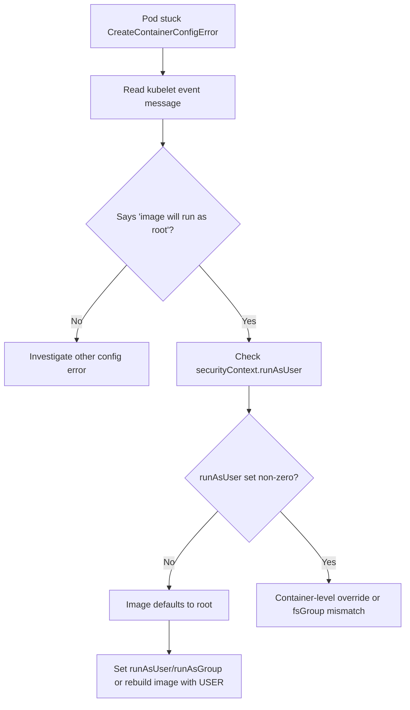

# runAsNonRoot Image Runs As Root

> **Severity:** High · **Typical recovery time:** 10–30 min · **Affected versions:** 1.20+

## Error Message

```text
Warning  Failed     12s   kubelet   Error: container has runAsNonRoot and image will run as root
Warning  Failed     12s   kubelet   Error: container has runAsNonRoot and image will run as root,
                                     pod has been created but is failing to start
```

## Description

This is a **runtime** check performed by the kubelet, not an admission rejection. The pod was accepted and scheduled, but when the kubelet prepares to start the container it inspects the image's effective user ID. Because the spec sets `securityContext.runAsNonRoot: true` and the image either declares `USER 0`/no `USER` or resolves to UID 0, the kubelet refuses to launch it. The pod sits in `CreateContainerConfigError` and never serves traffic.

In an incident this looks like a crashing pod that produces no application logs — the process never executes. The distinction that trips people up: `runAsNonRoot` only *asserts* the container must not be root; it does not *choose* a UID. If the image defaults to root and you do not also set a numeric `runAsUser`, the kubelet has nothing safe to run and blocks it. The fix is to make the image (or spec) run as an explicit non-zero UID.

## Affected Kubernetes Versions

- The `runAsNonRoot` enforcement has been present since the GA `SecurityContext` in **1.20** and earlier; behaviour is stable across current releases.
- `runAsNonRoot` is part of both the `restricted` Pod Security Standard and many admission policies, so you may hit it via PSA first (see related page) and the kubelet check second.
- Behaviour is identical across containerd and CRI-O runtimes.

## Likely Root Causes

- The container image has no `USER` directive (defaults to root) while the spec sets `runAsNonRoot: true`.
- `runAsNonRoot: true` is set but no matching `runAsUser: <non-zero>` is provided, and the image's user is root.
- The image declares `USER root` (or `USER 0`) explicitly.
- A pod-level `runAsUser` is overridden by a container-level `runAsUser: 0`.

## Diagnostic Flow



## Verification Steps

Confirm the message originates from the kubelet at container start and that the image's effective user is root, rather than a permissions error inside a running process.

## kubectl Commands

```bash
# The defining event is on the pod, from source=kubelet
kubectl describe pod <pod> -n <namespace>

# Inspect the requested security context (pod and container level)
kubectl get pod <pod> -n <namespace> -o jsonpath='{.spec.securityContext}{"\n"}{.spec.containers[*].securityContext}'

# Confirm the phase / waiting reason
kubectl get pod <pod> -n <namespace> -o jsonpath='{.status.containerStatuses[*].state}'

# Recent events ordered by time
kubectl get events -n <namespace> --field-selector involvedObject.name=<pod> --sort-by=.lastTimestamp

# Inspect the image config to see its declared USER (read-only)
kubectl get pod <pod> -n <namespace> -o jsonpath='{.spec.containers[*].image}'
```

## Expected Output

```text
Name:           api-5f6c9b7d8-h2lqz
Status:         Pending
Containers:
  api:
    State:          Waiting
      Reason:       CreateContainerConfigError
    Image:          registry.example.com/api:1.4.2
Events:
  Type     Reason   Age              From     Message
  ----     ------   ----             ----     -------
  Warning  Failed   3s (x4 over 21s) kubelet  Error: container has runAsNonRoot and image will run as root
```

## Common Fixes

1. Set an explicit non-zero UID: `securityContext.runAsUser: 1000` (and `runAsGroup`, `fsGroup` as needed) on the container or pod.
2. Rebuild the image with a `USER 1000` (non-root) directive so it is safe by default.
3. Ensure no container-level `runAsUser: 0` overrides a safe pod-level value.
4. If the image *requires* root for a one-time setup, move that work to an init container or fix the image — do not drop `runAsNonRoot`.

## Recovery Procedures

1. Identify the offending image's default user from its Dockerfile / registry metadata.
2. As an immediate mitigation, add `runAsUser: <non-zero>` and `runAsGroup` to the pod template; ensure the process and any mounted volumes are writable by that UID/GID (`fsGroup`).
3. Re-apply the manifest. The kubelet recreates the container with the new UID.
4. **Disruptive — blast radius: the rolling workload only.** Updating the pod template triggers a rollout; respect PDBs and surge settings for stateful or singleton pods.
5. **Security trade-off.** Removing `runAsNonRoot: true` "to make it start" defeats the control and lets the container run as root — avoid it. Prefer assigning a real non-root UID or fixing the image. Permanent root containers must be a documented, owned exception.

## Validation

```bash
kubectl get pod <pod> -n <namespace> -o jsonpath='{.status.phase}'
kubectl logs <pod> -n <namespace>
```

The pod should reach `Running` and the application should emit its normal startup logs as the non-root user.

## Prevention

- Author images with a non-root `USER` and publish the expected UID in your platform docs.
- Set `runAsNonRoot: true` *and* a numeric `runAsUser` in base manifests so the two never drift apart.
- Scan images in CI for a root default user and fail the build.
- Test in a `restricted`-labelled namespace before promotion.

## Related Errors

- [PodSecurity Restricted Violation](../security/psa-restricted-privilege-escalation.md)
- [Read-only Root Filesystem Write](../security/readonly-rootfs-write.md)
- [Privileged Containers Not Allowed](../security/privileged-containers-not-allowed.md)

## References

- [Configure a Security Context for a Pod or Container](https://kubernetes.io/docs/tasks/configure-pod-container/security-context/)
- [Pod Security Standards](https://kubernetes.io/docs/concepts/security/pod-security-standards/)
- [SecurityContext API reference](https://kubernetes.io/docs/reference/kubernetes-api/workload-resources/pod-v1/#security-context)

## Further Reading

- [Free Kubernetes config validators](https://devopsaitoolkit.com/validators/)
