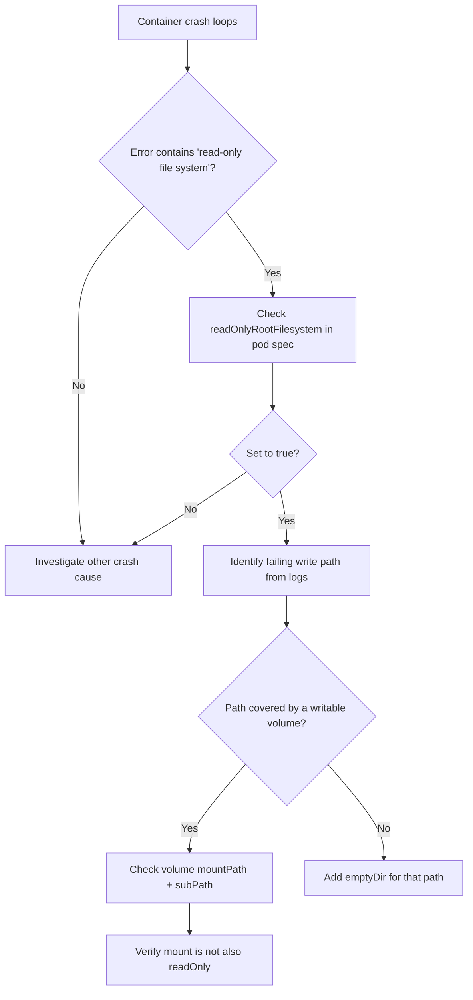

# Read-Only Root Filesystem Write

> **Severity:** High · **Typical recovery time:** 5–30 min · **Affected versions:** 1.20+

## Error Message

```text
Error: cannot create /app/cache/index.tmp: read-only file system
open /var/run/app.pid: read-only file system
```

## Description

A container started with `securityContext.readOnlyRootFilesystem: true` mounts its entire image filesystem read-only. Any process that tries to write outside of an explicitly mounted writable volume fails immediately with `EROFS` (`read-only file system`). This is a deliberate hardening control — it stops attackers from dropping binaries, tampering with config, or persisting a foothold inside the running container — but it surfaces as a crash loop the first time a legitimate application writes a temp file, PID file, log, or cache to a path it assumed was writable.

In production this almost always appears right after a security baseline is rolled out: the workload ran fine for months, then a Pod Security Standard or admission policy flipped `readOnlyRootFilesystem` on and the container began crashing. The application is not broken — its writable paths simply need to be backed by `emptyDir` or another mounted volume. The fix is to identify every write path and provide a volume, not to disable the control.

## Affected Kubernetes Versions

- All supported versions (1.20+). `readOnlyRootFilesystem` is a stable field of `SecurityContext`.
- Commonly enforced indirectly via Pod Security Admission, Gatekeeper/OPA, or Kyverno on 1.23+.

## Likely Root Causes

- `readOnlyRootFilesystem: true` set on the container with no writable volume for its scratch paths.
- Application writes temp files to `/tmp`, `/var/run`, `/var/cache`, or a working directory inside the image layer.
- Logging frameworks or PID/lock files writing to the image filesystem instead of stdout.
- A base image that expects to write to `/etc` or `/usr` at startup (config rendering, certificate stores).
- An admission policy mutated the pod spec to enforce read-only root without the team adding volumes.

## Diagnostic Flow



## Verification Steps

1. Confirm the container is crashing on a write, not a missing dependency.
2. Read the application logs and capture the exact failing path.
3. Inspect the container `securityContext` for `readOnlyRootFilesystem: true`.
4. List existing `volumeMounts` and check whether the failing path is already covered.
5. Confirm any covering volume is not itself mounted with `readOnly: true`.

## kubectl Commands

```bash
# Identify the crashing pod and restart reason
kubectl get pods -n prod -l app=checkout
kubectl describe pod -n prod checkout-7c9f8-abcde

# Read the exact write failure
kubectl logs -n prod checkout-7c9f8-abcde --previous

# Inspect the security context and volume mounts
kubectl get pod -n prod checkout-7c9f8-abcde -o jsonpath='{.spec.containers[*].securityContext}'
kubectl get pod -n prod checkout-7c9f8-abcde -o jsonpath='{.spec.containers[*].volumeMounts}'

# Check enforcing admission policy / namespace labels
kubectl get ns prod -o jsonpath='{.metadata.labels}'
kubectl get events -n prod --field-selector reason=FailedCreate
```

## Expected Output

```text
NAME                   READY   STATUS             RESTARTS   AGE
checkout-7c9f8-abcde   0/1     CrashLoopBackOff   6          5m

# logs --previous
panic: open /var/run/checkout.pid: read-only file system

# securityContext jsonpath
{"readOnlyRootFilesystem":true,"allowPrivilegeEscalation":false}
```

## Common Fixes

1. Add an `emptyDir` volume and mount it at the exact failing path (e.g. `/tmp`, `/var/run`).
2. For multiple scratch paths, add one `emptyDir` per path or use `subPath` mounts from a single volume.
3. Reconfigure the application to log to stdout/stderr instead of files.
4. Point the app's temp/cache directory to a writable mount via an env var (e.g. `TMPDIR`).
5. If the image renders config at startup, write it to a writable mount and reference it from there.

## Recovery Procedures

1. Capture the failing path from `--previous` logs before the pod is recycled again.
2. Add an `emptyDir` (use `medium: Memory` for small, sensitive scratch data) mounted at that path in the Deployment spec.
3. **Disruptive — blast radius: all pods of this Deployment.** Rolling out the spec change triggers a rollout; pods restart in waves. Confirm `maxUnavailable` is low and PodDisruptionBudgets are in place.
4. As a last resort to restore service while you map all write paths, you may temporarily set `readOnlyRootFilesystem: false`. **Trade-off:** this removes a hardening control and re-opens the container filesystem to tampering — track it as a regression and revert within the same change window, not "later".
5. Once volumes cover every path, re-enable `readOnlyRootFilesystem: true` and verify a clean start.

## Validation

- Pod reaches `Running` and stays `Ready` across at least one full restart cycle.
- `securityContext.readOnlyRootFilesystem` is still `true` after the fix.
- Application writes succeed only to mounted volumes; the image layer remains immutable.

## Prevention

- Bake `readOnlyRootFilesystem: true` into the base manifest from day one so write paths are discovered in dev.
- Standardize an `emptyDir` for `/tmp` across templates.
- Enforce the control with Pod Security Admission (restricted) or a Kyverno/Gatekeeper policy.
- Prefer stdout logging in all images to avoid file-based log writes.

## Related Errors

- [Privilege escalation blocked under restricted PSA](../security/psa-restricted-privilege-escalation.md)
- [Dropped Capability Not Permitted](../security/dropped-capability-not-permitted.md)
- [Privileged Containers Not Allowed](../security/privileged-containers-not-allowed.md)

## References

- [Configure a Security Context for a Pod or Container](https://kubernetes.io/docs/tasks/configure-pod-container/security-context/)
- [Pod Security Standards](https://kubernetes.io/docs/concepts/security/pod-security-standards/)
- [emptyDir volumes](https://kubernetes.io/docs/concepts/storage/volumes/#emptydir)

## Further Reading

- [DevOps AI ToolKit — Kubernetes guides](https://devopsaitoolkit.com/blog/)
