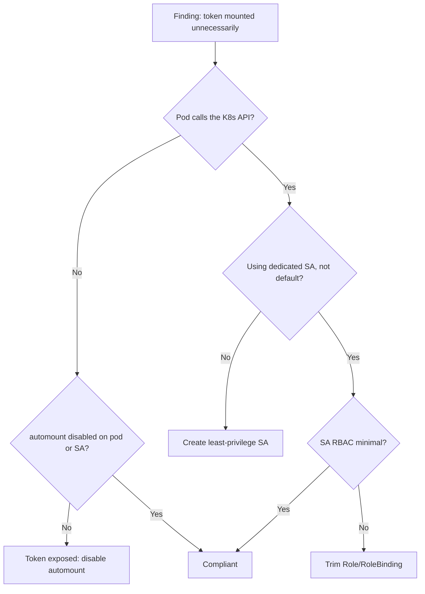

# ServiceAccount Token Automount Exposure

> **Severity:** High · **Typical recovery time:** 5–30 min · **Affected versions:** 1.20+

## Error Message

```text
default SA token mounted unnecessarily
```

## Description

By default, Kubernetes mounts a ServiceAccount token into every pod at `/var/run/secrets/kubernetes.io/serviceaccount/token`. For workloads that never call the Kubernetes API — most application pods — this token is dead weight that quietly expands your attack surface. If an attacker achieves remote code execution inside such a container, the mounted token becomes an immediate pivot point into the API server, scoped to whatever RBAC the pod's ServiceAccount carries. Mounting the *default* ServiceAccount token is especially risky because operators often forget the default SA exists and may inadvertently grant it broad roles.

This finding is typically raised by admission policies, CIS benchmark scanners, or security reviews rather than by a hard runtime failure — nothing crashes, which is precisely why it persists. Since Kubernetes 1.22 the `BoundServiceAccountTokenVolume` feature is GA, so tokens are now short-lived, audience-bound projected tokens rather than long-lived Secret tokens. That is a meaningful improvement, but a mounted bound token is still a usable credential. The correct posture is to mount a token only into pods that genuinely talk to the API, and to disable automount everywhere else.

## Affected Kubernetes Versions

- **1.20–1.21** — legacy non-expiring Secret-based tokens automounted by default; highest exposure.
- **1.22+** — `BoundServiceAccountTokenVolume` GA; projected, time-bound, audience-scoped tokens, but still automounted unless disabled.
- **1.24+** — auto-generated Secret tokens for ServiceAccounts no longer created automatically, reducing stale long-lived tokens.

## Likely Root Causes

- `automountServiceAccountToken` left at its default (`true`) on pods that never use the API.
- Pods running under the namespace `default` ServiceAccount, which then accumulates RBAC grants.
- ServiceAccount object does not set `automountServiceAccountToken: false`.
- RoleBindings or ClusterRoleBindings granting privileges to the `default` SA.
- Copy-pasted manifests that omit any ServiceAccount hardening.

## Diagnostic Flow



## Verification Steps

1. Confirm whether the workload actually needs API access (controllers, operators, sidecars that watch resources do; static web apps do not).
2. Check the pod spec and the ServiceAccount object for `automountServiceAccountToken`.
3. Inspect whether the pod uses `default` or a dedicated ServiceAccount.
4. Enumerate the RBAC attached to that ServiceAccount.
5. Confirm the projected token volume is actually present in the running pod.

## kubectl Commands

```bash
# Which ServiceAccount does the pod use, and is a token volume mounted?
kubectl get pod <pod> -n <ns> -o jsonpath='{.spec.serviceAccountName}{"\n"}'
kubectl get pod <pod> -n <ns> -o jsonpath='{.spec.automountServiceAccountToken}{"\n"}'
kubectl describe pod <pod> -n <ns>

# Inspect the ServiceAccount object
kubectl get serviceaccount default -n <ns> -o yaml
kubectl get sa -A

# What can the default SA actually do? (read-only RBAC probe)
kubectl auth can-i --list --as=system:serviceaccount:<ns>:default -n <ns>
kubectl auth can-i create pods --as=system:serviceaccount:<ns>:default -n <ns>

# Find bindings that reference the default SA
kubectl get rolebindings,clusterrolebindings -A -o wide | grep -i default

# Confirm the mounted projected token volume
kubectl get pod <pod> -n <ns> -o jsonpath='{.spec.volumes[*].projected.sources[*].serviceAccountToken}{"\n"}'
```

## Expected Output

```text
$ kubectl get pod web-7d9c -n shop -o jsonpath='{.spec.serviceAccountName}'
default
$ kubectl get pod web-7d9c -n shop -o jsonpath='{.spec.automountServiceAccountToken}'

$ kubectl auth can-i --list --as=system:serviceaccount:shop:default -n shop
Resources   Non-Resource URLs   Resource Names   Verbs
secrets     []                  []               [get list]
pods        []                  []               [get list watch]
```

The empty `automountServiceAccountToken` value means the default (`true`) applies, and the SA can list secrets — an unnecessary, exploitable grant for a static web app.

## Common Fixes

1. Set `automountServiceAccountToken: false` in the pod spec for workloads that do not call the API.
2. Set `automountServiceAccountToken: false` on the ServiceAccount object to make opt-out the namespace default.
3. Stop using the `default` ServiceAccount — create a dedicated SA per workload.
4. Remove RoleBindings/ClusterRoleBindings that grant privileges to the `default` SA.
5. For pods that do need a token, scope its audience and expiry with a projected `serviceAccountToken` volume.

## Recovery Procedures

1. **Triage (non-disruptive):** Use `kubectl auth can-i --list` to determine the blast radius of the exposed token — what an attacker holding it could do.
2. **Disable automount at the SA level (non-disruptive for app pods):** Set `automountServiceAccountToken: false` on the ServiceAccount; existing pods keep their token until recreated.
3. **Roll workloads to drop the token. Disruptive — blast radius: each rolled Deployment briefly cycles pods; use surge rollouts to avoid downtime.** New pods come up without the mounted token.
4. **Trim RBAC on the default SA. Disruptive — blast radius: any pod silently relying on the default SA's permissions will start getting 403s.** Remove bindings only after confirming via `auth can-i` that nothing legitimate depends on them — do not blanket-revoke without checking, as that can break controllers.
5. **If a token was exposed in an incident, rotate it. Disruptive — blast radius: invalidates active sessions for that SA.** Delete the associated token Secret (1.20–1.23) or rely on short bound-token expiry (1.22+) so the leaked credential ages out.

## Validation

- `kubectl get pod <pod> -o jsonpath='{.spec.volumes}'` shows no `serviceAccountToken` projection for hardened pods.
- `kubectl auth can-i --list --as=system:serviceaccount:<ns>:default` returns only the minimal expected verbs.
- Re-run your CIS/admission scan; the automount finding clears.

## Prevention

- Default `automountServiceAccountToken: false` on every ServiceAccount, opting in only where needed.
- One dedicated ServiceAccount per workload; never bind roles to `default`.
- Enforce with Pod Security Admission plus a policy engine (Kyverno/Gatekeeper) that rejects pods using the default SA.
- Audit RBAC regularly and prefer Roles over ClusterRoles.

## Related Errors

- [Secret Double Base64 Encoding](../security/secret-double-base64.md)
- [Restricted PSA Privilege Escalation](../security/psa-restricted-privilege-escalation.md)
- [Default-Deny NetworkPolicy Lockout](../security/networkpolicy-default-deny-lockout.md)

## References

- [Configure Service Accounts for Pods](https://kubernetes.io/docs/tasks/configure-pod-container/configure-service-account/)
- [Managing Service Accounts](https://kubernetes.io/docs/reference/access-authn-authz/service-accounts-admin/)
- [Bound Service Account Token Volume](https://kubernetes.io/docs/reference/access-authn-authz/service-accounts-admin/#bound-service-account-token-volume)

## Further Reading

- [DevOps AI ToolKit — Kubernetes guides](https://devopsaitoolkit.com/blog/)
