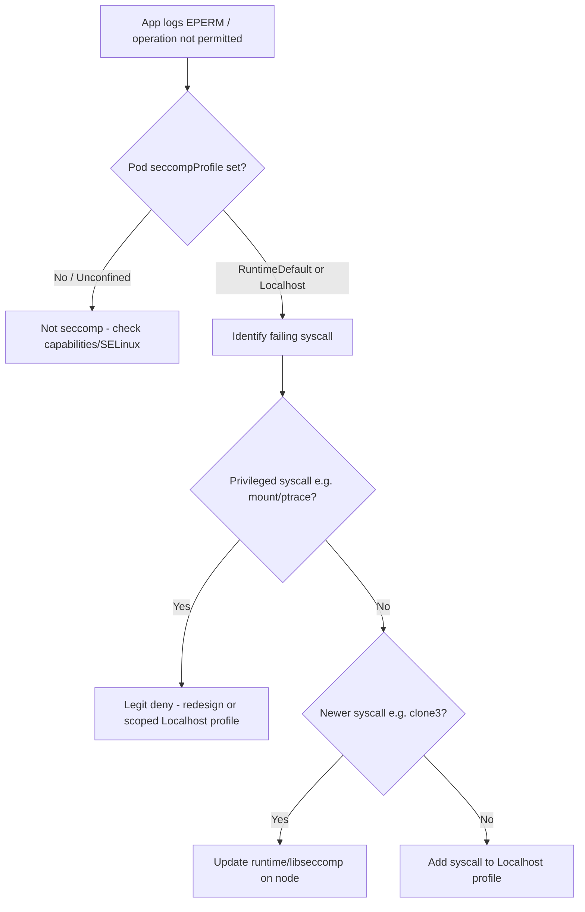

# Seccomp Blocked Syscall

> **Severity:** Medium · **Typical recovery time:** 15–45 min · **Affected versions:** 1.19+

## Error Message

```text
runtime error: operation not permitted (seccomp filtered syscall)
clone3: Operation not permitted (os error 1)
EPERM: operation not permitted, syscall 'mount'
```

## Description

Seccomp (secure computing mode) restricts the set of Linux syscalls a container may make. When a pod uses `seccompProfile.type: RuntimeDefault` (the containerd/CRI-O default profile) or a custom `Localhost` profile, any syscall outside the allow-list is blocked by the kernel and the process receives `EPERM` — "operation not permitted". The application, not Kubernetes, surfaces the error, so it shows up in container logs rather than pod events.

From an SRE standpoint this is subtle: the container starts fine and most code works, then a specific operation fails. Classic offenders are newer glibc/runtime syscalls (`clone3`, `faccessat2`, `statx`), or genuinely privileged operations like `mount`, `ptrace`, `bpf`, and `unshare`. The runtime default profile deliberately blocks the dangerous ones. The right fix is almost never "turn seccomp off" — it is to update the runtime, or add the minimum syscalls via a tailored `Localhost` profile.

## Affected Kubernetes Versions

- Seccomp support is GA since **1.19**; the `securityContext.seccompProfile` field replaced the older `seccomp.security.alpha.kubernetes.io` annotations.
- `RuntimeDefault` becoming the cluster default can be enabled via the kubelet `SeccompDefault` feature gate, **GA in 1.27**. Before that, pods ran `Unconfined` unless they opted in.
- The exact `RuntimeDefault` allow-list is defined by the container runtime (containerd/CRI-O), so behaviour can differ slightly by node image.

## Likely Root Causes

- An old `RuntimeDefault` profile (or old libseccomp on the node) blocks newer syscalls like `clone3` used by recent glibc.
- The workload performs a privileged syscall (`mount`, `ptrace`, `bpf`, `unshare`, `keyctl`) that the default profile denies.
- A custom `Localhost` profile is too restrictive or missing required syscalls.
- The cluster enabled `SeccompDefault` and a workload that previously ran `Unconfined` now inherits `RuntimeDefault`.

## Diagnostic Flow



## Verification Steps

Confirm the `EPERM` is seccomp (not a missing capability or SELinux/AppArmor denial) and identify the exact syscall being filtered, because the remedy depends entirely on which syscall and why.

## kubectl Commands

```bash
# Which seccomp profile is applied to the pod/containers?
kubectl get pod <pod> -n <namespace> -o jsonpath='{.spec.securityContext.seccompProfile}{"\n"}{.spec.containers[*].securityContext.seccompProfile}'

# Read the application logs showing the EPERM and ideally the syscall name
kubectl logs <pod> -n <namespace>
kubectl logs <pod> -n <namespace> --previous

# Node the pod runs on, to correlate with runtime/libseccomp version
kubectl get pod <pod> -n <namespace> -o wide

# Runtime and kernel version of that node (read-only)
kubectl get node <node> -o jsonpath='{.status.nodeInfo.containerRuntimeVersion}{"\n"}{.status.nodeInfo.kernelVersion}'

# Events, in case the kubelet flagged a Localhost profile that does not exist
kubectl get events -n <namespace> --field-selector involvedObject.name=<pod> --sort-by=.lastTimestamp
```

## Expected Output

```text
{"type":"RuntimeDefault"}
{"type":"RuntimeDefault"}

# from kubectl logs:
thread 'main' panicked at 'failed to spawn worker: Operation not permitted (os error 1)'
  caused by: clone3 syscall returned EPERM
```

## Common Fixes

1. Update the container runtime and `libseccomp` on the affected nodes so the `RuntimeDefault` profile permits modern syscalls like `clone3`.
2. Upgrade or rebuild the application against a glibc/runtime that falls back to permitted syscalls.
3. For a genuinely required syscall, ship a minimal `Localhost` seccomp profile that adds *only* that syscall to the default allow-list, and reference it via `seccompProfile.type: Localhost`.
4. As an absolute last resort and only with sign-off, scope `Unconfined` to the single container — never the whole pod by habit.

## Recovery Procedures

1. Pin down the failing syscall from logs or by reproducing under a tracing tool in a non-prod copy.
2. If it is a runtime/libseccomp version gap, patch the node images and roll nodes through your standard node-upgrade process.
3. **Disruptive — blast radius: every pod on each node being drained/replaced.** Node rollouts evict workloads cluster-wide; do it zone by zone, honour PDBs, and watch capacity.
4. If a custom profile is needed, deploy the `Localhost` JSON profile to `/var/lib/kubelet/seccomp/profiles` (via your node config tooling) and reference it from the pod spec, then roll the workload.
5. **Security trade-off.** Setting `seccompProfile.type: Unconfined` removes syscall filtering for that container and widens the kernel attack surface — only acceptable as a temporary, documented exception with an owner and expiry. Prefer the narrowest `Localhost` profile that unblocks the workload.

## Validation

```bash
kubectl get pod <pod> -n <namespace> -o jsonpath='{.status.phase}'
kubectl logs <pod> -n <namespace> --since=2m
```

The previously failing operation should now succeed and the `EPERM` lines should stop appearing in fresh logs.

## Prevention

- Keep node runtime and `libseccomp` current so `RuntimeDefault` tracks new syscalls.
- Test workloads under `RuntimeDefault` in staging before enabling `SeccompDefault` fleet-wide.
- Maintain custom `Localhost` profiles in version control and lint them.
- Add syscall-coverage checks to CI for workloads with unusual runtime requirements.

## Related Errors

- [AppArmor Denied Operation](../security/apparmor-denied-operation.md)
- [Dropped Capability Not Permitted](../security/dropped-capability-not-permitted.md)
- [PodSecurity Restricted Violation](../security/psa-restricted-privilege-escalation.md)

## References

- [Restrict a Container's Syscalls with seccomp](https://kubernetes.io/docs/tutorials/security/seccomp/)
- [Seccomp in Pod Security Standards](https://kubernetes.io/docs/concepts/security/pod-security-standards/)
- [Configure a Security Context for a Pod or Container](https://kubernetes.io/docs/tasks/configure-pod-container/security-context/)

## Further Reading

- [Free Kubernetes config validators](https://devopsaitoolkit.com/validators/)
