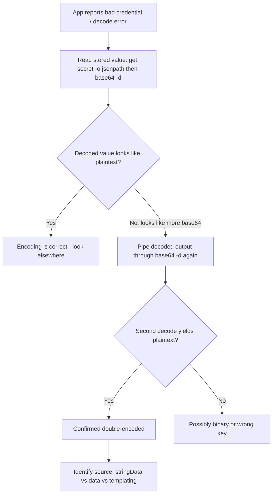

# Secret Double Base64 Encoded

> **Severity:** High · **Typical recovery time:** 5–30 min · **Affected versions:** 1.20+

## Error Message

```text
secret value decodes incorrectly (double-encoded)
Error: invalid character looking for beginning of value
panic: failed to load credentials: illegal base64 data at input byte 0
```

## Description

A Kubernetes `Secret` stores values base64-encoded at rest in etcd, but the encoding is an implementation detail — not a security control. The most common operational footgun is *double-encoding*: a user runs `echo -n 'hunter2' | base64` to get `aHVudGVyMg==`, then pastes that already-encoded string into the `data:` field of a manifest. Kubernetes treats `data:` values as base64, decodes them once to `hunter2`, and stores them. That works. The break happens when the value is pre-encoded *and* placed under a field that encodes again — for example using `kubectl create secret --from-literal` with an already-encoded value, or putting the encoded string under `stringData:` (which base64-encodes on top of it). The application then reads the secret, gets `aHVudGVyMg==` instead of `hunter2`, and authentication, TLS handshakes, or database connections fail with cryptic decode errors.

From an SRE perspective this is high severity because it silently corrupts credentials without any admission rejection — the Secret is structurally valid, so the failure only surfaces at runtime in the consuming workload. Diagnosis is purely read-only: you decode the stored value and inspect whether it is still itself valid base64.

## Affected Kubernetes Versions

- All actively supported versions (1.20 through 1.31+) — this is a usage pattern, not a version-specific bug.
- `stringData` behavior (auto base64-encoding on write) has been stable since 1.13; the double-encode hazard exists wherever `stringData` and `data` are confused.

## Likely Root Causes

- Value pre-encoded with `base64` then placed under `stringData:` (which encodes again).
- Already-encoded literal passed to `kubectl create secret generic --from-literal=key=aHVudGVyMg==`.
- A templating layer (Helm `b64enc`, Kustomize generators) applied to a value that was already encoded.
- Copy-pasting `kubectl get secret -o yaml` output (already encoded `data:`) into a new manifest's `stringData:` block.
- CI pipeline that base64-encodes secrets before handing them to a tool that also encodes.

## Diagnostic Flow



## Verification Steps

1. Confirm which key in the Secret the workload consumes (env var, mounted file, or `valueFrom`).
2. Read the stored value and decode it exactly once.
3. Inspect the once-decoded result — if it still matches a base64 alphabet pattern (`^[A-Za-z0-9+/]+=*$`) and decodes again to readable plaintext, it is double-encoded.
4. Cross-check against the source of truth (vault, password manager) to confirm the expected plaintext.

## kubectl Commands

```bash
# List secrets and confirm the type and keys
kubectl get secret app-db-credentials -n prod -o yaml

# Decode the stored value exactly once (read-only)
kubectl get secret app-db-credentials -n prod \
  -o jsonpath='{.data.password}' | base64 -d; echo

# If output still looks like base64, decode a second time to confirm double-encoding
kubectl get secret app-db-credentials -n prod \
  -o jsonpath='{.data.password}' | base64 -d | base64 -d; echo

# Inspect how the consuming pod references the secret
kubectl describe pod -l app=api -n prod

# Check recent events for credential failures
kubectl get events -n prod --field-selector involvedObject.kind=Pod --sort-by=.lastTimestamp

# Look at the application logs for the decode/auth error
kubectl logs deploy/api -n prod --tail=50
```

## Expected Output

```text
$ kubectl get secret app-db-credentials -n prod -o jsonpath='{.data.password}' | base64 -d; echo
aHVudGVyMg==

$ kubectl get secret app-db-credentials -n prod -o jsonpath='{.data.password}' | base64 -d | base64 -d; echo
hunter2
```

The first decode returns another base64 string (`aHVudGVyMg==`) instead of plaintext — the smoking gun. The second decode reveals the real value, confirming the secret was encoded twice.

## Common Fixes

1. **Use `stringData` with the raw plaintext value** — let Kubernetes do the single encode. Never pre-encode for `stringData`.
2. **Use `data` only with values you encoded exactly once** (`echo -n 'plaintext' | base64`).
3. **For `--from-literal`, pass plaintext** — `kubectl create secret generic ... --from-literal=password=hunter2`. Kubernetes encodes it for you.
4. **In Helm, drop the extra `b64enc`** when feeding a value into `data:` that is already encoded, or switch the template to `stringData:` with the raw value.
5. **Audit Kustomize `secretGenerator`** — it expects literal/file plaintext and encodes once.

## Recovery Procedures

1. Capture the correct plaintext from your source of truth (vault/password manager) before touching anything.
2. **Disruptive — blast radius: all pods consuming this Secret.** Recreate or update the Secret with the corrected value (via `stringData` raw plaintext). Pods that already mounted the bad value will not pick up env-var changes until restarted; mounted volume secrets refresh after the kubelet sync period (~1 min) but the app may have cached the bad value.
3. **Disruptive — blast radius: the affected Deployment's replicas.** Trigger a rolling restart of the consuming workloads so they re-read the corrected credential. Stagger the rollout to preserve availability.
4. If the corrupted credential caused a downstream lockout (e.g., too many failed DB logins), coordinate with the database team to clear lockouts — do not work around it by disabling authentication.
5. Verify the upstream credential was never actually wrong (rule out rotation) before assuming encoding is the only issue.

## Validation

- Re-run the single-decode command — it should now return readable plaintext directly, and a second decode should fail or produce garbage.
- Confirm the consuming pod started cleanly and its logs show successful authentication.
- Diff the decoded value byte-for-byte against the source of truth.

## Prevention

- Standardize on `stringData:` with raw plaintext in manifests; reserve `data:` for tooling output.
- Add a CI check that decodes each `data:` value once and flags results matching a base64 regex.
- Avoid hand-editing secrets; generate them from a secrets manager (External Secrets Operator, Vault).
- Document a single canonical encoding command for your team and forbid double pipelines.

## Related Errors

- [TLS Secret Wrong Type](../security/tls-secret-wrong-type.md)
- [ServiceAccount Token Automount Exposure](../security/sa-token-automount-exposure.md)

## References

- [Kubernetes Secrets](https://kubernetes.io/docs/concepts/configuration/secret/)
- [Managing Secrets using kubectl](https://kubernetes.io/docs/tasks/configmap-secret/managing-secret-using-kubectl/)
- [Distribute Credentials Securely Using Secrets](https://kubernetes.io/docs/tasks/inject-data-application/distribute-credentials-secure/)

## Further Reading

- [DevOps AI ToolKit — Kubernetes guides](https://devopsaitoolkit.com/blog/)
