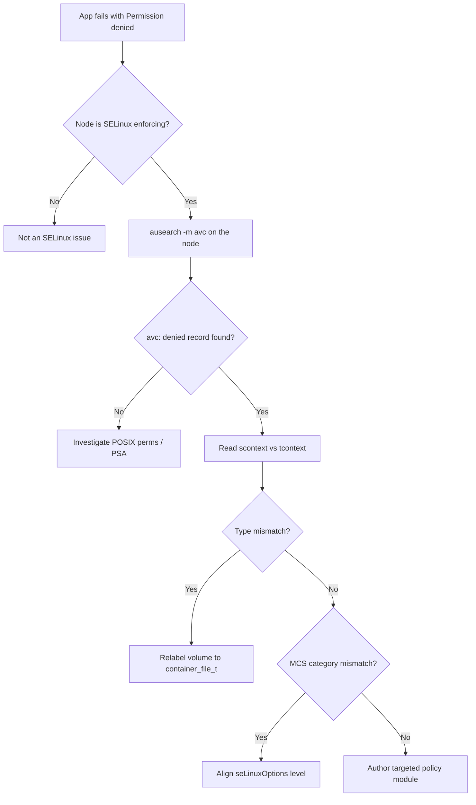

# SELinux AVC Denied

> **Severity:** High · **Typical recovery time:** 15–45 min · **Affected versions:** 1.20+

## Error Message

```text
type=AVC msg=audit(1718900000.123:456): avc:  denied  { write } for  pid=4821 comm="app"
  name="data" dev="dm-0" ino=131072 scontext=system_u:system_r:container_t:s0:c123,c456
  tcontext=unconfined_u:object_r:default_t:s0 tclass=dir permissive=0
avc: denied { ... } (SELinux)
```

## Description

SELinux is a node-level Mandatory Access Control (MAC) system enforced by the Linux kernel, not by Kubernetes. When a container process (labeled `container_t` by the container runtime) touches a resource whose SELinux type it is not permitted to use, the kernel blocks the syscall and writes an `avc: denied` record to the node's audit log. The application typically sees a generic `Permission denied` (EACCES) — the real reason only appears in `ausearch`/`journalctl` on the node, which is why these failures are easy to misdiagnose as ordinary filesystem permission problems.

In a Kubernetes context the most common trigger is a `hostPath` or improperly relabeled volume: the container is confined to `container_t` with a unique MCS category pair (e.g. `s0:c123,c456`), but the target directory carries a host label like `default_t` or `var_lib_t` that `container_t` may not write. The correct response is to give the volume a container-appropriate label via `securityContext.seLinuxOptions` or the runtime's `:Z`/`:z` relabeling — **not** to set SELinux permissive or disable it, which removes the protection for the entire node.

## Affected Kubernetes Versions

- **All versions on SELinux-enforcing nodes** (RHEL, CentOS Stream, Fedora, Rocky, Alma, Bottlerocket).
- **1.25+** — `SELinuxMountReadWriteOncePod` improves relabeling performance for RWOP volumes.
- **1.27+ / 1.31+** — broader `SELinuxMount` feature work changes how volumes are relabeled at mount time; behavior differs across these gates.
- Not applicable on nodes where SELinux is `Disabled` or `Permissive`.

## Likely Root Causes

- A `hostPath`/local volume directory has a non-container SELinux type (`default_t`, `var_lib_t`, `home_root_t`).
- Volume mounted without `:Z` (private) or `:z` (shared) relabeling by the runtime.
- MCS category mismatch between the pod's assigned labels and the file context.
- A custom `seLinuxOptions` in the spec that does not match the on-disk labels.
- Node base image policy lacks an allow rule for a legitimate access pattern.

## Diagnostic Flow



## Verification Steps

1. Confirm the node is in `enforcing` mode (the denial only happens if so).
2. Locate the AVC record and read the source (`scontext`) and target (`tcontext`) labels.
3. Map `tclass`/permission (e.g. `{ write } dir`) to the failing operation.
4. Inspect the volume's on-disk SELinux context.
5. Compare with the pod's `securityContext.seLinuxOptions`.

## kubectl Commands

```bash
# Identify the pod, node, and volumes involved
kubectl get pod app -n prod -o wide
kubectl describe pod app -n prod
kubectl get pod app -n prod -o jsonpath='{.spec.securityContext.seLinuxOptions}'

# Application-side symptom (EACCES) shows in container logs
kubectl logs app -n prod --previous

# Cluster events around the failure
kubectl get events -n prod --sort-by=.lastTimestamp

# Confirm read access to investigate
kubectl auth can-i get pods -n prod
```

```bash
# NODE-level (run on the node via your existing node-access path) — read-only:
# ausearch -m avc -ts recent
# journalctl -t setroubleshoot -t kernel | grep -i 'avc: *denied'
# ls -Z /path/to/volume
```

## Expected Output

```text
time->Mon Jun 24 14:13:20 2026
type=AVC msg=audit(...): avc: denied { write } for pid=4821 comm="app"
  name="data" scontext=system_u:system_r:container_t:s0:c123,c456
  tcontext=unconfined_u:object_r:default_t:s0 tclass=dir permissive=0

$ ls -Z /srv/data
unconfined_u:object_r:default_t:s0   data
```

## Common Fixes

1. **Relabel the host directory** to a container type, e.g. `container_file_t`, so `container_t` may access it.
2. **Let the runtime relabel** by mounting with `:Z` (private) or `:z` (shared) where supported.
3. **Set `seLinuxOptions`** in the pod's `securityContext` to a type/level that matches the data.
4. **Author a targeted policy module** from the audit record for legitimate, recurring access.
5. For RWOP PVCs, ensure the CSI driver performs mount-time relabeling (avoids slow recursive chcon).

## Recovery Procedures

1. From the AVC record, decide whether the access is legitimate; if it is an attack signal, contain the pod instead of allowing it.
2. Relabel the target path to the correct container context, or apply the matching `seLinuxOptions` and re-deploy the workload. **Disruptive — blast radius: single workload.** Recursive relabeling of a large volume can take minutes and the pod restarts.
3. If a node-wide policy module is required, build and install it from the audit log. **Disruptive — blast radius: node / all pods on it.** Stage on one node first; a bad module can block unrelated workloads.
4. **Never** run `setenforce 0` or set `SELINUX=permissive` as a "fix" beyond a brief, logged diagnostic window. **Disruptive — blast radius: entire node.** The trade-off: permissive mode removes MAC enforcement for every container on the node, so use it only to confirm SELinux is the cause, then revert and fix with labels/policy.
5. Re-test under enforcing mode before closing the incident.

## Validation

- `ausearch -m avc -ts recent` shows no new denials after the fix.
- `ls -Z` on the volume reports a `container_file_t` (or matching) type.
- The application reads/writes the path without EACCES.
- Node remains in `enforcing` mode (`getenforce`).

## Prevention

- Keep node images SELinux `enforcing`; treat permissive as a temporary diagnostic state only.
- Prefer CSI/PVC volumes that relabel at mount time over raw `hostPath`.
- Standardize `seLinuxOptions` in workload templates that touch host-backed storage.
- Ship vetted custom policy modules through your node image pipeline, version-controlled.

## Related Errors

- [AppArmor Denied Operation](../security/apparmor-denied-operation.md)
- [Read-only Root Filesystem Write Failure](../security/readonly-rootfs-write.md)
- [hostPath Volumes Not Allowed](../security/hostpath-not-allowed.md)

## References

- [Configure a Security Context — SELinux](https://kubernetes.io/docs/tasks/configure-pod-container/security-context/)
- [Volumes — mountOptions and SELinux relabeling](https://kubernetes.io/docs/concepts/storage/volumes/)
- [Pod Security Standards](https://kubernetes.io/docs/concepts/security/pod-security-standards/)

## Further Reading

- [DevOps AI ToolKit — Kubernetes guides](https://devopsaitoolkit.com/blog/)
