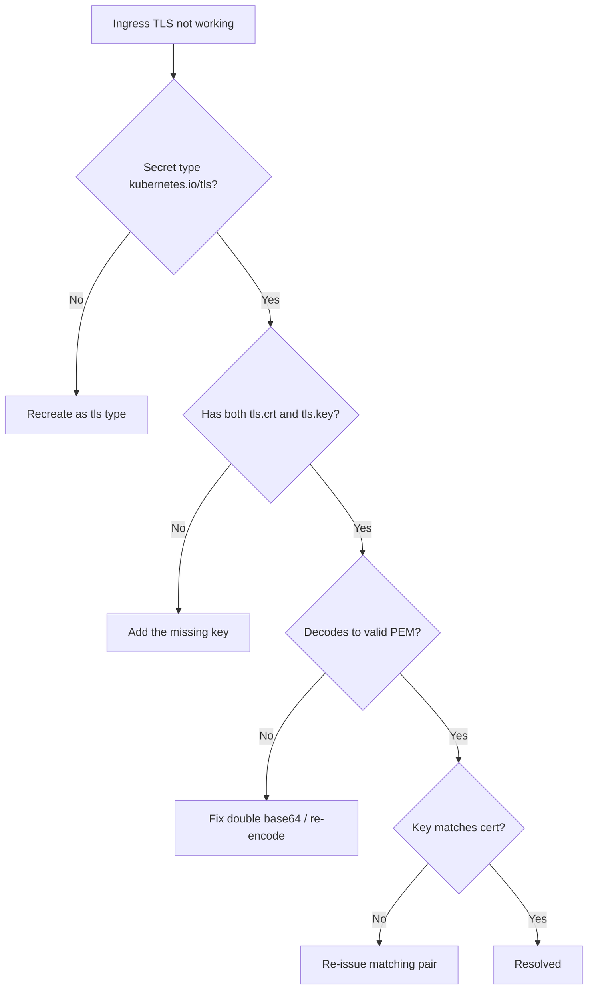

# TLS Secret Wrong Type

> **Severity:** Medium · **Typical recovery time:** 5–30 min · **Affected versions:** 1.20+

## Error Message

```text
type kubernetes.io/tls requires tls.crt and tls.key
```

## Description

A Secret of type `kubernetes.io/tls` is a contract: Kubernetes validates that it contains exactly the keys `tls.crt` and `tls.key`. When you try to create or update such a Secret without both keys — or store the certificate under a different name like `cert.pem` and `key.pem` — the API server rejects it outright with `type kubernetes.io/tls requires tls.crt and tls.key`. A subtler variant produces no API error at all: the Secret is created as type `Opaque` with the right data keys, so it stores fine, but Ingress controllers that expect `kubernetes.io/tls` skip it, fall back to a default/self-signed certificate, and your HTTPS endpoint serves the wrong cert or fails the handshake.

In production this surfaces as failed Ingress provisioning, browsers warning about an invalid certificate, or the controller logging that it cannot find a usable TLS secret. The root cause is almost always a mismatch between how the Secret was created and what consumers require — wrong `type`, wrong key names, or PEM data that was double base64-encoded before being placed in `data`. The fix is mechanical once you see which of those three it is.

## Affected Kubernetes Versions

- **1.20+** — `kubernetes.io/tls` validation requiring `tls.crt` and `tls.key` is stable and consistent across all current releases.
- Behavior is identical across managed and self-managed clusters; Ingress controller specifics (NGINX, Traefik, cloud) determine the consumer-side symptom.

## Likely Root Causes

- Secret created as `Opaque` instead of `kubernetes.io/tls`.
- Certificate/key stored under wrong keys (e.g. `cert.pem`/`key.pem` instead of `tls.crt`/`tls.key`).
- Only one of the two required keys present.
- PEM contents double base64-encoded before being placed in `data` (encode once for `data`, or use `stringData`).
- `tls.crt` missing the full chain, or `tls.key` not matching the certificate.

## Diagnostic Flow



## Verification Steps

1. Confirm the Secret's `type` field is `kubernetes.io/tls`.
2. Confirm both `tls.crt` and `tls.key` keys exist.
3. Decode `tls.crt` and verify it is valid PEM (begins with `-----BEGIN CERTIFICATE-----`).
4. Confirm the certificate and private key are a matching pair.
5. Check that the Ingress references the correct Secret name and that the controller accepted it.

## kubectl Commands

```bash
# Confirm the Secret type and the data keys present
kubectl get secret <name> -n <ns> -o jsonpath='{.type}{"\n"}'
kubectl get secret <name> -n <ns> -o jsonpath='{.data}{"\n"}'
kubectl describe secret <name> -n <ns>

# Inspect the full object (data is base64-encoded)
kubectl get secret <name> -n <ns> -o yaml

# Decode and sanity-check the certificate is real PEM (read-only)
kubectl get secret <name> -n <ns> -o jsonpath='{.data.tls\.crt}' | base64 -d | head -2

# Which Ingress references this Secret, and did the controller accept it?
kubectl get ingress -n <ns> -o yaml
kubectl describe ingress <name> -n <ns>
kubectl get events -n <ns> --sort-by=.lastTimestamp
kubectl logs -n <ingress-ns> <ingress-controller-pod> --tail=50
```

## Expected Output

```text
$ kubectl get secret shop-tls -n shop -o jsonpath='{.type}'
Opaque
$ kubectl get secret shop-tls -n shop -o jsonpath='{.data}'
{"cert.pem":"LS0tLS1CRUdJTi...","key.pem":"LS0tLS1CRUdJTi..."}

$ kubectl describe ingress shop -n shop
Events:
  Type     Reason  Message
  ----     ------  -------
  Warning  Sync    Secret shop/shop-tls does not contain keys tls.crt and tls.key
```

Here the type is `Opaque` and the keys are `cert.pem`/`key.pem` — both must be corrected to `kubernetes.io/tls` with `tls.crt`/`tls.key`.

## Common Fixes

1. Recreate the Secret with `type: kubernetes.io/tls` (e.g. `kubectl create secret tls`), not `Opaque`.
2. Store the certificate under `tls.crt` and the private key under `tls.key` — exact key names.
3. Include both keys; a TLS Secret with only one is invalid.
4. Use `stringData` for raw PEM, or base64-encode exactly once for `data` — never double-encode.
5. Ensure `tls.crt` contains the full chain (leaf + intermediates) and matches `tls.key`.

## Recovery Procedures

1. **Triage (non-disruptive):** Determine which of the three causes applies — wrong type, wrong keys, or bad encoding — using the read-only commands above. This avoids guesswork.
2. **Recreate the Secret correctly. Disruptive — blast radius: any Ingress/workload mounting this Secret reloads TLS; expect a brief handshake blip on affected hostnames.** Replace it with a `kubernetes.io/tls` Secret carrying `tls.crt` and `tls.key`. Do not loosen validation or switch consumers to plaintext as a shortcut — that trades a config error for an exposure.
3. **Let consumers pick up the change.** Most Ingress controllers watch Secrets and reload automatically; confirm via controller logs rather than assuming.
4. **If the private key may have been mishandled or logged, re-issue the certificate. Disruptive — blast radius: clients must trust the new cert; rotation invalidates the old key.** Treat an exposed `tls.key` as compromised.
5. **Roll back only by reapplying a known-good Secret**, never by deleting TLS from the Ingress, which would expose traffic.

## Validation

- `kubectl get secret <name> -o jsonpath='{.type}'` returns `kubernetes.io/tls`.
- Both `tls.crt` and `tls.key` decode to valid PEM blocks.
- `kubectl describe ingress` shows no TLS warnings and the controller log reports the secret loaded.
- An external `curl -v https://<host>` (or browser) presents the expected certificate and a clean handshake.

## Prevention

- Always create TLS Secrets with `kubectl create secret tls` or a `type: kubernetes.io/tls` manifest.
- Automate issuance and renewal with cert-manager so keys are never hand-encoded.
- Add an admission policy (Kyverno/Gatekeeper) that rejects Ingress-referenced Secrets lacking `tls.crt`/`tls.key`.
- Lint manifests in CI to catch `Opaque` Secrets used where TLS is expected.

## Related Errors

- [Secret Double Base64 Encoding](../security/secret-double-base64.md)
- [Default-Deny NetworkPolicy Lockout](../security/networkpolicy-default-deny-lockout.md)
- [ServiceAccount Token Automount Exposure](../security/sa-token-automount-exposure.md)

## References

- [Secrets — TLS Secrets](https://kubernetes.io/docs/concepts/configuration/secret/#tls-secrets)
- [Manage TLS Certificates in a Cluster](https://kubernetes.io/docs/tasks/tls/managing-tls-in-a-cluster/)
- [Ingress — TLS](https://kubernetes.io/docs/concepts/services-networking/ingress/#tls)

## Further Reading

- [DevOps AI ToolKit — Kubernetes guides](https://devopsaitoolkit.com/blog/)
