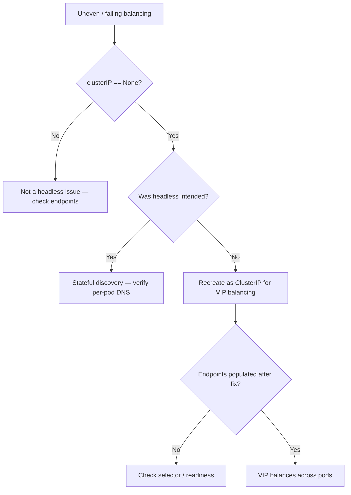

# clusterIP None Misuse

> **Severity:** High · **Typical recovery time:** 5–30 min · **Affected versions:** 1.20+

## Error Message

```text
# A normal Service was made headless by mistake:
$ kubectl get svc api
NAME   TYPE        CLUSTER-IP   EXTERNAL-IP   PORT(S)   AGE
api    ClusterIP   None         <none>        80/TCP    3d

$ curl http://api
curl: (7) Failed to connect to api port 80: Connection refused   # different pod each retry, no VIP balancing
```

## Description

Setting `clusterIP: None` makes a Service *headless*: Kubernetes allocates no
virtual IP and kube-proxy programs no load-balancing rules. DNS returns the raw
pod IPs instead of one stable VIP. That is correct for stateful peer discovery,
but wrong for an ordinary Service that expects the cluster to load-balance across
replicas behind a single address.

This is High severity because the symptom is subtle: the Service object looks
healthy and DNS resolves, but there is no VIP, no even load distribution, and
clients that cache or pin the first returned IP hammer one pod (or hit a since-
deleted pod). Connection pooling and long-lived clients are hit hardest because
they never re-resolve.

## Affected Kubernetes Versions

Applies to all clusters (1.20+). Headless behavior is unchanged across versions
and providers; `clusterIP` is immutable after creation, which makes accidental
misuse costly to undo (the Service must be recreated).

## Likely Root Causes

- Copied a StatefulSet/headless manifest and kept `clusterIP: None`
- Intent was VIP load balancing, but the Service was declared headless
- Templating/Helm value set `clusterIP: None` unintentionally
- Misunderstanding that headless still load-balances (it does not)
- Client library caches the first resolved pod IP and never refreshes

## Diagnostic Flow



## Verification Steps

Confirm whether the Service is headless and whether that was intended. Resolve
the Service name from a test pod: a headless Service returns multiple pod IPs
(round-robin from DNS), while a normal Service returns a single ClusterIP. If you
see pod IPs but expected a VIP, the Service was misconfigured.

## kubectl Commands

```bash
kubectl get svc api -o jsonpath='{.spec.clusterIP}{"\n"}'
kubectl get svc api -o yaml
kubectl get endpointslices -l kubernetes.io/service-name=api
kubectl describe svc api
kubectl exec dnsutils -- nslookup api.default.svc.cluster.local
kubectl get pods -l app=api -o wide
```

## Expected Output

```text
# Misuse: clusterIP is None on a service meant to balance
$ kubectl get svc api -o jsonpath='{.spec.clusterIP}'
None

# DNS returns raw pod IPs, not one VIP:
Name:    api.default.svc.cluster.local
Address: 10.244.1.7
Address: 10.244.2.5
Address: 10.244.3.9

# Correct (normal) Service would show a single VIP:
# Address: 10.96.140.22
```

## Common Fixes

1. Recreate the Service with a real `clusterIP` (omit `clusterIP: None`).
2. Keep headless only for StatefulSets / peer discovery, not general balancing.
3. Remove the stray `clusterIP: None` from copied Helm/Kustomize templates.
4. Make clients re-resolve DNS or use a VIP so a cached pod IP can't pin them.

## Recovery Procedures

1. Verify `clusterIP: None` and confirm it was unintended.
2. Because `clusterIP` is immutable, you must recreate the Service as a normal
   ClusterIP type via your manifest source. **Disruptive:** deleting and
   recreating the Service changes its identity and DNS answer; clients
   re-resolve and a new VIP is assigned. Blast radius is every consumer of this
   Service during the gap.
3. After recreation, confirm a VIP is assigned and endpoints populate. Empty
   endpoints point to a selector or readiness issue — see
   [Service Has No Endpoints](./service-no-endpoints.md).
4. If headless *was* intended, leave it and instead validate per-pod DNS — see
   [Headless Service No DNS Records](./service-headless-no-records.md).

## Validation

`kubectl get svc` shows a real ClusterIP (not `None`), DNS returns that single
VIP, and traffic distributes evenly across all ready backend pods on retries.

## Prevention

- Lint manifests to flag `clusterIP: None` outside StatefulSet patterns
- Template headless and normal Services from distinct, labeled bases
- Code-review Service type/clusterIP changes; clusterIP is immutable
- Educate teams that headless Services do not load-balance

## Related Errors

- [Headless Service No DNS Records](./service-headless-no-records.md)
- [Service Has No Endpoints](./service-no-endpoints.md)
- [Service Selector Mismatch](./service-selector-mismatch.md)
- [TargetPort Mismatch](./service-targetport-mismatch.md)

## References

- [Headless Services](https://kubernetes.io/docs/concepts/services-networking/service/#headless-services)
- [Service — ClusterIP](https://kubernetes.io/docs/concepts/services-networking/service/#type-clusterip)

## Further Reading

- [DevOps AI ToolKit — Kubernetes guides](https://devopsaitoolkit.com/blog/)
