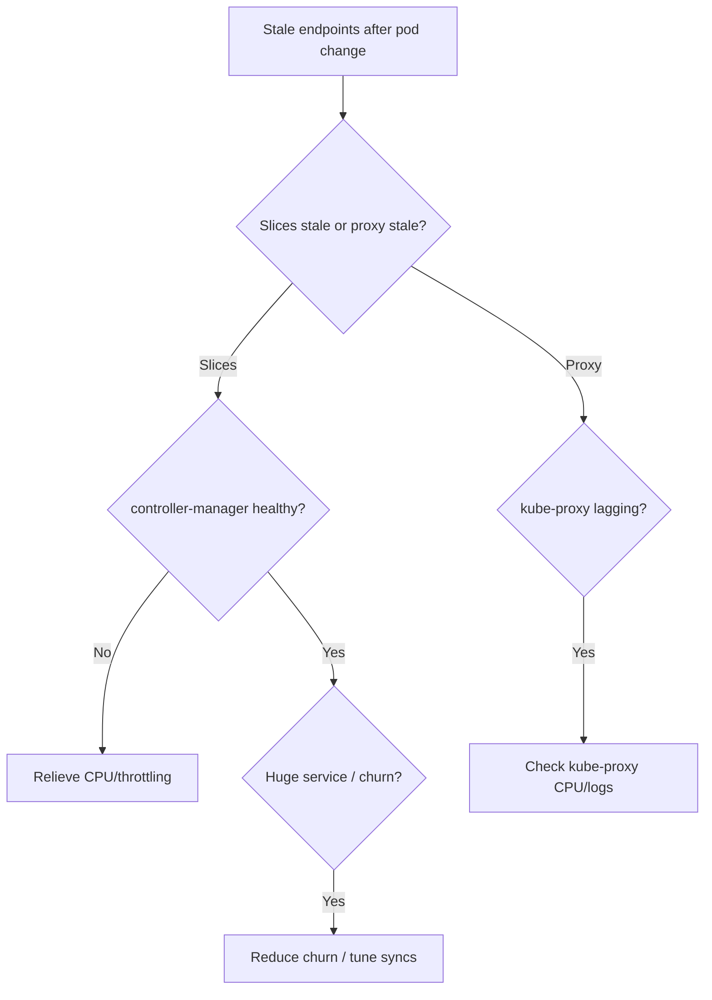

# EndpointSlice Update Lag

> **Severity:** High · **Typical recovery time:** 5–30 min · **Affected versions:** 1.20+

## Error Message

```text
# Pods scaled/replaced minutes ago, but traffic still hits dead endpoints:
$ kubectl get endpointslices -n prod -l kubernetes.io/service-name=checkout
NAME              ADDRESSTYPE   PORTS   ENDPOINTS                       AGE
checkout-abc12    IPv4          8080    10.0.3.4,10.0.3.5,+ 1 more...   9m

# 10.0.3.4 no longer exists — connections to it time out / RST
```

## Description

After pods are added, deleted, or rescheduled, the set of addresses in a Service's EndpointSlices should converge within a second or two. When the EndpointSlice controller in kube-controller-manager is overloaded — or kube-proxy is slow to consume updates — there is a measurable lag during which slices reference pods that have already terminated, or omit pods that are already serving. Clients then receive connection resets, timeouts, or 502s routed to addresses that no longer exist.

From an SRE perspective this surfaces during scale events, rolling updates, node drains, or large-scale pod churn. The control plane is healthy, but reconciliation throughput cannot keep pace. Very large Services (thousands of endpoints), high cardinality of Services, and an undersized or contended controller-manager are the usual aggravating factors. The EndpointSlice mirroring controller (which mirrors legacy Endpoints) can add additional delay.

## Affected Kubernetes Versions

All supported releases (1.20+). EndpointSlices are the default endpoint backing since 1.21. Lag characteristics depend on controller-manager `--concurrent-endpoint-syncs` and cluster size rather than a specific version.

## Likely Root Causes

- kube-controller-manager is CPU/throttle constrained, slowing the EndpointSlice controller.
- Massive pod churn (large rollouts, HPA flapping, node drains) outpaces reconciliation.
- Very large Services exceeding the per-slice limit (100 endpoints) require many slice writes.
- API server latency or etcd pressure delays slice writes and watches.
- kube-proxy on nodes is slow to process EndpointSlice watch events.
- EndpointSlice mirroring adding overhead for Services still using legacy Endpoints.

## Diagnostic Flow



## Verification Steps

1. Compare live pod IPs against the addresses listed in the EndpointSlices.
2. Check kube-controller-manager resource use and restart count.
3. Measure how long after a pod deletion the slice updates.
4. Confirm whether kube-proxy or the slices are the stale layer.

## kubectl Commands

```bash
# Compare current pod IPs with slice contents
kubectl get pods -n prod -l app=checkout -o wide
kubectl get endpointslices -n prod -l kubernetes.io/service-name=checkout -o yaml

# Inspect controller-manager health and resource pressure
kubectl get pods -n kube-system -l component=kube-controller-manager
kubectl describe pod -n kube-system -l component=kube-controller-manager
kubectl logs -n kube-system -l component=kube-controller-manager --tail=100
kubectl top pods -n kube-system

# Check kube-proxy on the affected nodes
kubectl get pods -n kube-system -l k8s-app=kube-proxy -o wide
kubectl logs -n kube-system <kube-proxy-pod> --tail=100

# Count slices and endpoints for scale context
kubectl get endpointslices -n prod -l kubernetes.io/service-name=checkout
```

## Expected Output

```text
$ kubectl get pods -n prod -l app=checkout -o wide
NAME                       READY   STATUS    IP          NODE
checkout-6f8c9d4b7-q2mzx   1/1     Running   10.0.3.9    node-3
checkout-6f8c9d4b7-r7tlp   1/1     Running   10.0.3.10   node-4

$ kubectl get endpointslices -n prod -l kubernetes.io/service-name=checkout -o yaml
endpoints:
- addresses: ["10.0.3.4"]   # <-- terminated pod, still listed (lag)
  conditions: {ready: true}
```

## Common Fixes

1. Relieve kube-controller-manager CPU throttling (raise limits/requests, dedicate capacity).
2. Reduce simultaneous pod churn — stagger rollouts and tune HPA stabilization.
3. Split very large Services or rely on topology to limit per-node slice size.
4. Tune `--concurrent-endpoint-syncs` and `--endpoint-updates-batch-period` on the controller-manager.
5. Address API server / etcd latency so slice writes and watches are fast.
6. Ensure kube-proxy has adequate CPU to apply slice updates promptly.

## Recovery Procedures

1. Confirm from the diagnostic flow whether the slices or kube-proxy are the stale layer.
2. If controller-manager is throttled, increase its resources. **Disruptive:** on self-managed control planes this restarts the controller-manager; blast radius = brief pause in all controller reconciliation cluster-wide. On managed clusters this is provider-controlled.
3. If churn is the cause, pause or slow the in-flight rollout to let reconciliation catch up. **Disruptive:** delays the rollout for the affected workload only.
4. Wait for slices to converge to the live pod set, then verify kube-proxy applied them.
5. Re-test the Service ClusterIP from a debug pod to confirm only live endpoints receive traffic.

## Validation

- EndpointSlice addresses exactly match current ready pod IPs.
- A pod deletion is reflected in slices within ~1–2 seconds.
- No connection resets to terminated addresses in client logs.

## Prevention

- Right-size and isolate kube-controller-manager; alert on its CPU and sync latency.
- Use `terminationGracePeriodSeconds` and preStop hooks so pods drain before removal.
- Cap Service size and use topology-aware routing to bound slice churn.

## Related Errors

- [Service No Endpoints](./service-no-endpoints.md)
- [Service Selector Mismatch](./service-selector-mismatch.md)
- [Service ExternalTrafficPolicy Local Drops](./service-externaltrafficpolicy-local-drops.md)
- [DNS Resolution Failure](../networking/dns-resolution-failure.md)

## References

- [EndpointSlices](https://kubernetes.io/docs/concepts/services-networking/endpoint-slices/)
- [kube-controller-manager](https://kubernetes.io/docs/reference/command-line-tools-reference/kube-controller-manager/)
- [Service](https://kubernetes.io/docs/concepts/services-networking/service/)
