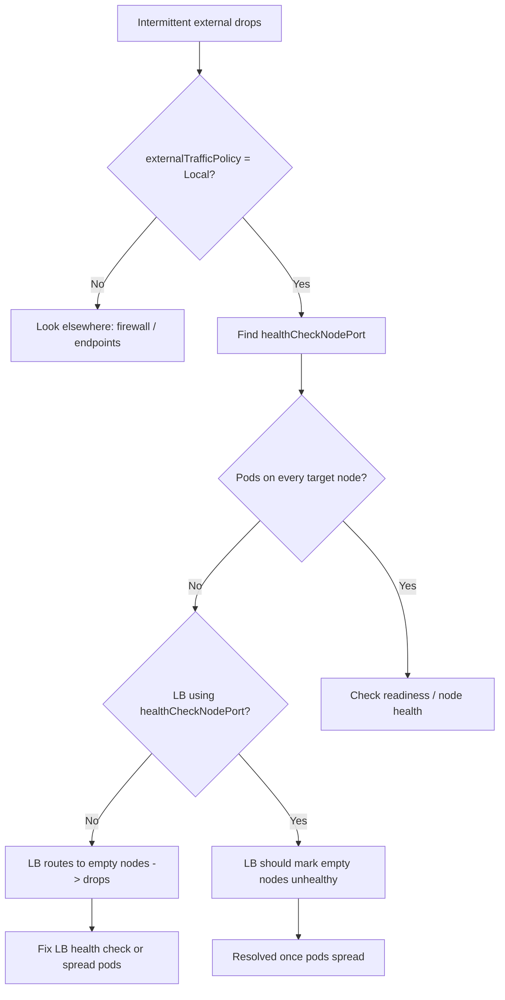

# externalTrafficPolicy Local Drops

> **Severity:** High · **Typical recovery time:** 5–30 min · **Affected versions:** 1.20+

## Error Message

```text
traffic dropped (externalTrafficPolicy: Local, no local endpoint)
curl: (28) Connection timed out after 5001 milliseconds
# intermittent: ~50% of requests fail through the load balancer
```

## Description

When a Service sets `externalTrafficPolicy: Local`, `kube-proxy` only forwards external traffic to pods running on the **same node** that received the packet. This preserves the client source IP and avoids an extra hop, but it also means that any node without a local backing pod will silently drop traffic for that Service.

From an SRE perspective the classic symptom is *intermittent* failures: requests succeed when the load balancer or NodePort hits a node that hosts a pod, and time out when it hits a node that does not. To make this safe, the Service exposes a health-check NodePort that returns HTTP 200 only on nodes with a local endpoint; cloud load balancers must be configured to use it so they stop routing to empty nodes. When the load balancer ignores or misconfigures that health check, you get partial outages.

## Affected Kubernetes Versions

All releases 1.20+ implement `externalTrafficPolicy` and the per-node `healthCheckNodePort`. The behavior is consistent across iptables and IPVS proxy modes; the newer `internalTrafficPolicy` (GA in 1.26) is a separate, intra-cluster setting and is not the cause here.

## Likely Root Causes

- A node receiving external traffic has no local ready pod for the Service.
- Pods are concentrated on a subset of nodes (no anti-affinity / not a DaemonSet).
- The cloud load balancer is not using the Service's `healthCheckNodePort`, so it routes to empty nodes.
- A pod just terminated/rescheduled, leaving a node temporarily without a local endpoint.
- `externalTrafficPolicy: Local` was set without understanding source-IP-preservation trade-offs.

## Diagnostic Flow



## Verification Steps

1. Confirm the Service has `externalTrafficPolicy: Local` and note its `healthCheckNodePort`.
2. Map which nodes actually host ready pods for the Service.
3. Compare that set against the nodes the load balancer is forwarding to.
4. Probe the health-check NodePort on a node with a pod vs a node without.

## kubectl Commands

```bash
# Confirm policy and health-check NodePort
kubectl get svc my-svc -o yaml | grep -E "externalTrafficPolicy|healthCheckNodePort|type:"

# Which nodes host ready pods for this Service
kubectl get pods -l app=my-app -o wide

# Endpoints / endpointslices and their node assignment
kubectl get endpointslices -l kubernetes.io/service-name=my-svc -o yaml

# Node inventory and readiness
kubectl get nodes -o wide

# kube-proxy mode and health
kubectl get configmap kube-proxy -n kube-system -o yaml | grep -i mode
kubectl logs -n kube-system -l k8s-app=kube-proxy --tail=50
```

## Expected Output

```text
    externalTrafficPolicy: Local
    healthCheckNodePort: 32114
    type: LoadBalancer

NAME            READY   STATUS    NODE
my-app-7d9-aaa  1/1     Running   node-1
my-app-7d9-bbb  1/1     Running   node-1
# node-2 and node-3 host NO pod -> they will drop external traffic
```

A health probe to a node with a pod returns `200 OK`; a node without a pod returns a non-200 / connection failure on the `healthCheckNodePort`.

## Common Fixes

1. Spread pods across all candidate nodes using topology spread constraints or pod anti-affinity, or run the workload as a DaemonSet.
2. Configure the cloud load balancer to use the Service's `healthCheckNodePort` so empty nodes are marked unhealthy and removed from rotation.
3. If source-IP preservation is not required, switch to `externalTrafficPolicy: Cluster` to let kube-proxy forward to any node's endpoint.
4. Scale the deployment so every node in the load balancer's target group hosts at least one replica.
5. Ensure readiness probes are accurate so pods are not counted before they can serve.

## Recovery Procedures

1. Confirm the failure is policy-driven (drops only on nodes without a local pod).
2. **Fastest mitigation:** switch the Service to `externalTrafficPolicy: Cluster`. **Disruptive: client source IP is no longer preserved (an extra SNAT hop) and existing connections may reset — cluster-wide for this Service.**
3. **Preferred durable fix:** spread replicas across nodes via topology spread / DaemonSet. **Low blast radius: a rolling reschedule of the workload's pods.**
4. Fix the load balancer health check to target `healthCheckNodePort`. **Disruptive on the LB: target-group membership churns while it re-evaluates node health.**
5. Re-test repeatedly through the external endpoint to confirm no intermittent drops.

## Validation

```bash
# Confirm pods now land on every target node and Service config is correct
kubectl get pods -l app=my-app -o wide
kubectl get svc my-svc -o yaml | grep -E "externalTrafficPolicy|healthCheckNodePort"
```

Run a sustained `curl` loop (e.g. 100 requests) through the external load balancer and confirm a 0% failure rate.

## Prevention

- Default to `externalTrafficPolicy: Cluster` unless you specifically need source-IP preservation.
- When using `Local`, always pair it with topology spread constraints or a DaemonSet.
- Verify the load balancer's health-check port in IaC reviews.
- Alert on per-node endpoint counts dropping to zero for `Local` Services.

## Related Errors

- [NodePort Unreachable](./service-nodeport-unreachable.md)
- [Service Has No Endpoints](./service-no-endpoints.md)
- [LoadBalancer Stuck in Pending](./service-loadbalancer-pending.md)
- [Service Selector Mismatch](./service-selector-mismatch.md)

## References

- [Source IP & externalTrafficPolicy: Local](https://kubernetes.io/docs/tutorials/services/source-ip/)
- [Service traffic policies](https://kubernetes.io/docs/reference/networking/virtual-ips/#traffic-policies)
- [Preserving the client source IP](https://kubernetes.io/docs/concepts/services-networking/service/#preserving-the-client-source-ip)
