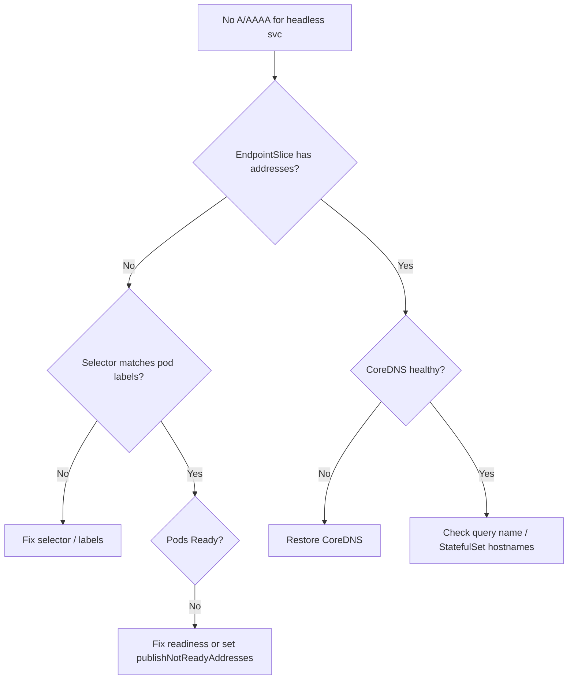

# Headless Service No DNS Records

> **Severity:** High · **Typical recovery time:** 5–30 min · **Affected versions:** 1.20+

## Error Message

```text
nslookup db.prod.svc.cluster.local
Server:    10.96.0.10
Address:   10.96.0.10:53

** server can't find db.prod.svc.cluster.local: NXDOMAIN

dial tcp: lookup web-0.web.default.svc.cluster.local: no such host
```

## Description

A headless Service (`clusterIP: None`) has no virtual IP. Instead of a single
VIP, CoreDNS is expected to publish one A/AAAA record per ready backend pod, plus
per-pod records like `pod-0.svc.ns.svc.cluster.local` for StatefulSets. When a
client resolves the headless name and gets `NXDOMAIN` or an empty answer, direct
pod addressing breaks — exactly the discovery pattern databases and clustered
apps rely on.

This is High severity because headless Services back stateful workloads
(databases, Kafka, etcd-style quorum apps). No records means peers cannot find
each other, replication stalls, and clients fall back to nothing. The root is
almost always that the Service has no *ready* endpoints to turn into records.

## Affected Kubernetes Versions

Applies to all CoreDNS-based clusters (1.20+). Behavior is identical across EKS,
GKE, and AKS. `publishNotReadyAddresses` semantics have been stable since 1.11;
EndpointSlice-driven DNS is the default from 1.21 onward.

## Likely Root Causes

- No ready pods, so no addresses exist to publish as records
- Selector does not match any pod labels (empty EndpointSlice)
- Pods failing readiness probes and `publishNotReadyAddresses` is false
- Querying the per-pod name without a StatefulSet (no stable hostnames)
- CoreDNS down or stale, returning NXDOMAIN for valid names

## Diagnostic Flow



## Verification Steps

Confirm the Service is truly headless (`clusterIP: None`), then check whether its
EndpointSlice carries `ready: true` addresses. If addresses exist but DNS still
returns nothing, query CoreDNS directly from a test pod to isolate a resolver
problem from an endpoints problem.

## kubectl Commands

```bash
kubectl get svc db -o yaml
kubectl get endpointslices -l kubernetes.io/service-name=db -o yaml
kubectl get endpoints db -o wide
kubectl get pods -l app=db -o wide --show-labels
kubectl describe svc db
kubectl exec dnsutils -- nslookup db.prod.svc.cluster.local
kubectl get pods -n kube-system -l k8s-app=kube-dns
```

## Expected Output

```text
# Headless Service confirmed:
spec:
  clusterIP: None
  selector:
    app: db

# EndpointSlice with no ready addresses = no records:
addressType: IPv4
endpoints: []

# Or selector mismatch — pods exist but slice is empty:
NAME    READY   STATUS    LABELS
db-0    0/1     Running   app=database   # label is "database", selector is "app=db"
```

## Common Fixes

1. Reconcile the selector so it matches the pods' actual labels.
2. Fix failing readiness probes so endpoints become `ready`.
3. Set `publishNotReadyAddresses: true` if peers must discover unready pods.
4. Use a StatefulSet with `serviceName` for stable per-pod DNS hostnames.

## Recovery Procedures

1. Verify `clusterIP: None` and inspect the EndpointSlice. An empty slice is the
   signal — proceed by cause.
2. If labels mismatch, align the Service selector with pod labels (read-only
   confirm here; apply via your manifest source of control).
3. If pods are unready, repair the readiness probe or backing dependency. For
   bootstrap/quorum apps that must see peers before Ready, enable
   `publishNotReadyAddresses`. **Caution:** clients may then receive addresses
   of pods not yet serving traffic — blast radius is every consumer of this
   Service.
4. If addresses are present but DNS fails, roll CoreDNS. **Disruptive —
   cluster-wide:** brief lookup failures during rollout; keep ≥2 replicas.

## Validation

`nslookup <headless-name>` returns one A record per ready pod, and StatefulSet
per-pod names (`pod-0.svc.ns.svc.cluster.local`) resolve to the correct IPs.

## Prevention

- Add CI checks that Service selectors match a workload's labels
- Use StatefulSets for stable network identity instead of bare pods
- Decide `publishNotReadyAddresses` deliberately for quorum apps
- Alert on headless Services whose EndpointSlices are empty

## Related Errors

- [Service Has No Endpoints](./service-no-endpoints.md)
- [Service Selector Mismatch](./service-selector-mismatch.md)
- [SRV Records Missing](./service-srv-records-missing.md)
- [clusterIP None Misuse](./service-clusterip-none-misuse.md)

## References

- [DNS for Services and Pods](https://kubernetes.io/docs/concepts/services-networking/dns-pod-service/)
- [Headless Services](https://kubernetes.io/docs/concepts/services-networking/service/#headless-services)

## Further Reading

- [DevOps AI ToolKit — Kubernetes guides](https://devopsaitoolkit.com/blog/)
