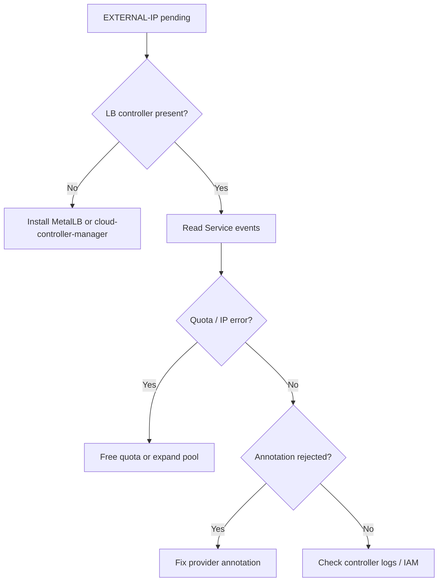

# LoadBalancer EXTERNAL-IP Pending

> **Severity:** High · **Typical recovery time:** 5–30 min · **Affected versions:** 1.20+

## Error Message

```text
$ kubectl get svc frontend -n web
NAME       TYPE           CLUSTER-IP     EXTERNAL-IP   PORT(S)        AGE
frontend   LoadBalancer   10.96.44.10    <pending>     80:31280/TCP   7m
```

## Description

A `type: LoadBalancer` Service stays in `EXTERNAL-IP <pending>` when no controller successfully provisions an external load balancer for it. In managed clouds the cloud-controller-manager handles this; on bare metal a controller such as MetalLB must be installed. Until provisioning succeeds, only the NodePort (here `31280`) is reachable — there is no external entry point.

From an SRE viewpoint, `<pending>` is a control-loop failure, not a data-plane failure. The Service and its endpoints can be perfectly healthy. The question is why the responsible controller cannot complete provisioning: it may be absent, lack cloud credentials, hit a quota or subnet constraint, or reject a required provider-specific annotation. The controller's events and logs are the fastest path to the answer.

## Affected Kubernetes Versions

All supported releases (1.20+). The split into the external cloud-controller-manager is complete in modern releases, but the pending symptom is version-independent.

## Likely Root Causes

- No load balancer controller installed (bare metal without MetalLB, or missing cloud-controller-manager).
- Cloud credentials / IAM permissions insufficient to create a load balancer.
- Subscription quota or address pool exhausted (no free public IPs).
- Missing or invalid provider-specific annotation (subnet, scheme, or LB class).
- Nodes not registered with the cloud provider, or `--cloud-provider` not configured.

## Diagnostic Flow



## Verification Steps

1. Confirm whether a load balancer controller is running in the cluster.
2. Read the Service events for provisioning errors.
3. Inspect the controller logs for credential, quota, or annotation messages.
4. Verify required provider annotations are present and valid.

## kubectl Commands

```bash
# Inspect the Service and its events
kubectl describe svc frontend -n web
kubectl get svc frontend -n web -o yaml

# Look for a cloud-controller-manager or MetalLB
kubectl get pods -n kube-system | grep -i -E 'cloud-controller|metallb'
kubectl get pods -A -l app.kubernetes.io/name=metallb

# Read controller logs (adjust namespace/name)
kubectl logs -n kube-system -l k8s-app=cloud-controller-manager --tail=100
kubectl logs -n metallb-system -l component=controller --tail=100

# Confirm endpoints exist behind the Service
kubectl get endpoints frontend -n web

# Check node provider registration
kubectl get nodes -o jsonpath='{range .items[*]}{.metadata.name}{"\t"}{.spec.providerID}{"\n"}{end}'
```

## Expected Output

```text
$ kubectl describe svc frontend -n web
Events:
  Type     Reason                  Age   From                Message
  ----     ------                  ----  ----                -------
  Warning  SyncLoadBalancerFailed  2m    service-controller  Error syncing load balancer:
           failed to ensure load balancer: googleapi: Error 403: QUOTA_EXCEEDED
```

## Common Fixes

1. Install a load balancer controller (MetalLB on bare metal; ensure cloud-controller-manager runs in managed clusters).
2. Grant the controller's identity permission to create load balancers.
3. Increase the cloud quota or expand the MetalLB address pool.
4. Add the correct provider annotation (subnet, internal/external scheme, LB class).
5. Ensure `--cloud-provider`/`providerID` is set so nodes are recognized.

## Recovery Procedures

1. From the Service events, classify the failure (missing controller, IAM, quota, annotation).
2. If no controller exists, install one. **Disruptive:** installing MetalLB/CCM is a cluster-wide change (blast radius = all LoadBalancer Services).
3. For quota or IAM, fix in the cloud console; no in-cluster change is needed and running pods are unaffected.
4. For annotation issues, update the Service annotations — **non-disruptive** to backends.
5. Wait for the controller to re-reconcile; the EXTERNAL-IP should populate within minutes.

## Validation

- `kubectl get svc frontend` shows a concrete `EXTERNAL-IP`.
- `kubectl describe svc` shows an `EnsuredLoadBalancer` success event.
- An external request to the assigned IP reaches the application.

## Prevention

- Monitor cloud load balancer and public-IP quotas with alerts.
- Pin and version-control required provider annotations in your manifests.
- Validate that the LB controller is healthy as part of cluster bootstrap checks.

## Related Errors

- [LoadBalancer Quota Exceeded](./service-loadbalancer-quota-exceeded.md)
- [NodePort Unreachable](./service-nodeport-unreachable.md)
- [Service Has No Endpoints](./service-no-endpoints.md)
- [DNS Resolution Failure](../networking/dns-resolution-failure.md)

## References

- [Service Type LoadBalancer](https://kubernetes.io/docs/concepts/services-networking/service/#loadbalancer)
- [Cloud Controller Manager](https://kubernetes.io/docs/concepts/architecture/cloud-controller/)
- [Create an External Load Balancer](https://kubernetes.io/docs/tasks/access-application-cluster/create-external-load-balancer/)
