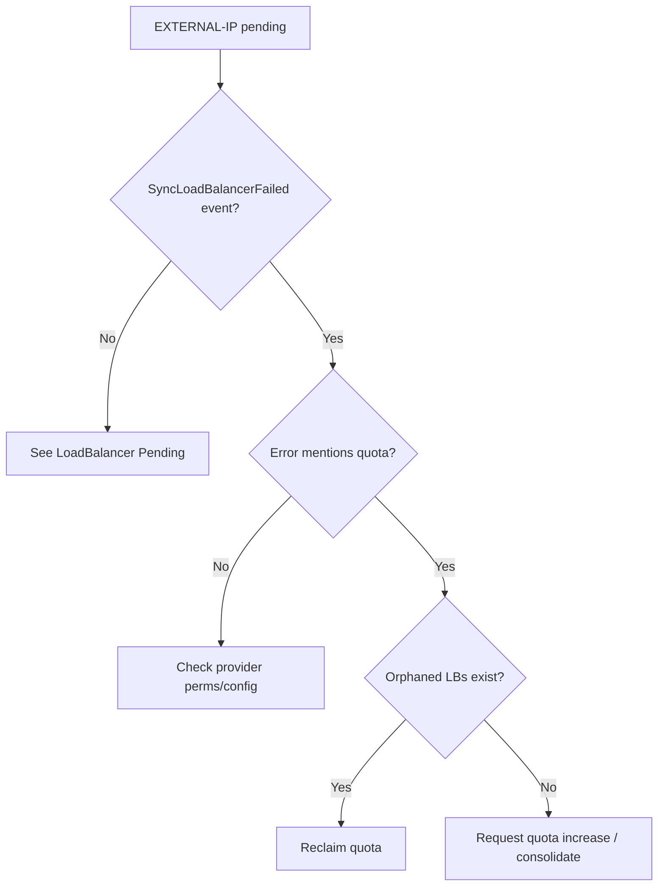

# LoadBalancer Quota Exceeded

> **Severity:** High · **Typical recovery time:** 5–30 min · **Affected versions:** 1.20+

## Error Message

```text
$ kubectl describe svc storefront -n prod
Type:                     LoadBalancer
LoadBalancer Ingress:
Events:
  Type     Reason                  Age   From                Message
  ----     ------                  ----  ----                -------
  Warning  SyncLoadBalancerFailed  2m    service-controller  Error syncing load
    balancer: failed to ensure load balancer: googleapi: Error 403: QUOTA_EXCEEDED
    - Quota 'IN_USE_ADDRESSES' exceeded. Limit: 8.0 in region us-central1
```

## Description

A `type: LoadBalancer` Service stays stuck with an empty `EXTERNAL-IP` because the cloud-controller-manager cannot provision the underlying cloud load balancer or external address — the project/account has hit a provider quota. Common limits include in-use external IP addresses, forwarding rules, backend services, target pools, or the number of load balancers per region. The Service object is valid; the failure is entirely at the cloud API boundary.

From an SRE perspective this is a capacity/governance problem that often appears suddenly when a team creates "one more" LoadBalancer Service in a region that is already near its cap. The cloud-controller-manager retries on a backoff and surfaces the provider error verbatim in the Service events, which is the fastest way to identify the exact quota that is exhausted.

## Affected Kubernetes Versions

All supported releases (1.20+). The behavior depends on the cloud provider and its cloud-controller-manager implementation, not the Kubernetes version. The error text is passed through from the provider API.

## Likely Root Causes

- The region/project has reached its quota for external IP addresses or forwarding rules.
- Too many `type: LoadBalancer` Services created, each provisioning its own LB.
- Orphaned cloud LBs from deleted Services still consuming quota.
- Per-network or per-project backend-service / target-pool limits exceeded.
- Billing or account-level restrictions capping provisioning.

## Diagnostic Flow



## Verification Steps

1. Read the Service events for the exact provider quota name and limit.
2. Count how many `type: LoadBalancer` Services exist across the cluster.
3. Compare consumed cloud resources against the provider quota in that region.
4. Identify any orphaned cloud LBs not backed by a current Service.

## kubectl Commands

```bash
# Read the provider error verbatim from Service events
kubectl describe svc storefront -n prod
kubectl get svc storefront -n prod -o yaml

# Inventory all LoadBalancer Services cluster-wide
kubectl get svc --all-namespaces -o wide
kubectl get svc --all-namespaces \
  -o jsonpath='{range .items[?(@.spec.type=="LoadBalancer")]}{.metadata.namespace}/{.metadata.name}{"\n"}{end}'

# Inspect cloud-controller-manager logs for quota errors
kubectl get pods -n kube-system -l component=cloud-controller-manager
kubectl logs -n kube-system -l component=cloud-controller-manager --tail=100

# Check recent cluster events for the failed sync
kubectl get events -n prod --sort-by=.lastTimestamp
```

## Expected Output

```text
$ kubectl get svc --all-namespaces -o jsonpath='{range .items[?(@.spec.type=="LoadBalancer")]}{.metadata.namespace}/{.metadata.name}{"\n"}{end}'
prod/storefront
prod/api-gateway
staging/storefront
... (9 LoadBalancer services in a region with limit 8)

$ kubectl logs -n kube-system -l component=cloud-controller-manager --tail=20
E0629 ensureLoadBalancer: googleapi: Error 403: QUOTA_EXCEEDED - Quota
'IN_USE_ADDRESSES' exceeded. Limit: 8.0 in region us-central1
```

## Common Fixes

1. Request a quota increase from the cloud provider for the exhausted resource.
2. Consolidate multiple LoadBalancer Services behind a single Ingress/Gateway to reuse one LB.
3. Delete orphaned cloud LBs and unused `type: LoadBalancer` Services to reclaim quota.
4. Use an internal LB annotation or shared LB where a public IP per service is unnecessary.
5. Spread workloads across regions if a single region's quota is the bottleneck.

## Recovery Procedures

1. From the Service events, identify the precise quota name and the region affected.
2. Reclaim quota by removing orphaned/unused LoadBalancer Services. **Disruptive:** deleting a Service removes its external endpoint; blast radius = all external clients of that Service. Confirm the Service is truly unused first.
3. If consolidation is the strategy, front the affected Services with an Ingress/Gateway so they share one LB. **Disruptive:** changes the external entry point; plan a DNS cutover for affected clients.
4. If neither is sufficient, file a provider quota-increase request and wait for approval.
5. Once quota is available, the cloud-controller-manager retries automatically and assigns `EXTERNAL-IP`.

## Validation

- `kubectl get svc storefront -n prod` shows a populated `EXTERNAL-IP`.
- No `SyncLoadBalancerFailed` events remain in the Service description.
- Consumed cloud LB resources are below the regional quota with headroom.

## Prevention

- Track LoadBalancer Service counts against provider quotas and alert at ~80%.
- Prefer a shared Ingress/Gateway over one LB per Service.
- Add cleanup automation so deleted Services release their cloud resources.
- Govern who can create `type: LoadBalancer` Services via policy/admission control.

## Related Errors

- [Service LoadBalancer Pending](./service-loadbalancer-pending.md)
- [Service NodePort Unreachable](./service-nodeport-unreachable.md)
- [Service ExternalTrafficPolicy Local Drops](./service-externaltrafficpolicy-local-drops.md)
- [DNS Resolution Failure](../networking/dns-resolution-failure.md)

## References

- [Service — type LoadBalancer](https://kubernetes.io/docs/concepts/services-networking/service/#loadbalancer)
- [Cloud Controller Manager](https://kubernetes.io/docs/concepts/architecture/cloud-controller/)
- [Ingress](https://kubernetes.io/docs/concepts/services-networking/ingress/)
