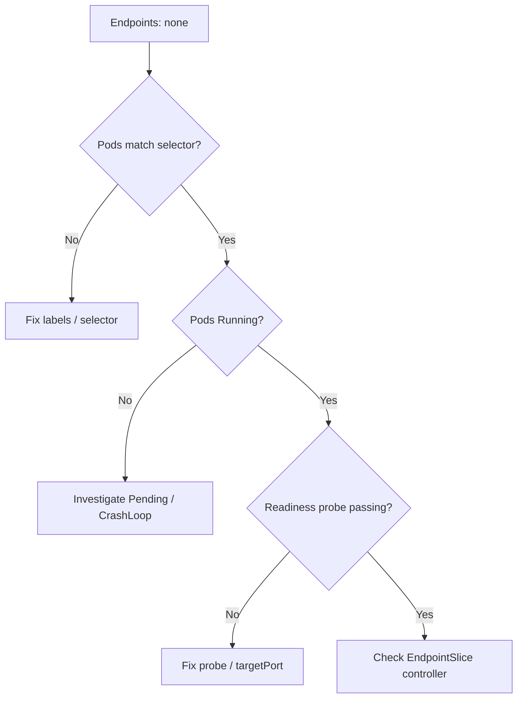

# Service Has No Endpoints

> **Severity:** High · **Typical recovery time:** 5–30 min · **Affected versions:** 1.20+

## Error Message

```text
$ kubectl describe svc payments
Name:              payments
Namespace:         prod
Selector:          app=payments
Type:              ClusterIP
IP:                10.96.12.7
Port:              http  80/TCP
TargetPort:        8080/TCP
Endpoints:         <none>
```

## Description

A Service object exists and has a stable ClusterIP, but the `Endpoints` field is empty. Kubernetes populates Endpoints (and the backing EndpointSlices) only with pods that match the Service `spec.selector` **and** are passing their readiness probes. When the list is empty, kube-proxy programs no destination rules, so every connection to the ClusterIP fails with connection refused or times out.

From an SRE perspective this is one of the most common "the Service is up but nothing works" incidents. The control plane is healthy and DNS resolves the ClusterIP fine; the gap is purely between the Service selector and the set of *ready* pods behind it. Because the symptom is identical whether pods are missing, mislabeled, or simply not ready, diagnosis is about narrowing which of those three is true.

## Affected Kubernetes Versions

All supported releases (1.20+). Behavior is identical across versions, though the EndpointSlice controller (default since 1.21) is what reconciles membership.

## Likely Root Causes

- No pods match the selector (wrong labels, pods in another namespace, or no pods running at all).
- Pods match but are **not Ready** — failing or pending readiness probes keep them out of Endpoints.
- Pods are crash-looping, Pending, or stuck in `ContainerCreating` so none ever reach Running.
- `spec.selector` was omitted or set to labels that no workload uses.
- A `targetPort` mismatch causing readiness probes against the wrong port to fail.

## Diagnostic Flow



## Verification Steps

1. Confirm the Service selector and target port.
2. List pods using the same selector and check how many exist.
3. Check the `READY` column — `0/1` means not ready, excluded from Endpoints.
4. Inspect readiness probe events on a non-ready pod.

## kubectl Commands

```bash
# Inspect the Service selector and ports
kubectl describe svc payments -n prod
kubectl get svc payments -n prod -o yaml

# Find pods matching the Service selector
kubectl get pods -n prod -l app=payments -o wide

# See readiness state and recent events
kubectl get pods -n prod -l app=payments
kubectl describe pod <pod-name> -n prod

# Inspect EndpointSlices the controller produced
kubectl get endpointslices -n prod -l kubernetes.io/service-name=payments
kubectl get endpoints payments -n prod -o yaml

# Check probe failures in container logs
kubectl logs <pod-name> -n prod --tail=50
```

## Expected Output

```text
$ kubectl get pods -n prod -l app=payments
NAME                        READY   STATUS    RESTARTS   AGE
payments-7c9d8f6b5-2xkqz    0/1     Running   0          4m

$ kubectl describe pod payments-7c9d8f6b5-2xkqz -n prod
  Warning  Unhealthy  30s (x6)  kubelet  Readiness probe failed: HTTP probe failed with statuscode: 500
```

## Common Fixes

1. Correct the pod labels or the Service `spec.selector` so they match exactly.
2. Fix the application so the readiness probe returns success.
3. Align the probe port and Service `targetPort` with the port the container actually listens on.
4. Resolve scheduling problems so pods reach Running (resources, image pulls).
5. Ensure pods live in the same namespace as the Service.

## Recovery Procedures

1. Identify the cause from the diagnostic flow above (mismatch vs. not-ready).
2. If labels are wrong, update the workload's pod template labels. **Disruptive:** this triggers a rolling replacement of pods (blast radius = the affected Deployment only).
3. If the readiness probe is misconfigured, correct the probe path/port in the Deployment spec. **Disruptive:** rollout replaces pods.
4. Wait for pods to report `READY 1/1`; the EndpointSlice controller adds them automatically.
5. Re-run `kubectl get endpoints` to confirm population, then test the ClusterIP from a debug pod.

## Validation

- `kubectl get endpoints payments -n prod` lists one or more `IP:port` entries.
- `kubectl get pods -l app=payments` shows `READY 1/1` for all replicas.
- A test request to the ClusterIP returns the expected application response.

## Prevention

- Keep selector labels and pod template labels in a single source of truth (Helm/Kustomize values).
- Always define realistic readiness probes and test them in CI.
- Add alerting on Services with zero ready endpoints.

## Related Errors

- [Service Selector Mismatch](./service-selector-mismatch.md)
- [Service TargetPort Mismatch](./service-targetport-mismatch.md)
- [EndpointSlice Lag](./service-endpointslice-lag.md)
- [DNS Resolution Failure](../networking/dns-resolution-failure.md)

## References

- [Service — Kubernetes Documentation](https://kubernetes.io/docs/concepts/services-networking/service/)
- [EndpointSlices](https://kubernetes.io/docs/concepts/services-networking/endpoint-slices/)
- [Configure Liveness, Readiness and Startup Probes](https://kubernetes.io/docs/tasks/configure-pod-container/configure-liveness-readiness-startup-probes/)
