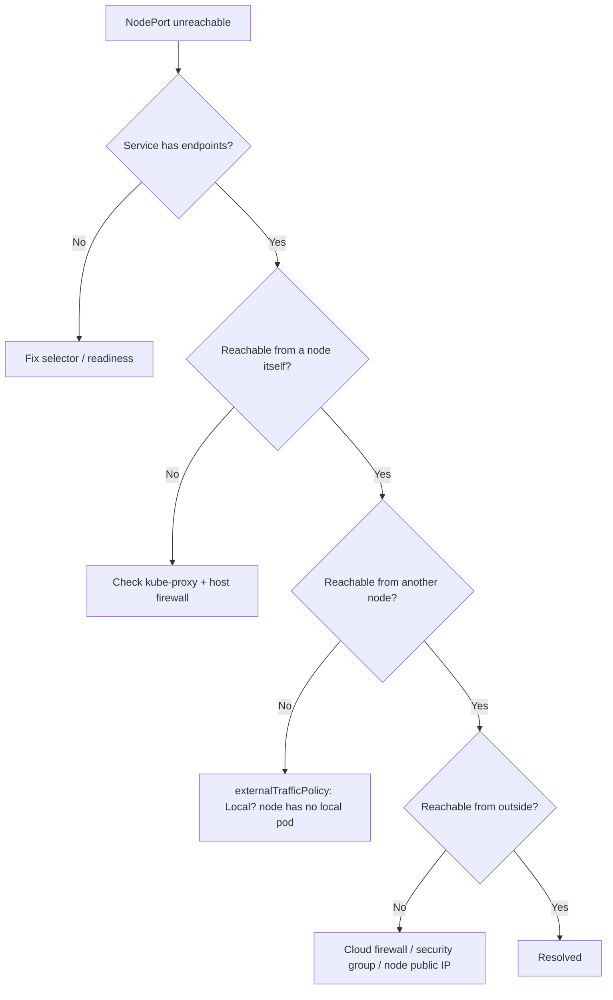

# NodePort Unreachable

> **Severity:** High · **Typical recovery time:** 5–30 min · **Affected versions:** 1.20+

## Error Message

```text
curl: (7) Failed to connect to 203.0.113.10 port 31080 after 2003 ms: Connection timed out
NodePort not reachable from outside
```

## Description

A `NodePort` Service exposes a port (default range 30000–32767) on every node in the cluster, allowing external clients to reach pods via `<NodeIP>:<NodePort>`. When that endpoint times out or refuses connections, the application appears down even though pods are healthy and the Service exists.

From an SRE perspective, this is almost always an infrastructure or routing problem rather than a workload problem. The most common culprits are cloud firewall rules or security groups that never opened the NodePort range, clients targeting an unreachable private node IP, a node with no healthy backing pod, or a degraded `kube-proxy` that failed to program the forwarding rules. The fix path is to confirm the Service and endpoints first, then walk outward through the node and the network boundary.

## Affected Kubernetes Versions

All supported releases (1.20+) behave the same way. The default NodePort range and `kube-proxy` modes (iptables and IPVS) are stable across these versions; nftables proxy mode (beta in 1.31+) follows the same external-reachability rules.

## Likely Root Causes

- Cloud firewall / security group does not allow inbound traffic on the NodePort range (30000–32767).
- Client is hitting a private/internal node IP that is not routable from outside the VPC.
- `externalTrafficPolicy: Local` and the targeted node has no local endpoint, so packets are dropped.
- `kube-proxy` is not running or failed to program iptables/IPVS rules on the node.
- The selected node is NotReady, cordoned, or the host firewall (firewalld/ufw) blocks the port.
- No ready endpoints behind the Service (selector or readiness probe issues).

## Diagnostic Flow



## Verification Steps

1. Confirm the Service type is `NodePort` and note the allocated port.
2. Confirm the Service has ready endpoints.
3. Test connectivity from inside a node, then from another node, then from outside.
4. Inspect `kube-proxy` status and the node's external IP and firewall posture.

## kubectl Commands

```bash
# Confirm Service type and NodePort
kubectl get svc my-svc -o wide

# Inspect full Service spec (type, nodePort, externalTrafficPolicy)
kubectl get svc my-svc -o yaml

# Confirm endpoints exist and are ready
kubectl get endpoints my-svc -o wide
kubectl get endpointslices -l kubernetes.io/service-name=my-svc

# Node IPs (ExternalIP vs InternalIP) and readiness
kubectl get nodes -o wide

# kube-proxy health on each node
kubectl get pods -n kube-system -l k8s-app=kube-proxy -o wide
kubectl logs -n kube-system -l k8s-app=kube-proxy --tail=50

# Verify the targeted pods are Running and Ready
kubectl get pods -l app=my-app -o wide
```

## Expected Output

```text
NAME     TYPE       CLUSTER-IP      EXTERNAL-IP   PORT(S)          AGE
my-svc   NodePort   10.96.140.22    <none>        80:31080/TCP     12d

NAME     ENDPOINTS                          AGE
my-svc   10.244.1.7:8080,10.244.2.5:8080   12d

NAME       STATUS   ROLES    AGE   VERSION   INTERNAL-IP    EXTERNAL-IP
node-1     Ready    <none>   30d   v1.29.4   10.0.1.11      203.0.113.10
```

## Common Fixes

1. Open the NodePort range (or the specific port) inbound in the cloud security group / firewall for the client source range.
2. Target a node IP that is actually routable from the client (ExternalIP for internet clients, InternalIP within the VPC).
3. If using `externalTrafficPolicy: Local`, send traffic to a node that hosts a pod, or front the Service with a load balancer that honors the health check.
4. Restart or repair `kube-proxy` so iptables/IPVS rules are programmed on every node.
5. Ensure ready endpoints exist by fixing the selector or readiness probe.
6. Open the port in the host firewall (firewalld/ufw) if one is enabled.

## Recovery Procedures

1. Identify the failing layer using the diagnostic flow above (node-local vs cross-node vs external).
2. If endpoints are missing, fix the workload selector/readiness — **blast radius: the Service only; no node-wide impact.**
3. If `kube-proxy` is unhealthy, roll its DaemonSet pod on affected nodes. **Disruptive: briefly re-programs forwarding rules on that node; in-flight NodePort connections to that node may reset (single-node blast radius).**
4. Update the cloud firewall/security group to permit the NodePort range. **Disruptive: changes network exposure; scope the source CIDR tightly and review with security before widening.**
5. Re-test from outside the cluster.

## Validation

```bash
# Confirm endpoints are populated and kube-proxy pods are Running
kubectl get endpoints my-svc
kubectl get pods -n kube-system -l k8s-app=kube-proxy
```

Then `curl http://<routable-node-ip>:<nodePort>/` from the external client and confirm a successful response from multiple nodes.

## Prevention

- Bake the NodePort range firewall rule into infrastructure-as-code so it is never missing on new node pools.
- Prefer a `LoadBalancer` Service or Ingress over raw NodePort for production internet exposure.
- Pin explicit `nodePort` values for stable firewall rules instead of relying on random allocation.
- Alert on Services with zero ready endpoints.

## Related Errors

- [externalTrafficPolicy Local Drops](./service-externaltrafficpolicy-local-drops.md)
- [Service Has No Endpoints](./service-no-endpoints.md)
- [Service targetPort Mismatch](./service-targetport-mismatch.md)
- [LoadBalancer Stuck in Pending](./service-loadbalancer-pending.md)

## References

- [Kubernetes Service — type NodePort](https://kubernetes.io/docs/concepts/services-networking/service/#type-nodeport)
- [Virtual IPs and Service Proxies (kube-proxy)](https://kubernetes.io/docs/reference/networking/virtual-ips/)
- [Connecting Applications with Services](https://kubernetes.io/docs/tutorials/services/connect-applications-service/)
