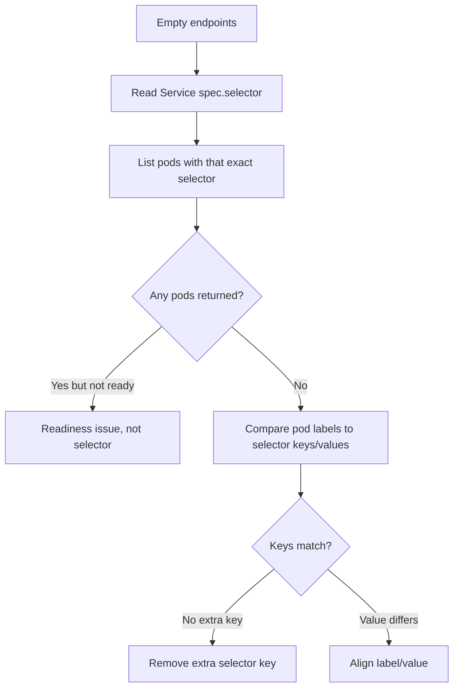

# Service Selector Mismatch

> **Severity:** High · **Typical recovery time:** 5–30 min · **Affected versions:** 1.20+

## Error Message

```text
$ kubectl get endpoints checkout -n shop
NAME       ENDPOINTS   AGE
checkout   <none>      12m

# Service selector matches no pods
$ kubectl get pods -n shop -l app=checkout
No resources found in shop namespace.
```

## Description

A Service routes traffic by matching its `spec.selector` (a set of label key/value pairs) against pod labels. When the selector keys or values don't exactly match the labels on the intended pods, the EndpointSlice controller finds nothing to register and the Service has zero backends. The pods may be perfectly healthy and Ready — they are simply invisible to the Service.

This is subtly different from "no endpoints because pods aren't ready." Here the pods exist and pass probes, but a label typo, a version-suffixed label (`app=checkout-v2`), or a selector that includes an extra key the pods lack causes a clean miss. Label matching is exact and ALL specified pairs must be present on a pod, so a single mismatched value drops every candidate.

## Affected Kubernetes Versions

All supported releases (1.20+). The label-matching semantics for Service selectors are unchanged across versions.

## Likely Root Causes

- Typo or case difference between selector value and pod label value.
- Selector includes an extra label key that pods do not carry (selectors are ANDed).
- Pods carry a versioned or environment-suffixed label the selector doesn't account for.
- Pods and Service live in different namespaces.
- A templating bug (Helm/Kustomize) rendered different labels for the Service and the workload.

## Diagnostic Flow



## Verification Steps

1. Read the exact `spec.selector` from the Service.
2. List pods using that selector verbatim and confirm zero matches.
3. List candidate pods with `--show-labels` and compare each key/value.
4. Confirm both objects are in the same namespace.

## kubectl Commands

```bash
# Read the Service selector exactly as defined
kubectl get svc checkout -n shop -o jsonpath='{.spec.selector}{"\n"}'

# Try matching pods with that selector
kubectl get pods -n shop -l app=checkout

# Show all candidate pods with their full label set
kubectl get pods -n shop --show-labels

# Compare a specific pod's labels
kubectl get pod <pod-name> -n shop -o jsonpath='{.metadata.labels}{"\n"}'

# Confirm endpoints are empty
kubectl get endpoints checkout -n shop -o yaml
kubectl describe svc checkout -n shop
```

## Expected Output

```text
$ kubectl get svc checkout -n shop -o jsonpath='{.spec.selector}{"\n"}'
{"app":"checkout"}

$ kubectl get pods -n shop --show-labels
NAME                         READY   STATUS    AGE   LABELS
checkout-6b4f9c7d8-aa11      1/1     Running   18m   app=checkout-v2,tier=web
```

The Service selects `app=checkout`, but pods carry `app=checkout-v2` — a clean mismatch.

## Common Fixes

1. Align the Service `spec.selector` value with the actual pod label value.
2. Or relabel the workload's pod template to match the Service.
3. Remove any extra selector key that pods do not carry.
4. Ensure Service and pods share the same namespace.
5. Fix the templating source so both render identical labels.

## Recovery Procedures

1. Decide whether to change the Service selector or the pod labels (prefer the side that is wrong in source control).
2. If updating pod labels, edit the Deployment's pod template. **Disruptive:** this rolls all replicas (blast radius = the one Deployment).
3. Editing only `spec.selector` of the Service is **non-disruptive** to running pods and takes effect immediately.
4. Wait for the EndpointSlice controller to reconcile (seconds).
5. Confirm endpoints populate and test the ClusterIP.

## Validation

- `kubectl get pods -l <selector>` returns the expected pods.
- `kubectl get endpoints checkout` lists their IPs.
- Application traffic to the ClusterIP succeeds.

## Prevention

- Define labels once and reference them for both Service and workload in Helm/Kustomize.
- Add a CI check that the Service selector matches at least one workload's labels.
- Avoid embedding version suffixes in the `app` label; use a separate `version` key.

## Related Errors

- [Service Has No Endpoints](./service-no-endpoints.md)
- [Service TargetPort Mismatch](./service-targetport-mismatch.md)
- [EndpointSlice Lag](./service-endpointslice-lag.md)
- [DNS Resolution Failure](../networking/dns-resolution-failure.md)

## References

- [Service — Kubernetes Documentation](https://kubernetes.io/docs/concepts/services-networking/service/)
- [Labels and Selectors](https://kubernetes.io/docs/concepts/overview/working-with-objects/labels/)
- [EndpointSlices](https://kubernetes.io/docs/concepts/services-networking/endpoint-slices/)
