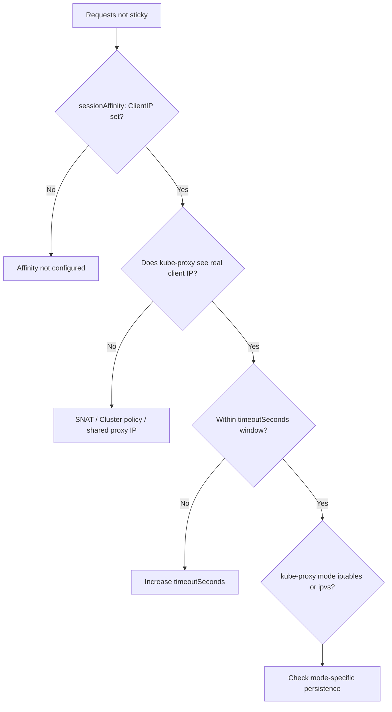

# Session Affinity Not Sticking

> **Severity:** Medium · **Typical recovery time:** 5–30 min · **Affected versions:** 1.20+

## Error Message

```text
# Same client, consecutive requests, different backend pods:
$ for i in $(seq 5); do curl -s http://app/whoami; done
served-by: app-7d9c-abc12
served-by: app-7d9c-xyz88
served-by: app-7d9c-abc12
served-by: app-7d9c-qq431
served-by: app-7d9c-xyz88
```

## Description

With `sessionAffinity: ClientIP`, kube-proxy is supposed to pin a given source IP
to the same backend pod for a configurable timeout. When affinity "doesn't
stick," a client's requests fan out across pods, breaking apps that keep
in-memory session state, sticky uploads, or per-connection caches.

This is Medium severity: traffic still flows and most stateless apps are
unaffected, but stateful sessions see logouts, lost carts, or cache misses. The
usual culprit is that kube-proxy never sees the *real* client IP — SNAT or a
proxy rewrites the source — so every request looks like a different (or the same
gateway) client, defeating the ClientIP hash.

## Affected Kubernetes Versions

Applies to all kube-proxy clusters (1.20+) in both iptables and IPVS modes.
ClientIP affinity is the only built-in mode; cookie-based affinity is not
supported. IPVS uses its own persistence timer, which can behave differently
from iptables under the same `timeoutSeconds`.

## Likely Root Causes

- Source IP is SNAT'd (affinity hashes on a rewritten/gateway IP)
- `externalTrafficPolicy: Cluster` hides the real external client IP
- All client traffic enters via one proxy/ingress, sharing one source IP
- `sessionAffinityConfig.clientIP.timeoutSeconds` expired between requests
- IPVS vs iptables persistence differences after a kube-proxy mode change

## Diagnostic Flow



## Verification Steps

Confirm `sessionAffinity` and its timeout on the Service. Then determine the
source IP that kube-proxy actually load-balances on: for external traffic with
`Cluster` policy, the original client IP is SNAT'd away, so all clients can
collapse to node IPs. Compare requests inside the cluster (pod-to-Service) versus
from outside.

## kubectl Commands

```bash
kubectl get svc app -o yaml | grep -A6 sessionAffinity
kubectl get svc app -o jsonpath='{.spec.sessionAffinityConfig.clientIP.timeoutSeconds}'
kubectl get svc app -o jsonpath='{.spec.externalTrafficPolicy}'
kubectl get endpointslices -l kubernetes.io/service-name=app
kubectl get configmap kube-proxy -n kube-system -o yaml | grep mode
kubectl logs -n kube-system -l k8s-app=kube-proxy --tail=50
```

## Expected Output

```text
# Service config present:
sessionAffinity: ClientIP
sessionAffinityConfig:
  clientIP:
    timeoutSeconds: 10800

# But external policy is hiding the client IP:
$ kubectl get svc app -o jsonpath='{.spec.externalTrafficPolicy}'
Cluster

# kube-proxy mode:
mode: "ipvs"
```

## Common Fixes

1. Raise `clientIP.timeoutSeconds` if sessions outlive the default 3-hour window.
2. Set `externalTrafficPolicy: Local` so the real client IP reaches kube-proxy.
3. Move stickiness to the ingress/L7 layer (cookie affinity) for HTTP traffic.
4. Account for IPVS persistence semantics after switching kube-proxy mode.

## Recovery Procedures

1. Confirm `sessionAffinity: ClientIP` and read `timeoutSeconds`. If the gap
   between requests exceeds it, that alone explains the misses.
2. Determine whether the source IP is preserved. For external clients,
   `externalTrafficPolicy: Cluster` SNATs the source — switching to `Local`
   preserves it. **Disruptive:** `Local` drops traffic to nodes with no local
   endpoint and changes load distribution; blast radius is all ingress traffic
   for this Service. See
   [ExternalTrafficPolicy Local Drops](./service-externaltrafficpolicy-local-drops.md).
3. If all clients arrive through one proxy IP, implement L7 cookie affinity at
   the ingress instead — ClientIP cannot distinguish them.
4. After a kube-proxy mode change, restart kube-proxy pods so persistence rules
   rebuild. **Disruptive — node-local:** brief reprogramming of dataplane rules.

## Validation

Repeated requests from a single real client IP land on the same backend pod for
the full `timeoutSeconds` window, confirmed by a `served-by` header or pod name.

## Prevention

- Choose ClientIP affinity only when the real client IP is preserved end-to-end
- Prefer L7 cookie stickiness for HTTP behind shared proxies/ingress
- Document `timeoutSeconds` to match real session lengths
- Re-test affinity after any kube-proxy iptables↔IPVS migration

## Related Errors

- [ExternalTrafficPolicy Local Drops](./service-externaltrafficpolicy-local-drops.md)
- [Service Has No Endpoints](./service-no-endpoints.md)
- [NodePort Unreachable](./service-nodeport-unreachable.md)
- [Service Selector Mismatch](./service-selector-mismatch.md)

## References

- [Service — Session Affinity](https://kubernetes.io/docs/reference/networking/virtual-ips/#session-affinity)
- [Source IP for Services](https://kubernetes.io/docs/tutorials/services/source-ip/)

## Further Reading

- [DevOps AI ToolKit — Kubernetes guides](https://devopsaitoolkit.com/blog/)
