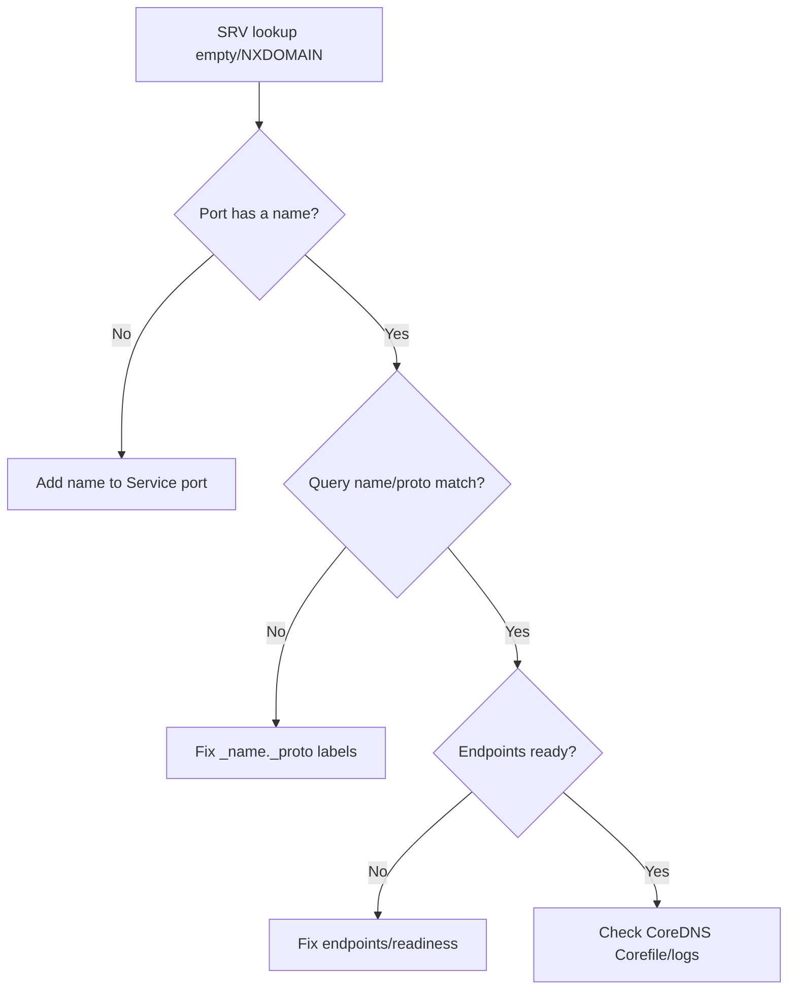

# Service SRV Records Missing

> **Severity:** Medium · **Typical recovery time:** 5–30 min · **Affected versions:** 1.20+

## Error Message

```text
$ dig +short SRV _grpc._tcp.payments.prod.svc.cluster.local
(no answer)

$ nslookup -type=SRV _grpc._tcp.payments.prod.svc.cluster.local 10.96.0.10
** server can't find _grpc._tcp.payments.prod.svc.cluster.local: NXDOMAIN
```

## Description

A client performs an SRV lookup (`_portname._protocol.service.namespace.svc.cluster.local`) to discover a service's port and backing instances, but CoreDNS returns no records or NXDOMAIN. SRV records are how gRPC name resolvers, SIP clients, and many service-discovery libraries find both the port number and the per-pod hostnames behind a Service. When they are missing, clients fall back to defaults or fail to connect entirely.

From an SRE perspective the cause is almost always a schema detail rather than a DNS outage: Kubernetes only synthesizes SRV records for **named** ports. A Service port defined without a `name` produces no `_port._proto` SRV entry, so a lookup keyed on the expected port name resolves to nothing even though the A record for the Service works fine. The second common cause is querying a headless Service that has no ready endpoints.

## Affected Kubernetes Versions

All supported releases (1.20+). SRV synthesis rules are part of the stable Kubernetes DNS specification and behave identically across versions and CoreDNS releases.

## Likely Root Causes

- The Service port has no `name`, so no `_name._proto` SRV record is generated.
- The query uses a port name or protocol that does not match the Service definition (`_grpc` vs `_http`, `_tcp` vs `_udp`).
- A headless (`clusterIP: None`) Service has zero ready endpoints, so per-pod SRV targets are absent.
- The Service has no endpoints at all (selector mismatch, not-ready pods).
- Wrong FQDN form — missing the `_proto` label or the `svc.cluster.local` suffix.

## Diagnostic Flow



## Verification Steps

1. Confirm the Service ports are named and note the exact names and protocols.
2. Verify the Service has ready endpoints.
3. Reconstruct the SRV FQDN from the actual port name and protocol.
4. Compare an A-record lookup (should work) against the SRV lookup (failing).

## kubectl Commands

```bash
# Inspect Service ports — look for the `name` field on each port
kubectl describe svc payments -n prod
kubectl get svc payments -n prod -o yaml

# Confirm endpoints exist and are ready
kubectl get endpoints payments -n prod -o yaml
kubectl get endpointslices -n prod -l kubernetes.io/service-name=payments

# Verify CoreDNS is healthy
kubectl get pods -n kube-system -l k8s-app=kube-dns
kubectl logs -n kube-system -l k8s-app=kube-dns --tail=50

# Inspect the CoreDNS configuration
kubectl get configmap coredns -n kube-system -o yaml
```

## Expected Output

```text
$ kubectl get svc payments -n prod -o yaml
spec:
  ports:
  - port: 50051
    protocol: TCP
    targetPort: 50051
    # NOTE: no `name:` field — SRV record _grpc._tcp will NOT exist

# After naming the port, the record appears:
$ dig +short SRV _grpc._tcp.payments.prod.svc.cluster.local
0 100 50051 payments.prod.svc.cluster.local.
```

## Common Fixes

1. Add a `name` to every Service port (e.g. `name: grpc`) so `_grpc._tcp` SRV records are generated.
2. Match the SRV query labels to the actual port name and protocol exactly.
3. Ensure the Service has ready endpoints; SRV targets mirror live endpoints.
4. For per-pod SRV targets, use a headless Service and set `hostname`/`subdomain` or rely on EndpointSlice hostnames.
5. Use the fully qualified SRV name including the `_proto` label and cluster domain.

## Recovery Procedures

1. Determine from the diagnostic flow whether the issue is a missing port name, a wrong query, or missing endpoints.
2. If the port is unnamed, add a `name` to the Service `spec.ports[]` entry. **Disruptive:** editing the Service is low risk, but clients caching NXDOMAIN may need their negative TTL (default 30s) to expire. Blast radius = consumers of this Service only.
3. If endpoints are missing, resolve the selector/readiness problem first so SRV targets can be populated.
4. Re-issue the SRV lookup from a debug pod to confirm records now return.
5. Roll any clients that cached the empty result if they do not honor TTLs.

## Validation

- `dig SRV _name._proto.svc.ns.svc.cluster.local` returns priority/weight/port/target lines.
- The returned port matches the Service `targetPort`.
- gRPC/SIP clients connect without falling back to hardcoded ports.

## Prevention

- Standardize on always naming Service ports in templates and lint for unnamed ports in CI.
- Document the SRV FQDN scheme your services expect.
- Add synthetic checks that perform SRV lookups for critical services.

## Related Errors

- [Service Headless No Records](./service-headless-no-records.md)
- [Service ClusterIP None Misuse](./service-clusterip-none-misuse.md)
- [Service No Endpoints](./service-no-endpoints.md)
- [DNS Resolution Failure](../networking/dns-resolution-failure.md)

## References

- [DNS for Services and Pods](https://kubernetes.io/docs/concepts/services-networking/dns-pod-service/)
- [Service](https://kubernetes.io/docs/concepts/services-networking/service/)
- [Headless Services](https://kubernetes.io/docs/concepts/services-networking/service/#headless-services)
