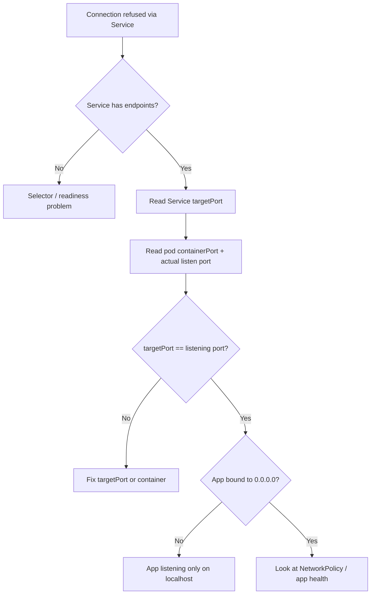

# Service targetPort Mismatch

> **Severity:** High · **Typical recovery time:** 5–30 min · **Affected versions:** 1.20+

## Error Message

```text
upstream connect error or disconnect/reset before headers. reset reason: connection failure
curl: (7) Failed to connect to 10.96.55.12 port 80: Connection refused
connection refused (targetPort != container port)
```

## Description

A Service forwards traffic from its `port` to the pods' `targetPort`. The `targetPort` must match the port the container process actually listens on. When it points at a port nothing is bound to, `kube-proxy` still creates a valid endpoint (the pod exists and is ready), but every connection that reaches the pod is immediately refused.

This is a deceptive failure mode for SREs because the Service has endpoints and the pods are `Running` and `Ready` — so the usual "no endpoints" checks pass. The break is one layer deeper: the endpoint's port does not line up with the listening socket inside the container. It often appears after a container image upgrade changes the listen port, after a copy-paste error in the manifest, or when a named port in the Service does not match the `containerPort` name in the pod spec.

## Affected Kubernetes Versions

All releases 1.20+ resolve `targetPort` identically, whether it is a numeric port or a named port referencing a `containerPort` name. Named-port resolution and `appProtocol` handling are stable across these versions.

## Likely Root Causes

- `targetPort` is a number that does not match the container's actual listening port.
- `targetPort` uses a name that does not match any `containerPort` name in the pod spec.
- The container image was updated and now listens on a different port.
- The app binds to `127.0.0.1` instead of `0.0.0.0`, so it refuses non-loopback connections.
- `Service.port` and `targetPort` were confused during manifest editing.

## Diagnostic Flow



## Verification Steps

1. Confirm the Service has ready endpoints (rules out the no-endpoints case).
2. Read the Service `targetPort` (numeric or named).
3. Read the pod's `containerPort` and confirm the process' real listening port.
4. Connect to the pod IP directly on both the `targetPort` and the real port to localize the mismatch.

## kubectl Commands

```bash
# Service spec: note port and targetPort
kubectl get svc my-svc -o yaml | grep -A6 "ports:"

# Endpoints exist with their resolved port
kubectl get endpoints my-svc -o wide
kubectl get endpointslices -l kubernetes.io/service-name=my-svc -o yaml

# Pod spec: containerPort (name and number)
kubectl get pod my-app-pod -o yaml | grep -A4 "ports:"

# Confirm pods are Running and Ready (this case has healthy pods)
kubectl get pods -l app=my-app -o wide

# What is the container actually listening on (read-only exec)
kubectl exec my-app-pod -- netstat -tlnp 2>/dev/null || kubectl exec my-app-pod -- ss -tlnp

# Explain the field to confirm semantics
kubectl explain service.spec.ports.targetPort
```

## Expected Output

```text
  ports:
  - port: 80
    protocol: TCP
    targetPort: 80        # <-- Service forwards to pod port 80

# but the container actually listens on 8080:
  ports:
  - containerPort: 8080
    name: http

# inside the pod:
LISTEN 0  128  0.0.0.0:8080  0.0.0.0:*  users:(("app",pid=1,fd=6))

NAME     ENDPOINTS            AGE
my-svc   10.244.1.7:80        9d     # endpoint port 80 -> nothing listening
```

## Common Fixes

1. Set the Service `targetPort` to the port the container actually listens on (e.g. `8080`).
2. When using a named port, make the Service `targetPort` name exactly match the pod's `containerPort` name.
3. If the app should listen elsewhere, fix the container's listen configuration / `containerPort` instead.
4. Ensure the app binds to `0.0.0.0` (or the pod IP), not `127.0.0.1`.
5. After an image upgrade that moved the port, update the manifest to follow it.

## Recovery Procedures

1. Localize the mismatch: `curl` the pod IP directly on the real port (works) vs the `targetPort` (refused).
2. Decide the correct port of record — the container's actual listen port is authoritative.
3. Update the Service `targetPort` (or the container/`containerPort`) to align them. **Low blast radius: endpoints re-resolve for this Service only; no node-level impact.**
4. If the application must be reconfigured to bind correctly, roll the workload. **Disruptive: a rolling restart of the affected Deployment; scope is that workload's pods.**
5. Verify connectivity through the Service ClusterIP.

## Validation

```bash
# Endpoint port now matches the container's listening port
kubectl get endpoints my-svc -o wide
kubectl get svc my-svc -o yaml | grep -A6 "ports:"
```

From a debug pod, `curl http://my-svc.<namespace>.svc.cluster.local:80/` and confirm a `200`/expected response instead of connection refused.

## Prevention

- Use named ports consistently across the pod `containerPort` and the Service `targetPort`.
- Add a readiness probe that targets the same port the Service forwards to, so a mismatch surfaces before traffic shifts.
- Validate manifests in CI (e.g. policy checks that targetPort resolves to a declared containerPort).
- Document the canonical listen port alongside the image so upgrades update both.

## Related Errors

- [Service Has No Endpoints](./service-no-endpoints.md)
- [NodePort Unreachable](./service-nodeport-unreachable.md)
- [Service Selector Mismatch](./service-selector-mismatch.md)
- [DNS Resolution Failure](../networking/dns-resolution-failure.md)

## References

- [Service — defining a Service and targetPort](https://kubernetes.io/docs/concepts/services-networking/service/#defining-a-service)
- [Service — named ports](https://kubernetes.io/docs/concepts/services-networking/service/#multi-port-services)
- [Connecting Applications with Services](https://kubernetes.io/docs/tutorials/services/connect-applications-service/)
