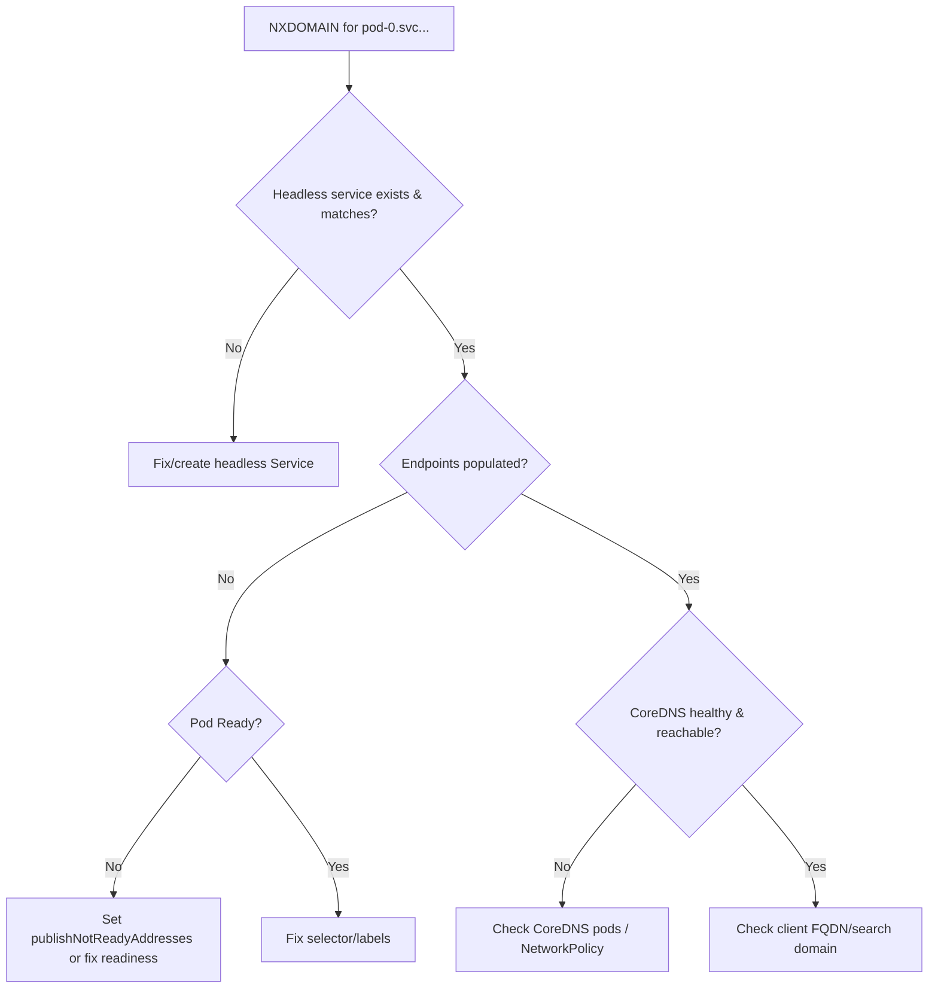

# Stable Pod DNS Not Resolving

> **Severity:** High · **Typical recovery time:** 10–40 min · **Affected versions:** 1.20+

## Error Message

```text
$ nslookup web-0.web.default.svc.cluster.local
Server:    10.96.0.10
Address:   10.96.0.10#53
** server can't find web-0.web.default.svc.cluster.local: NXDOMAIN
```

## Description

StatefulSets give each pod a stable DNS name of the form
`<pod>.<service>.<namespace>.svc.cluster.local`, backed by the headless governing
Service. Clustered apps (databases, message queues, etcd) rely on these names to
discover peers. When they return `NXDOMAIN` or the wrong IP, peer discovery and
replication break even though every pod is `Running`.

During an incident this is a networking problem, not a workload problem: the pods
are healthy but cannot address each other by their stable names. The cause lies in
the Service, the endpoints, CoreDNS, or `publishNotReadyAddresses` behavior.

## Affected Kubernetes Versions

Applies to all supported versions (1.20+). By default a headless Service only
publishes DNS A records for **Ready** pods; `publishNotReadyAddresses: true` (GA
since 1.20, replacing the old annotation) exposes not-ready pods too, which many
clustered apps need during bootstrap. CoreDNS has been the default resolver since
1.13.

## Likely Root Causes

- The headless Service is missing or its name does not match `serviceName`
- The pod is not Ready and `publishNotReadyAddresses` is false, so no A record yet
- Service selector does not match pod labels, so the headless Service has no endpoints
- CoreDNS is unhealthy, or the client uses the wrong FQDN / search domain
- NetworkPolicy blocks DNS (UDP/TCP 53) egress to kube-dns

## Diagnostic Flow



## Verification Steps

Confirm the headless Service exists with matching `serviceName`, that endpoints
list the pod IPs, and that CoreDNS pods are Running. Test resolution from a pod in
the same namespace using the full FQDN.

## kubectl Commands

```bash
kubectl get svc <service> -n <namespace> -o wide
kubectl get endpoints <service> -n <namespace>
kubectl get pods -l app=<name> -n <namespace> -o wide --show-labels
kubectl get pods -n kube-system -l k8s-app=kube-dns
kubectl logs -n kube-system -l k8s-app=kube-dns --tail=50
kubectl describe statefulset <name> -n <namespace>
```

## Expected Output

```text
$ kubectl get endpoints web -n default
NAME   ENDPOINTS                       AGE
web    <none>                          7m      # <-- no Ready pods published

# after fix:
web    10.244.1.5,10.244.2.7,...       8m
```

## Common Fixes

1. Ensure the headless Service exists, is `clusterIP: None`, and its selector
   matches the pod labels so endpoints (and DNS records) populate.
2. For bootstrap clusters that need to see not-ready peers, set
   `publishNotReadyAddresses: true` on the Service.
3. Restore CoreDNS health and allow DNS (port 53) in any NetworkPolicy.
4. Use the correct FQDN; resolution depends on the right namespace and search path.

## Recovery Procedures

1. Fix the Service/selector first — **non-disruptive**; DNS records appear once
   endpoints register.
2. To add `publishNotReadyAddresses`, update the Service — **non-disruptive** to
   pods; only DNS records change.
3. If CoreDNS itself is the problem: **restarting CoreDNS is disruptive cluster-wide
   — blast radius: brief DNS resolution failures for the whole cluster during the
   rollout. Prefer scaling/rolling rather than deleting all replicas at once.**

## Validation

`kubectl get endpoints` lists all pod IPs and `nslookup
pod-0.<svc>.<ns>.svc.cluster.local` from another pod returns the correct address.
The clustered app reports all peers joined.

## Prevention

- Ship the headless Service alongside the StatefulSet and keep labels in sync.
- Set `publishNotReadyAddresses` for apps that discover peers before readiness.
- Monitor CoreDNS and add DNS allow rules to NetworkPolicies by default.

## Related Errors

- [Headless Service Missing](./statefulset-headless-service-missing.md)
- [Pod Identity Lost After Reschedule](./statefulset-identity-lost.md)
- [StatefulSet Stuck on Pod-0](./statefulset-stuck-on-ordinal.md)

## References

- [Stable Network ID](https://kubernetes.io/docs/concepts/workloads/controllers/statefulset/#stable-network-id)
- [DNS for Services and Pods](https://kubernetes.io/docs/concepts/services-networking/dns-pod-service/)
- [Debugging DNS Resolution](https://kubernetes.io/docs/tasks/administer-cluster/dns-debugging-resolution/)

## Further Reading

- [DevOps AI ToolKit — Kubernetes guides](https://devopsaitoolkit.com/blog/)
