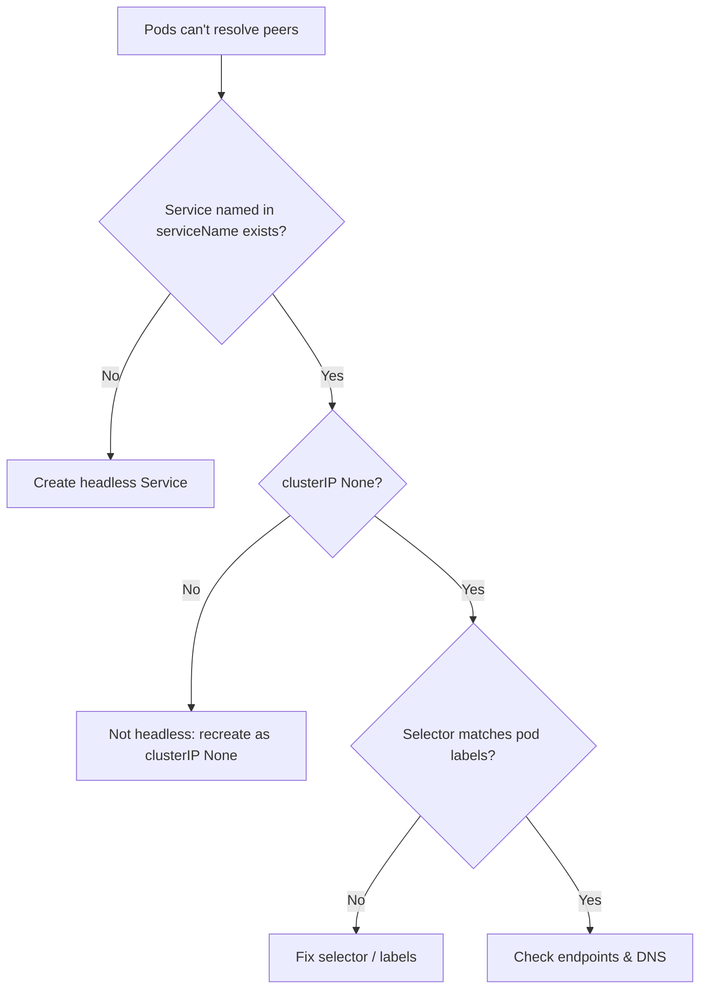

# Headless Service Missing

> **Severity:** High · **Typical recovery time:** 5–15 min · **Affected versions:** 1.20+

## Error Message

```text
StatefulSet requires a headless Service
# in practice you see no governing service and unresolvable pod DNS:
$ nslookup web-0.web.default.svc.cluster.local
** server can't find web-0.web.default.svc.cluster.local: NXDOMAIN
```

## Description

A StatefulSet's `spec.serviceName` names a **headless Service** (one with
`clusterIP: None`) that governs the network domain for the pods. That Service is
what creates the stable per-pod DNS records (`pod-0.svc.namespace.svc.cluster.local`)
the StatefulSet promises. Kubernetes does not auto-create this Service — you must
provide it.

During an incident this shows up as pods that run fine but cannot find each other:
clustering/replication fails because peer DNS names return `NXDOMAIN`. The
StatefulSet itself may still create pods (the API does not hard-fail on a missing
service), but the stable-identity guarantee is broken without it.

## Affected Kubernetes Versions

Applies to all supported versions (1.20+). The requirement for a headless
governing Service has existed since StatefulSets were introduced. The behavior is
unchanged across versions; what varies is whether your validation tooling warns
about the missing Service before apply.

## Likely Root Causes

- The headless Service was never created (only the StatefulSet was applied)
- `spec.serviceName` points to a Service name that does not exist or is misspelled
- The Service exists but is not headless (`clusterIP` is set, not `None`)
- Service selector does not match the StatefulSet pod labels, so no endpoints form

## Diagnostic Flow



## Verification Steps

Confirm a Service with the exact name from `spec.serviceName` exists, that its
`CLUSTER-IP` is `None`, and that its selector matches the pod labels so endpoints
populate.

## kubectl Commands

```bash
kubectl get statefulset <name> -n <namespace> -o jsonpath='{.spec.serviceName}'
kubectl get svc -n <namespace>
kubectl describe svc <service-name> -n <namespace>
kubectl get endpoints <service-name> -n <namespace>
kubectl get pods -l app=<name> -n <namespace> --show-labels
kubectl get events -n <namespace> --sort-by=.lastTimestamp
```

## Expected Output

```text
$ kubectl get svc -n default
# missing entirely, or wrong type:
NAME   TYPE        CLUSTER-IP     EXTERNAL-IP   PORT(S)   AGE
web    ClusterIP   10.96.10.20    <none>        80/TCP    9m   # <-- has an IP, NOT headless

# desired headless service:
web    ClusterIP   None           <none>        80/TCP    9m
```

## Common Fixes

1. Create a headless Service (`clusterIP: None`) whose `metadata.name` exactly
   matches the StatefulSet's `spec.serviceName` and whose selector matches the
   pods.
2. If a non-headless Service is in the way, recreate it with `clusterIP: None`
   (a Service's clusterIP is immutable, so it must be replaced).
3. Align the Service selector with the StatefulSet pod template labels.

## Recovery Procedures

1. Apply the missing headless Service — **non-disruptive**; pods are not restarted
   and DNS records appear within seconds once endpoints register.
2. If you must replace an existing wrong-type Service: **mildly disruptive —
   deleting and recreating the Service briefly removes its DNS/endpoints. Blast
   radius: clients resolving that name see NXDOMAIN for a few seconds. No pod or
   data impact.**
3. No StatefulSet recreation is required; `serviceName` only needs the Service to
   exist with the matching name.

## Validation

`kubectl get svc` shows `CLUSTER-IP None`, `kubectl get endpoints` lists all pod
IPs, and `nslookup pod-0.<svc>.<ns>.svc.cluster.local` from another pod resolves.

## Prevention

- Bundle the headless Service in the same manifest/chart as the StatefulSet.
- Add a CI check that `serviceName` references an existing headless Service.
- Keep Service selector and pod labels in sync via templated values.

## Related Errors

- [Stable Pod DNS Not Resolving](./statefulset-dns-not-resolving.md)
- [StatefulSet Stuck on Pod-0](./statefulset-stuck-on-ordinal.md)
- [Pod Identity Lost After Reschedule](./statefulset-identity-lost.md)

## References

- [Stable Network ID](https://kubernetes.io/docs/concepts/workloads/controllers/statefulset/#stable-network-id)
- [Headless Services](https://kubernetes.io/docs/concepts/services-networking/service/#headless-services)
- [DNS for Services and Pods](https://kubernetes.io/docs/concepts/services-networking/dns-pod-service/)

## Further Reading

- [DevOps AI ToolKit — Kubernetes guides](https://devopsaitoolkit.com/blog/)
