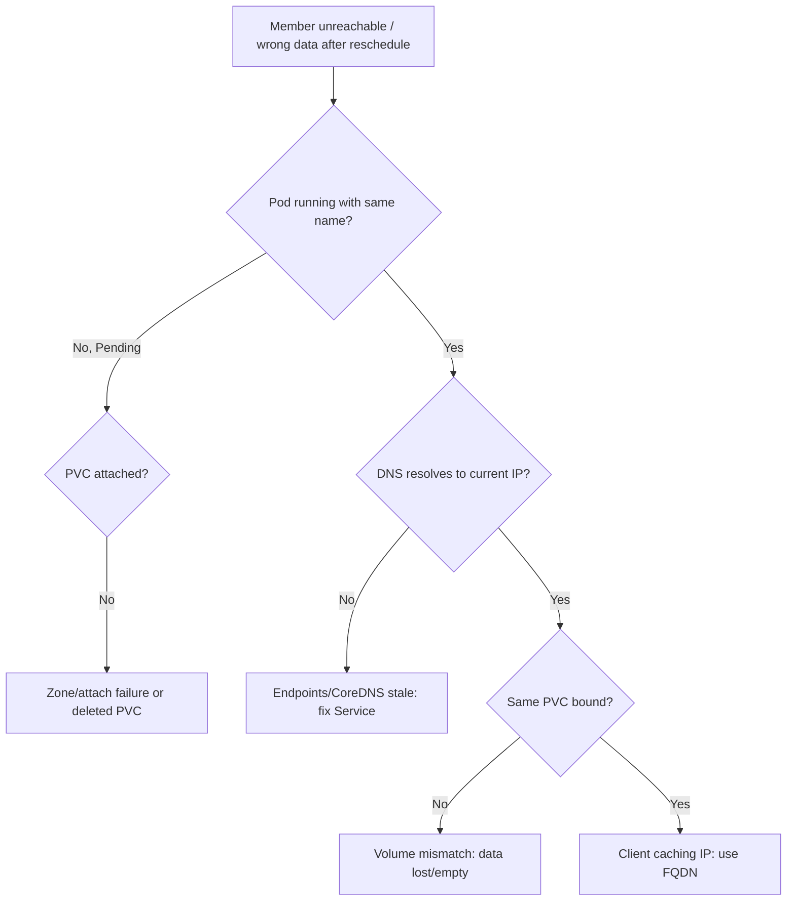

# Pod Identity Lost After Reschedule

> **Severity:** High · **Typical recovery time:** 10–40 min · **Affected versions:** 1.20+

## Error Message

```text
stable network identity changed
# peers can no longer reach the rescheduled member by its stable name,
# or the member came back with a different/empty data volume:
WARN  cluster member redis-2 unreachable at redis-2.redis.default.svc.cluster.local
```

## Description

A StatefulSet promises each pod a **stable identity**: the same ordinal name, the
same DNS record, and the same PVC across reschedules. The pod's IP can change, but
`pod-N`, its hostname, and its bound volume should not. When that contract appears
broken after a node failure or reschedule — peers cannot find the member, or it
returns with the wrong data — something has disrupted one of those stable
attributes.

During an incident this breaks clustered apps that pin membership to stable names
(etcd, Zookeeper, Redis, Cassandra). Usually the identity is intact and the real
problem is DNS/endpoints or a PVC that failed to re-attach in the new zone — but it
manifests as "the node lost its identity."

## Affected Kubernetes Versions

Applies to all supported versions (1.20+). The stable-identity guarantee is
core to StatefulSets in every version. A common modern wrinkle: zone-pinned
volumes (`WaitForFirstConsumer`) mean a pod's PVC can only attach in its original
zone, so a reschedule to another zone leaves the pod Pending rather than truly
"losing" identity.

## Likely Root Causes

- Headless Service/endpoints not updated, so the stable DNS name resolves stale/empty
- PVC could not re-attach in the new node's zone (volume is zone-bound)
- The pod was recreated without its PVC (e.g. PVC deleted), so it came back empty
- Clients cached the old pod IP instead of using the stable FQDN
- A force-delete plus manual recreate broke the ordinal/PVC association

## Diagnostic Flow



## Verification Steps

Confirm the pod still has the same ordinal name, is bound to its original PVC
(`data-<name>-N`), and that its stable FQDN resolves to the pod's current IP via
the headless Service endpoints.

## kubectl Commands

```bash
kubectl get pods -l app=<name> -n <namespace> -o wide
kubectl describe pod <name>-2 -n <namespace>
kubectl get pvc -l app=<name> -n <namespace>
kubectl get endpoints <service> -n <namespace>
kubectl get svc <service> -n <namespace>
kubectl get events -n <namespace> --sort-by=.lastTimestamp
```

## Expected Output

```text
$ kubectl describe pod redis-2 -n default
  Node:           node-zone-b
  Volumes:
    data:
      ClaimName:  data-redis-2          # same PVC re-attached = identity intact
$ kubectl get endpoints redis -n default
NAME    ENDPOINTS                    AGE
redis   10.244.3.9:6379,...          1h    # current IP published for stable name
```

## Common Fixes

1. Restore the headless Service/endpoints so the stable FQDN resolves to the new IP
   (see DNS Not Resolving and Headless Service Missing).
2. If the PVC is zone-bound and the pod rescheduled to another zone, ensure the pod
   can land in the volume's zone (topology/affinity) so it re-attaches.
3. Always address peers by the stable FQDN, never by cached IP.
4. If the pod returned with an empty volume, restore the correct PVC/data from backup.

## Recovery Procedures

1. Verify the PVC/identity binding first — **non-disruptive** inspection.
2. If DNS/endpoints are stale, fixing the Service is **non-disruptive** and
   restores reachability in seconds.
3. If a pod is stuck because its PVC cannot attach in the new zone, allow it to
   reschedule back to the volume's zone. **Deleting the pod to force rescheduling
   is disruptive — blast radius: that single member is briefly offline; for a
   quorum app ensure remaining members maintain quorum first.**
4. If the volume association was truly lost, **data-loss recovery: restore from a
   snapshot/backup; the rescheduled pod will not regenerate the missing data.**

## Validation

The member is reachable at its stable FQDN, bound to its original PVC, and the
clustered app shows full membership with no data divergence.

## Prevention

- Keep the headless Service healthy and use FQDNs, never pod IPs, for peers.
- Use topology-aware volumes and pod anti-affinity that respect volume zones.
- Never force-delete StatefulSet pods/PVCs as a routine recovery step.

## Related Errors

- [Stable Pod DNS Not Resolving](./statefulset-dns-not-resolving.md)
- [Headless Service Missing](./statefulset-headless-service-missing.md)
- [StatefulSet Pod Pending (PVC)](./statefulset-pod-pending-pvc.md)

## References

- [Stable Network ID](https://kubernetes.io/docs/concepts/workloads/controllers/statefulset/#stable-network-id)
- [Stable Storage](https://kubernetes.io/docs/concepts/workloads/controllers/statefulset/#stable-storage)
- [Force delete StatefulSet pods](https://kubernetes.io/docs/tasks/run-application/force-delete-stateful-set-pod/)

## Further Reading

- [DevOps AI ToolKit — Kubernetes guides](https://devopsaitoolkit.com/blog/)
