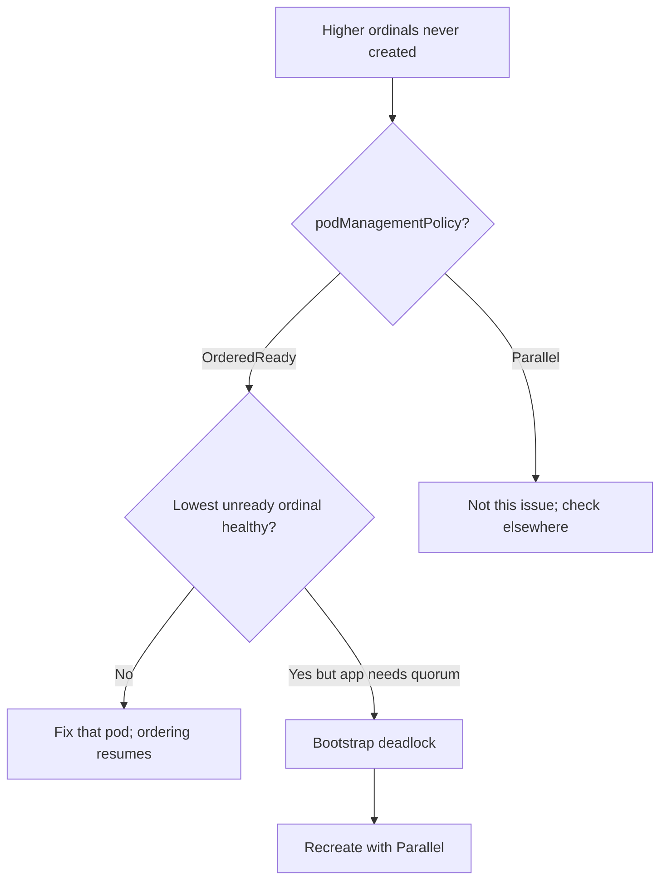

# OrderedReady Blocks Pods

> **Severity:** High · **Typical recovery time:** 10–45 min · **Affected versions:** 1.20+

## Error Message

```text
# all replicas blocked behind one unready ordinal:
$ kubectl get pods -l app=kafka
kafka-0   0/1   Running   0   8m
# kafka-1 and kafka-2 never created because OrderedReady waits for kafka-0 to be Ready
```

## Description

`podManagementPolicy: OrderedReady` (the default) makes the StatefulSet bring up
pods one at a time in ascending order and tear them down in descending order, each
gated on the previous pod's readiness. This guarantees ordered identity but means
a **single** unready pod halts creation of every subsequent pod and stalls scale
operations.

During an incident this is dangerous for apps that need their peers up before any
single node can become Ready — a bootstrap deadlock. The cluster can never form a
quorum because pod-0 waits for peers that OrderedReady refuses to create until
pod-0 is Ready. The answer is usually `Parallel` pod management.

## Affected Kubernetes Versions

Applies to all supported versions (1.20+). `OrderedReady` and `Parallel` have both
existed since StatefulSets GA. `podManagementPolicy` is **immutable** after
creation — you cannot switch an existing StatefulSet from `OrderedReady` to
`Parallel` with `kubectl edit`; it requires recreation.

## Likely Root Causes

- Default `OrderedReady` used for an app that needs peers up simultaneously (quorum)
- One low-ordinal pod is unready (probe, crash, PVC), blocking all higher ordinals
- Slow startup means strictly serial bring-up exceeds acceptable recovery time
- Scale-up/down stalls because an intermediate ordinal is unhealthy

## Diagnostic Flow



## Verification Steps

Confirm `podManagementPolicy` is `OrderedReady`, identify the lowest-ordinal pod
that is not Ready, and check whether the app's design requires peers before any
node can pass readiness (a quorum bootstrap).

## kubectl Commands

```bash
kubectl get statefulset <name> -n <namespace> -o jsonpath='{.spec.podManagementPolicy}'
kubectl get pods -l app=<name> -n <namespace> -o wide
kubectl describe pod <name>-0 -n <namespace>
kubectl logs <name>-0 -n <namespace>
kubectl get events -n <namespace> --sort-by=.lastTimestamp
kubectl describe statefulset <name> -n <namespace>
```

## Expected Output

```text
$ kubectl get statefulset kafka -o jsonpath='{.spec.podManagementPolicy}'
OrderedReady

$ kubectl get pods -l app=kafka
NAME      READY   STATUS    RESTARTS   AGE
kafka-0   0/1     Running   0          8m   # blocks kafka-1, kafka-2
```

## Common Fixes

1. If a single pod is simply unhealthy, fix it — OrderedReady resumes automatically.
2. For quorum apps that deadlock on serial startup, recreate the StatefulSet with
   `podManagementPolicy: Parallel` so all pods start at once.
3. Make readiness probes reflect "process up" rather than "cluster formed" so
   ordered bring-up is not blocked by a chicken-and-egg dependency.

## Recovery Procedures

1. First try to make the blocking pod Ready (probe/PVC/app fix) — **non-disruptive**.
2. To switch to `Parallel`: **Disruptive — `podManagementPolicy` is immutable, so
   delete the StatefulSet with `--cascade=orphan` (pods and PVCs survive), then
   recreate it with `Parallel`. Blast radius: brief loss of controller management;
   no data loss because PVCs are retained, but treat as a maintenance window for
   the cluster.**
3. After recreation, confirm all ordinals start concurrently and the app forms a
   quorum.

## Validation

All replicas reach `1/1 Ready`, `kubectl get statefulset` shows full readiness,
and the clustered app reports a healthy quorum/membership.

## Prevention

- Choose `Parallel` at creation time for quorum-forming systems.
- Keep readiness semantics independent of full-cluster formation where possible.
- Alert when ready replicas stay below desired for longer than the start budget.

## Related Errors

- [StatefulSet Stuck on Pod-0](./statefulset-stuck-on-ordinal.md)
- [Partition Rollout Not Progressing](./statefulset-partition-rollout.md)
- [Stable Pod DNS Not Resolving](./statefulset-dns-not-resolving.md)

## References

- [Pod management policies](https://kubernetes.io/docs/concepts/workloads/controllers/statefulset/#pod-management-policies)
- [Deployment and scaling guarantees](https://kubernetes.io/docs/concepts/workloads/controllers/statefulset/#deployment-and-scaling-guarantees)
- [StatefulSet limitations](https://kubernetes.io/docs/concepts/workloads/controllers/statefulset/#limitations)

## Further Reading

- [DevOps AI ToolKit — Kubernetes guides](https://devopsaitoolkit.com/blog/)
