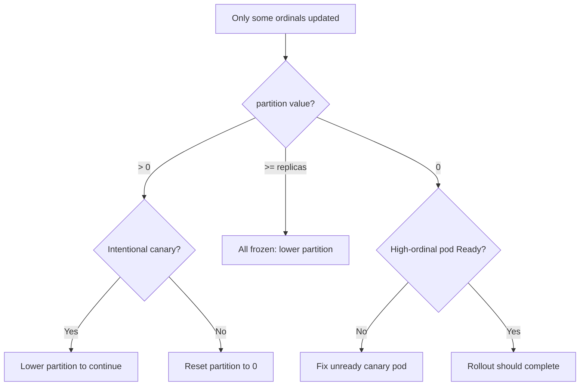

# Partition Rollout Not Progressing

> **Severity:** Medium · **Typical recovery time:** 5–20 min · **Affected versions:** 1.20+

## Error Message

```text
# new template applied but only the highest ordinals update:
$ kubectl rollout status statefulset/web
Waiting for partitioned roll out to finish: 1 out of 3 new pods have been updated...
# updateStrategy: { rollingUpdate: { partition: 2 } } leaves web-0 and web-1 on the old revision
```

## Description

A StatefulSet with `updateStrategy.type: RollingUpdate` and a `rollingUpdate.partition`
value only updates pods whose **ordinal is greater than or equal to** the
partition. Pods below the partition keep the old template revision on purpose —
this is the canary/staged-rollout mechanism. If the partition is set higher than
intended, the rollout appears "stuck" because lower-ordinal pods never change.

During an incident this is often a misread rather than a fault: the controller is
behaving exactly as configured. The fix is to lower the `partition` toward 0 as
each canary tier is validated. A partition equal to the replica count freezes all
pods.

## Affected Kubernetes Versions

Applies to all supported versions (1.20+). `RollingUpdate` with `partition` has
been GA since StatefulSets matured. 1.24+ added `maxUnavailable` for StatefulSet
RollingUpdate (alpha, behind a feature gate; beta/GA in later releases), which can
interact with partition behavior on newer clusters.

## Likely Root Causes

- `partition` is set higher than 0 (intentional staging, mistaken as "stuck")
- `partition` equals or exceeds `replicas`, freezing the whole set
- Operator forgot to step the partition down after validating the canary
- A canaried high-ordinal pod is not Ready, so the rollout pauses there

## Diagnostic Flow



## Verification Steps

Read the live `updateStrategy.rollingUpdate.partition` and compare each pod's
`controller-revision-hash` label against the StatefulSet's `updateRevision`. Pods
below the partition will show the old hash by design.

## kubectl Commands

```bash
kubectl get statefulset <name> -n <namespace> -o jsonpath='{.spec.updateStrategy}'
kubectl rollout status statefulset/<name> -n <namespace>
kubectl get statefulset <name> -n <namespace> -o jsonpath='{.status.updateRevision} {.status.currentRevision}'
kubectl get pods -l app=<name> -n <namespace> -L controller-revision-hash
kubectl describe statefulset <name> -n <namespace>
kubectl rollout history statefulset/<name> -n <namespace>
```

## Expected Output

```text
$ kubectl get pods -L controller-revision-hash
NAME    READY   STATUS    REVISION
web-0   1/1     Running   web-6b4c (old)
web-1   1/1     Running   web-6b4c (old)
web-2   1/1     Running   web-7f9d (new)   # only ordinal >= partition(2) updated
```

## Common Fixes

1. Confirm the intended `partition`; to continue the rollout, lower it (e.g. from
   2 to 1 to 0) as each tier passes validation.
2. To update everything at once, set `partition: 0` (or remove it).
3. If a canaried high-ordinal pod is not Ready, fix that pod so the staged rollout
   can proceed.

## Recovery Procedures

1. Decide the rollout strategy, then step the partition down. **Each decrement is
   a rolling update of the newly-included ordinals — disruptive per pod: the
   affected pod is terminated and recreated. Blast radius: the specific replicas
   crossing the partition; for a single-primary datastore, schedule around the
   primary's ordinal.**
2. To abort a bad rollout, set the template back to the previous revision (or use
   `rollout undo`) and the included ordinals roll back.
3. Validate each tier (Ready + app health) before lowering the partition further.

## Validation

`kubectl rollout status` reports the rollout complete, `currentRevision` equals
`updateRevision`, and all pods share the new `controller-revision-hash`.

## Prevention

- Document the partition stepping plan in the rollout runbook.
- Use a small canary partition first, validate, then proceed to 0.
- Alert if `partition` stays above 0 longer than a defined rollout window.

## Related Errors

- [StatefulSet Stuck on Pod-0](./statefulset-stuck-on-ordinal.md)
- [OrderedReady Blocks Pods](./statefulset-orderedready-blocked.md)
- [StatefulSet Update Forbidden](./statefulset-update-forbidden.md)

## References

- [Rolling updates and partitions](https://kubernetes.io/docs/concepts/workloads/controllers/statefulset/#partitions)
- [Update strategies](https://kubernetes.io/docs/concepts/workloads/controllers/statefulset/#update-strategies)
- [StatefulSet rolling update tutorial](https://kubernetes.io/docs/tutorials/stateful-application/basic-stateful-set/#rolling-update)

## Further Reading

- [DevOps AI ToolKit — Kubernetes guides](https://devopsaitoolkit.com/blog/)
