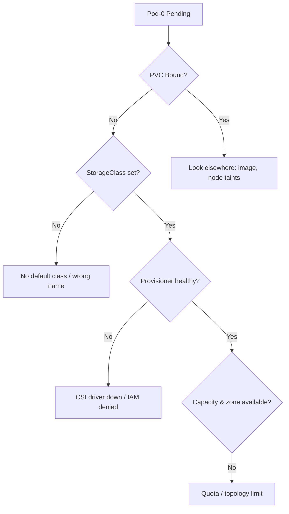

# StatefulSet Pod Pending (PVC)

> **Severity:** High · **Typical recovery time:** 10–45 min · **Affected versions:** 1.20+

## Error Message

```text
Warning  FailedScheduling  12s  default-scheduler  0/3 nodes are available: pod has unbound immediate PersistentVolumeClaims. preemption: 0/3 nodes are available.
```

## Description

A StatefulSet pod is stuck in `Pending` because the PersistentVolumeClaim
generated from its `volumeClaimTemplates` has not been bound to a
PersistentVolume. The scheduler will not place a pod that references an unbound
"immediate" PVC, so `pod-0` (and every later ordinal) waits indefinitely.

During an incident this is the classic "my database StatefulSet won't start"
symptom. The pod is healthy in every other respect — the blocker is entirely in
the storage layer: no matching PV exists, the StorageClass cannot provision one,
or the requested capacity/zone cannot be satisfied.

## Affected Kubernetes Versions

Applies to all supported versions (1.20+). The wording differs slightly between
`volumeBindingMode: Immediate` (you see "unbound immediate PersistentVolumeClaims")
and `WaitForFirstConsumer` (the PVC stays `Pending` with provisioning events
instead). `WaitForFirstConsumer` has been the recommended default for topology-aware
provisioning since 1.12 and is standard on managed clusters today.

## Likely Root Causes

- No StorageClass is set as default and the PVC requested none
- The named StorageClass does not exist or its provisioner is broken/uninstalled
- The CSI driver / provisioner pod is down or lacks cloud IAM permissions
- Requested size or accessMode (e.g. `ReadWriteMany`) is unsupported by the class
- Topology mismatch — no node in the PV's zone has schedulable capacity

## Diagnostic Flow



## Verification Steps

Confirm the pod event reads `unbound immediate PersistentVolumeClaims` and that
the matching PVC `STATUS` is `Pending`, not `Bound`. Check the PVC's events for
provisioning errors and confirm a usable StorageClass exists.

## kubectl Commands

```bash
kubectl get pods -n <namespace> -o wide
kubectl describe pod <statefulset>-0 -n <namespace>
kubectl get pvc -n <namespace>
kubectl describe pvc <statefulset>-<statefulset>-0 -n <namespace>
kubectl get storageclass
kubectl get events -n <namespace> --sort-by=.lastTimestamp
kubectl describe pv
```

## Expected Output

```text
NAME           READY   STATUS    RESTARTS   AGE
postgres-0     0/1     Pending   0          3m

# kubectl get pvc
NAME                  STATUS    VOLUME   CAPACITY   ACCESS MODES   STORAGECLASS   AGE
data-postgres-0       Pending                                      fast-ssd       3m

# describe pvc excerpt
Events:
  Warning  ProvisioningFailed  ...  no storage class is set / class "fast-ssd" not found
```

## Common Fixes

1. Create or mark a default StorageClass, or set `storageClassName` in the
   template to an existing class, then recreate the StatefulSet.
2. Restore the provisioner/CSI driver (it must be Running) and fix its cloud IAM
   permissions so dynamic provisioning succeeds.
3. Reduce the requested size or pick a supported `accessMode` for the class.
4. If using static PVs, create a PV that matches the claim's size, class, and zone.

## Recovery Procedures

1. Fix the storage prerequisite (class, provisioner, or PV) — this is
   non-disruptive on its own.
2. Because `volumeClaimTemplates` are immutable, you usually must recreate the
   StatefulSet to change `storageClassName`. **Disruptive: deleting the
   StatefulSet with `--cascade=orphan` keeps pods/PVCs alive; a full delete and
   recreate restarts the workload. Blast radius: the entire StatefulSet. No data
   loss as long as the PVCs are retained, but a full quorum loss for clustered
   apps during the gap.**
3. Once a class/PV is available, the PVC binds and the scheduler places `pod-0`
   automatically — no manual pod deletion needed.

## Validation

`kubectl get pvc` shows `Bound`, the pod moves to `Running`, and ordinals
progress in order. Confirm the volume is mounted with `kubectl describe pod`.

## Prevention

- Always set a cluster default StorageClass and reference an explicit class in
  templates.
- Monitor CSI driver health and cloud quota; alert on `ProvisioningFailed`.
- Use `WaitForFirstConsumer` so volumes provision in the pod's chosen zone.

## Related Errors

- [volumeClaimTemplates Immutable](./statefulset-volumeclaimtemplate-immutable.md)
- [PVC Resize Pending](./statefulset-pvc-resize-pending.md)
- [StatefulSet Stuck on Pod-0](./statefulset-stuck-on-ordinal.md)

## References

- [StatefulSet basics](https://kubernetes.io/docs/concepts/workloads/controllers/statefulset/)
- [Persistent Volumes](https://kubernetes.io/docs/concepts/storage/persistent-volumes/)
- [Storage Classes](https://kubernetes.io/docs/concepts/storage/storage-classes/)

## Further Reading

- [DevOps AI ToolKit — Kubernetes guides](https://devopsaitoolkit.com/blog/)
