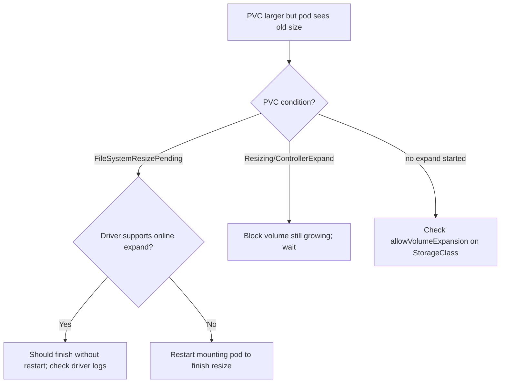

# PVC Resize Pending

> **Severity:** Medium · **Typical recovery time:** 10–30 min · **Affected versions:** 1.24+

## Error Message

```text
Waiting for user to (re-)start a pod to finish file system resize of volume on node.
# PVC condition:
  type: FileSystemResizePending
  status: "True"
  message: Waiting for user to (re-)start a pod to finish file system resize of volume on node.
```

## Description

When you expand a PersistentVolumeClaim, the CSI driver grows the underlying block
volume (the control-plane "ControllerExpand"). For many filesystems the on-node
filesystem still needs to be grown to use the new space, which the kubelet does
during a pod mount. Until the pod that mounts the PVC restarts (or the driver
supports online expansion), the PVC sits in `FileSystemResizePending` and the
extra capacity is not yet usable.

During an incident this is the "I expanded the disk but the database still says
it's full" symptom. The cloud volume is already bigger; only the filesystem resize
is outstanding, and it completes on the next mount.

## Affected Kubernetes Versions

Applies to 1.24+. Offline expansion (requiring a pod restart) is the classic path.
Online/in-use volume expansion graduated to GA in 1.24, so on supported CSI drivers
the filesystem grows without a restart. Whether you see `FileSystemResizePending`
depends on the driver and Kubernetes version; older/unsupported drivers always need
the restart. `allowVolumeExpansion: true` must be set on the StorageClass.

## Likely Root Causes

- Offline-only CSI driver: filesystem resize needs the mounting pod to restart
- Online expansion unsupported on this driver/version, so it waits for remount
- StorageClass lacks `allowVolumeExpansion`, so the requested grow never starts
- Expansion requested by editing the immutable template instead of the PVC

## Diagnostic Flow



## Verification Steps

Confirm the PVC's `status.capacity` versus `spec.resources.requests.storage` and
check for the `FileSystemResizePending` condition. Confirm the StorageClass has
`allowVolumeExpansion: true`.

## kubectl Commands

```bash
kubectl get pvc data-<name>-0 -n <namespace>
kubectl describe pvc data-<name>-0 -n <namespace>
kubectl get pvc data-<name>-0 -n <namespace> -o jsonpath='{.status.conditions}'
kubectl get storageclass <class> -o jsonpath='{.allowVolumeExpansion}'
kubectl get pods -l app=<name> -n <namespace> -o wide
kubectl get events -n <namespace> --sort-by=.lastTimestamp
```

## Expected Output

```text
$ kubectl get pvc data-postgres-0 -n db
NAME              STATUS   VOLUME    CAPACITY   ACCESS MODES   STORAGECLASS   AGE
data-postgres-0   Bound    pvc-a1b2  10Gi       RWO            fast-ssd       3h
# spec requests 20Gi but capacity still 10Gi

# describe excerpt
Conditions:
  Type                      Status
  FileSystemResizePending   True
  Message: Waiting for user to (re-)start a pod to finish file system resize...
```

## Common Fixes

1. On offline drivers, restart the pod that mounts the PVC so the kubelet grows the
   filesystem on mount.
2. On online-capable drivers, simply wait — the filesystem resize completes without
   a restart; check CSI node/controller logs if it stalls.
3. If no expansion started, set `allowVolumeExpansion: true` on the StorageClass,
   then increase the PVC request (not the immutable template).

## Recovery Procedures

1. Verify the block volume already grew (cloud console / PVC `status.capacity`
   progressing) — inspection is **non-disruptive**.
2. For offline drivers, restart the mounting pod to finish the resize.
   **Disruptive: the pod is terminated and recreated, briefly taking that ordinal
   offline. Blast radius: a single replica; for a single-instance datastore this is
   downtime. No data loss — the volume and its data are preserved across the
   restart.**
3. For a StatefulSet, restart the affected ordinal(s) one at a time, lowest-impact
   first, confirming readiness between each.

## Validation

`kubectl get pvc` shows `CAPACITY` equal to the requested size, the
`FileSystemResizePending` condition clears, and the application reports the new
free space (e.g. `df -h` inside the container).

## Prevention

- Enable `allowVolumeExpansion` on StorageClasses used by StatefulSets.
- Prefer CSI drivers that support online expansion to avoid restarts.
- Resize PVCs directly; never try to edit the immutable `volumeClaimTemplates`.

## Related Errors

- [volumeClaimTemplates Immutable](./statefulset-volumeclaimtemplate-immutable.md)
- [StatefulSet Pod Pending (PVC)](./statefulset-pod-pending-pvc.md)
- [StatefulSet Update Forbidden](./statefulset-update-forbidden.md)

## References

- [Expanding Persistent Volumes Claims](https://kubernetes.io/docs/concepts/storage/persistent-volumes/#expanding-persistent-volumes-claims)
- [Storage Classes: allowVolumeExpansion](https://kubernetes.io/docs/concepts/storage/storage-classes/#allow-volume-expansion)
- [Resizing an in-use PersistentVolumeClaim](https://kubernetes.io/docs/concepts/storage/persistent-volumes/#resizing-an-in-use-persistentvolumeclaim)

## Further Reading

- [DevOps AI ToolKit — Kubernetes guides](https://devopsaitoolkit.com/blog/)
