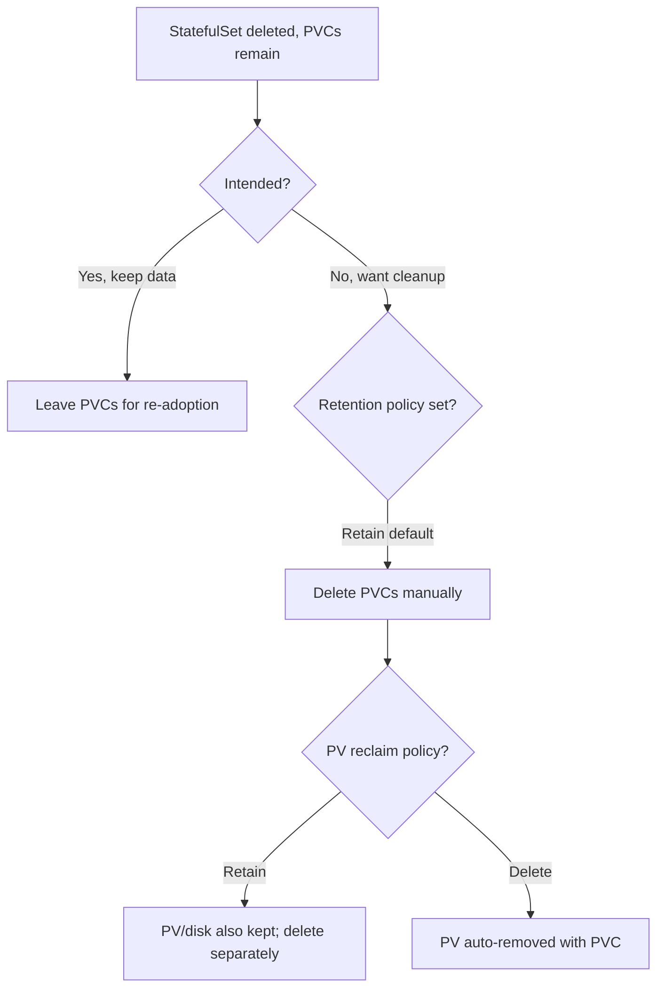

# PVCs Retained After Delete

> **Severity:** Medium · **Typical recovery time:** 5–20 min · **Affected versions:** 1.23+

## Error Message

```text
PVCs not deleted after StatefulSet removal
# observed:
$ kubectl delete statefulset postgres
statefulset.apps "postgres" deleted
$ kubectl get pvc
data-postgres-0   Bound   pvc-...   10Gi   RWO   fast-ssd   42m
data-postgres-1   Bound   pvc-...   10Gi   RWO   fast-ssd   41m
```

## Description

By default, deleting a StatefulSet does **not** delete the PersistentVolumeClaims
created from its `volumeClaimTemplates`. This is intentional and protective: it
prevents accidental data loss so you can recreate the StatefulSet and re-adopt the
same volumes. The leftover PVCs (and their PVs, if the reclaim policy is `Retain`)
stay until you remove them explicitly.

During an incident or cleanup this is usually a non-event, but it surprises
operators who expected `kubectl delete statefulset` to be a full teardown. It can
also leave orphaned storage that accrues cloud cost or blocks namespace deletion.

## Affected Kubernetes Versions

Retention is the historical default in all versions. 1.23 added the
`persistentVolumeClaimRetentionPolicy` field (alpha), which graduated to GA in
1.27. It lets you opt into deleting PVCs `whenDeleted` and/or `whenScaled`. Before
1.23 there is no built-in auto-cleanup — PVCs must always be removed manually.

## Likely Root Causes

- Default behavior: StatefulSet deletion never cascades to PVCs
- `persistentVolumeClaimRetentionPolicy` left at the default `Retain`
- PV reclaim policy is `Retain`, so even deleting the PVC keeps the PV/disk
- A finalizer or in-use mount keeps a PVC `Terminating` rather than gone

## Diagnostic Flow



## Verification Steps

Confirm the StatefulSet is gone but PVCs named `data-<name>-N` remain `Bound`.
Check the StatefulSet's `persistentVolumeClaimRetentionPolicy` (if it still
exists in git) and each PV's `RECLAIM POLICY`.

## kubectl Commands

```bash
kubectl get statefulset -n <namespace>
kubectl get pvc -l app=<name> -n <namespace>
kubectl describe pvc data-<name>-0 -n <namespace>
kubectl get pv
kubectl get pv <pv-name> -o jsonpath='{.spec.persistentVolumeReclaimPolicy}'
kubectl get events -n <namespace> --sort-by=.lastTimestamp
```

## Expected Output

```text
$ kubectl get pvc -l app=postgres -n db
NAME              STATUS   VOLUME      CAPACITY   ACCESS MODES   STORAGECLASS   AGE
data-postgres-0   Bound    pvc-a1b2    10Gi       RWO            fast-ssd       42m
data-postgres-1   Bound    pvc-c3d4    10Gi       RWO            fast-ssd       41m
```

## Common Fixes

1. If you want the data, leave the PVCs — recreating the StatefulSet with the same
   name re-adopts them automatically.
2. If you want a full teardown, delete the PVCs explicitly after the StatefulSet.
3. Set `persistentVolumeClaimRetentionPolicy.whenDeleted: Delete` (1.27+) so
   future deletions clean up PVCs automatically.

## Recovery Procedures

1. Decide first whether the data is needed — this is the irreversible decision.
2. To reclaim space: **Disruptive / data-loss: deleting the retained PVCs
   permanently destroys the volume contents (and the underlying disk if the PV
   reclaim policy is `Delete`). Blast radius: every ordinal's data is gone and
   cannot be recovered without a backup. Snapshot or back up first.**
3. If a PVC is stuck `Terminating`, identify the holding pod/finalizer before
   removing it rather than force-deleting blindly.
4. With reclaim policy `Retain`, remember to delete the released PV/cloud disk
   separately to actually stop the cost.

## Validation

`kubectl get pvc` and `kubectl get pv` return no leftover objects for the deleted
StatefulSet, and the cloud console shows the disks released or removed as intended.

## Prevention

- Set `persistentVolumeClaimRetentionPolicy` explicitly to match your intent.
- Take a volume snapshot before any deletion of stateful data.
- Add a cleanup checklist (PVC + PV + cloud disk) to teardown runbooks.

## Related Errors

- [Scale Down Data Loss Risk](./statefulset-scale-down-data-loss.md)
- [StatefulSet Pod Pending (PVC)](./statefulset-pod-pending-pvc.md)
- [volumeClaimTemplates Immutable](./statefulset-volumeclaimtemplate-immutable.md)

## References

- [PersistentVolumeClaim retention](https://kubernetes.io/docs/concepts/workloads/controllers/statefulset/#persistentvolumeclaim-retention)
- [Reclaiming Persistent Volumes](https://kubernetes.io/docs/concepts/storage/persistent-volumes/#reclaiming)
- [Delete a StatefulSet](https://kubernetes.io/docs/tasks/run-application/delete-stateful-set/)

## Further Reading

- [DevOps AI ToolKit — Kubernetes guides](https://devopsaitoolkit.com/blog/)
