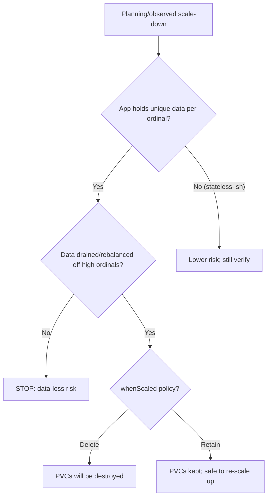

# Scale Down Data Loss Risk

> **Severity:** Critical · **Typical recovery time:** 15–60 min · **Affected versions:** 1.20+

## Error Message

```text
scaling down StatefulSet may orphan data
# scaling from 5 to 3 removes the highest ordinals; their data is no longer served:
$ kubectl scale statefulset cassandra --replicas=3
# cassandra-4 and cassandra-3 terminated; PVCs data-cassandra-3/-4 left behind (or deleted by retention policy)
```

## Description

Scaling a StatefulSet down removes the **highest-ordinal** pods first
(`pod-N`, then `pod-N-1`, …). The data on those pods' PVCs is no longer served by
a running replica. For sharded or quorum datastores this can mean the shards that
lived on the removed ordinals become unavailable, and if you have not rebalanced or
backed up, the data is effectively orphaned.

During an incident this is one of the highest-risk operations in Kubernetes. Even
though PVCs are retained by default, the data is not automatically migrated, and a
`persistentVolumeClaimRetentionPolicy.whenScaled: Delete` will actively destroy
those volumes. Treat every StatefulSet scale-down as a data-handling decision, not
a routine capacity change.

## Affected Kubernetes Versions

Applies to all supported versions (1.20+). Default behavior retains the
scaled-down PVCs. 1.27+ (GA `persistentVolumeClaimRetentionPolicy`) adds a
`whenScaled` option — setting it to `Delete` makes scale-down **immediately and
permanently** remove the orphaned PVCs, removing the safety net.

## Likely Root Causes

- Reducing `replicas` on a sharded/quorum datastore without rebalancing first
- `persistentVolumeClaimRetentionPolicy.whenScaled: Delete` deleting data on scale-down
- Assuming Kubernetes migrates data between ordinals (it does not)
- Autoscaler or GitOps lowering replicas unexpectedly

## Diagnostic Flow



## Verification Steps

Before scaling, confirm whether each ordinal holds unique data, check the
`persistentVolumeClaimRetentionPolicy`, and verify that a current backup or
snapshot exists for the ordinals about to be removed.

## kubectl Commands

```bash
kubectl get statefulset <name> -n <namespace> -o jsonpath='{.spec.replicas} {.spec.persistentVolumeClaimRetentionPolicy}'
kubectl get pods -l app=<name> -n <namespace> -o wide
kubectl get pvc -l app=<name> -n <namespace>
kubectl describe statefulset <name> -n <namespace>
kubectl get volumesnapshot -n <namespace>
kubectl get events -n <namespace> --sort-by=.lastTimestamp
```

## Expected Output

```text
$ kubectl get statefulset cassandra -o jsonpath='{.spec.persistentVolumeClaimRetentionPolicy}'
{"whenDeleted":"Retain","whenScaled":"Delete"}   # <-- scale-down WILL delete PVCs

$ kubectl get pvc -l app=cassandra
data-cassandra-0 ... Bound
data-cassandra-3 ... Bound   # about to be removed
data-cassandra-4 ... Bound   # about to be removed
```

## Common Fixes

1. Drain/rebalance data off the highest ordinals (app-level decommission) **before**
   reducing replicas.
2. Set `persistentVolumeClaimRetentionPolicy.whenScaled: Retain` so PVCs survive a
   scale-down and can be re-attached by scaling back up.
3. Take a volume snapshot or application backup of the affected ordinals first.

## Recovery Procedures

1. **Before scaling: data-loss prevention.** Rebalance shards/replicas off the
   target ordinals and confirm the cluster reports the data safe elsewhere.
2. Scale down only after the above. **Disruptive / potential data loss: removing
   ordinals stops serving their data; with `whenScaled: Delete` the PVCs are
   destroyed permanently. Blast radius: the removed ordinals' data and any shards
   that lived only there. Irreversible without a backup.**
3. To recover from an accidental scale-down where PVCs were **retained**, scale
   back up to the original count — pods re-adopt the same PVCs by name and the data
   returns. If PVCs were **deleted**, restore from snapshot/backup.

## Validation

Cluster membership and shard ownership are healthy at the new size, no
under-replicated/missing data is reported, and retained PVCs are either re-adopted
(if scaled back) or intentionally cleaned up.

## Prevention

- Default `whenScaled: Retain` for any StatefulSet holding real data.
- Require a backup/snapshot gate in the scale-down runbook.
- Disable autoscaling of stateful data tiers, or guard it with rebalance hooks.

## Related Errors

- [PVCs Retained After Delete](./statefulset-pvc-retained.md)
- [StatefulSet Pod Pending (PVC)](./statefulset-pod-pending-pvc.md)
- [Pod Identity Lost After Reschedule](./statefulset-identity-lost.md)

## References

- [Scaling guarantees](https://kubernetes.io/docs/concepts/workloads/controllers/statefulset/#deployment-and-scaling-guarantees)
- [PersistentVolumeClaim retention](https://kubernetes.io/docs/concepts/workloads/controllers/statefulset/#persistentvolumeclaim-retention)
- [Volume Snapshots](https://kubernetes.io/docs/concepts/storage/volume-snapshots/)

## Further Reading

- [DevOps AI ToolKit — Kubernetes guides](https://devopsaitoolkit.com/blog/)
