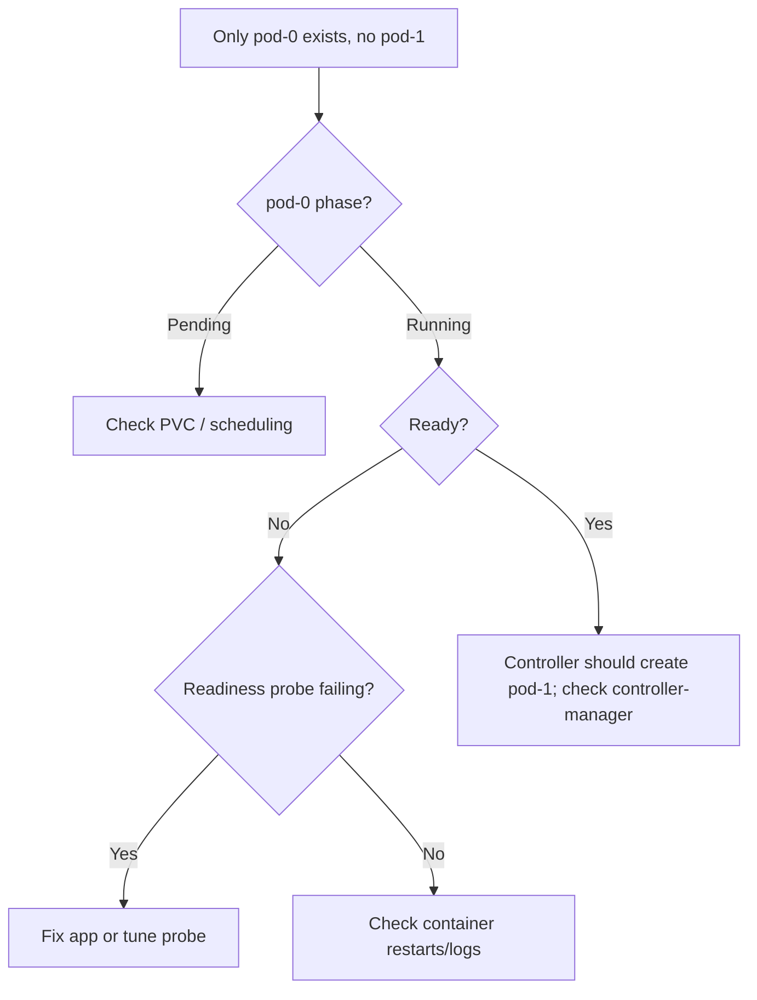

# StatefulSet Stuck on Pod-0

> **Severity:** High · **Typical recovery time:** 10–60 min · **Affected versions:** 1.20+

## Error Message

```text
statefulset.apps/web 1/3 ready; pod web-0 is not Ready, controller is waiting before creating web-1
```

## Description

With the default `podManagementPolicy: OrderedReady`, a StatefulSet creates and
starts pods strictly in order: `pod-0` must be Running **and** Ready before the
controller creates `pod-1`, and so on. If `pod-0` never becomes Ready, the entire
StatefulSet stalls — no higher ordinal is ever created.

During an incident this looks like "my 3-replica StatefulSet only ever shows one
pod." The root cause is almost always whatever is keeping `pod-0` from passing its
readiness probe: a failing app, an unbound volume, a bad config, or a probe that is
too strict. Fixing `pod-0` unblocks the rest automatically.

## Affected Kubernetes Versions

Applies to all supported versions (1.20+). `OrderedReady` has been the default
since StatefulSets went GA in 1.9. The alternative `Parallel` policy (also
long-available) removes the ordering constraint but cannot be changed in place —
it is set at creation time.

## Likely Root Causes

- `pod-0`'s readiness probe is failing (app not healthy, wrong port/path)
- `pod-0`'s PVC is unbound, so the pod is Pending and never becomes Ready
- The container is in CrashLoopBackOff or ImagePullBackOff
- App needs a peer/quorum that does not exist yet — a bootstrap deadlock
- Readiness probe `initialDelaySeconds` too short for a slow-starting datastore

## Diagnostic Flow



## Verification Steps

Confirm `kubectl get statefulset` shows `READY` < desired, that only `pod-0`
exists, and that `pod-0` is `0/1`. Inspect the readiness probe result and last
state in `kubectl describe pod`.

## kubectl Commands

```bash
kubectl get statefulset <name> -n <namespace>
kubectl get pods -l app=<name> -n <namespace> -o wide
kubectl describe pod <name>-0 -n <namespace>
kubectl logs <name>-0 -n <namespace>
kubectl get events -n <namespace> --sort-by=.lastTimestamp
kubectl get pvc -n <namespace>
```

## Expected Output

```text
NAME   READY   AGE
web    1/3     6m

NAME    READY   STATUS    RESTARTS   AGE
web-0   0/1     Running   0          6m

# describe excerpt
  Warning  Unhealthy  ...  Readiness probe failed: HTTP probe failed with statuscode: 503
```

## Common Fixes

1. Fix whatever is failing `pod-0`'s readiness probe — most often the app itself,
   a missing dependency, or a wrong probe path/port.
2. If `pod-0` is Pending on storage, resolve the PVC binding (see PVC Pending).
3. Tune the readiness probe (`initialDelaySeconds`, `failureThreshold`) for
   slow-starting datastores.
4. For clustered apps with a bootstrap chicken-and-egg, use `Parallel`
   podManagementPolicy on a freshly created StatefulSet.

## Recovery Procedures

1. Diagnose and fix `pod-0` first — the ordering will then resume on its own.
2. If a config change is needed, update the StatefulSet spec; the controller
   recreates `pod-0`. **Disruptive: pod-0 is restarted. Blast radius: a single
   replica, but for a single-replica datastore this is full downtime.**
3. To switch to `Parallel`, you must delete and recreate the StatefulSet.
   **Disruptive: full StatefulSet recreation. Blast radius: all replicas. Use
   `--cascade=orphan` to preserve PVCs and avoid data loss.**

## Validation

`kubectl get statefulset` shows `READY` matching desired replicas, all ordinals
are `Running` and `1/1`, and pods were created in order `0,1,2`.

## Prevention

- Keep readiness probes accurate and generous enough for cold starts.
- Use `Parallel` for apps that do not need strict start ordering.
- Alert when a StatefulSet's ready replicas stay below desired for several minutes.

## Related Errors

- [OrderedReady Blocks Pods](./statefulset-orderedready-blocked.md)
- [StatefulSet Pod Pending (PVC)](./statefulset-pod-pending-pvc.md)
- [Partition Rollout Not Progressing](./statefulset-partition-rollout.md)

## References

- [StatefulSet deployment and scaling guarantees](https://kubernetes.io/docs/concepts/workloads/controllers/statefulset/#deployment-and-scaling-guarantees)
- [Pod management policies](https://kubernetes.io/docs/concepts/workloads/controllers/statefulset/#pod-management-policies)
- [Configure liveness, readiness and startup probes](https://kubernetes.io/docs/tasks/configure-pod-container/configure-liveness-readiness-startup-probes/)

## Further Reading

- [DevOps AI ToolKit — Kubernetes guides](https://devopsaitoolkit.com/blog/)
