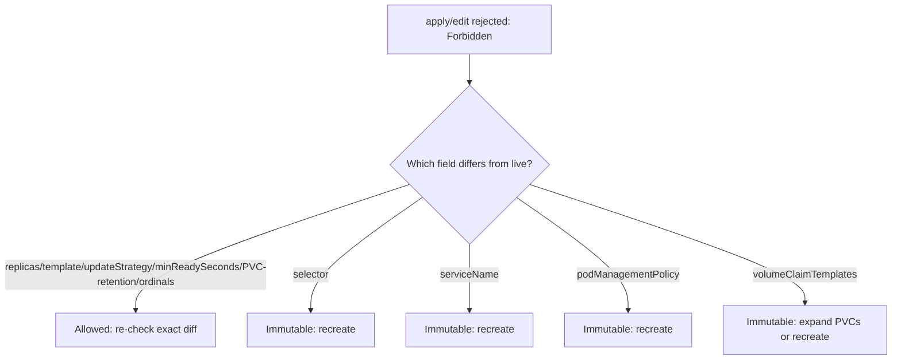

# StatefulSet Update Forbidden

> **Severity:** Medium · **Typical recovery time:** 15–45 min · **Affected versions:** 1.20+

## Error Message

```text
The StatefulSet "web" is invalid: spec: Forbidden: updates to statefulset spec for fields other than 'replicas', 'ordinals', 'template', 'updateStrategy', 'persistentVolumeClaimRetentionPolicy' and 'minReadySeconds' are forbidden
```

## Description

A StatefulSet only allows in-place updates to a small set of fields:
`replicas`, `ordinals`, `template`, `updateStrategy`,
`persistentVolumeClaimRetentionPolicy`, and `minReadySeconds`. Any attempt to
change other fields — most commonly `selector`, `serviceName`, `podManagementPolicy`,
or `volumeClaimTemplates` — is rejected by the API server with this `Forbidden`
validation error.

During an incident or routine change this blocks `kubectl apply`/`edit` and, in
GitOps, causes repeated failed syncs. The constraint exists because these fields
define the StatefulSet's stable identity and storage contract; changing them on a
live object would invalidate existing pods and PVCs.

## Affected Kubernetes Versions

Applies to all supported versions (1.20+). The list of mutable fields has expanded
over releases: `minReadySeconds` (1.25), `persistentVolumeClaimRetentionPolicy`
(GA 1.27), and `ordinals` (1.27+). On older clusters the error names fewer allowed
fields, so the exact message differs — but `selector`, `serviceName`, and
`podManagementPolicy` are immutable everywhere.

## Likely Root Causes

- Editing `selector` or `template.metadata.labels` so the selector no longer matches
- Changing `serviceName` (the governing headless Service name)
- Switching `podManagementPolicy` between `OrderedReady` and `Parallel`
- Modifying `volumeClaimTemplates`
- A GitOps controller looping on an immutable diff it cannot apply

## Diagnostic Flow



## Verification Steps

Diff the manifest against the live object to find which field actually changed. If
it is anything outside the allowed list, it is immutable and `apply` will keep
failing until you revert that field or recreate the StatefulSet.

## kubectl Commands

```bash
kubectl get statefulset <name> -n <namespace> -o yaml
kubectl describe statefulset <name> -n <namespace>
kubectl explain statefulset.spec
kubectl diff -f statefulset.yaml -n <namespace>
kubectl get pods -l app=<name> -n <namespace> --show-labels
kubectl get events -n <namespace> --sort-by=.lastTimestamp
```

## Expected Output

```text
$ kubectl apply -f web.yaml
The StatefulSet "web" is invalid: spec: Forbidden: updates to statefulset spec
for fields other than 'replicas', 'ordinals', 'template', 'updateStrategy',
'persistentVolumeClaimRetentionPolicy' and 'minReadySeconds' are forbidden

$ kubectl diff -f web.yaml
-  serviceName: web
+  serviceName: web-headless   # <-- immutable change causing the rejection
```

## Common Fixes

1. Revert the immutable field to its current value; only change `template`,
   `replicas`, `updateStrategy`, `minReadySeconds`, `ordinals`, or PVC retention
   in place.
2. If the immutable change is truly required, recreate the StatefulSet (preserving
   PVCs) with the new value.
3. In GitOps, configure server-side apply with replace, or ignore the immutable
   field, to stop the sync loop.

## Recovery Procedures

1. For an allowed field, fix the manifest so only mutable fields differ, then
   re-apply — **non-disruptive**.
2. For a required immutable change: **Disruptive — delete the StatefulSet with
   `--cascade=orphan` so pods and PVCs survive, then create the new StatefulSet
   which adopts the existing pods. Blast radius: brief loss of controller
   management; no data loss because PVCs are retained. Verify the new selector
   matches the orphaned pods' labels or they will not be adopted.**
3. Confirm pods are adopted (no duplicate/new ordinals) before resuming rollouts.

## Validation

`kubectl apply` succeeds, `kubectl get statefulset` reflects the desired spec, and
all existing pods/PVCs remain associated with their original ordinals.

## Prevention

- Treat `selector`, `serviceName`, `podManagementPolicy`, and
  `volumeClaimTemplates` as set-once design decisions.
- Use `kubectl diff` in CI to catch immutable-field changes before apply.
- Configure GitOps to handle immutable resources with replace, not patch.

## Related Errors

- [volumeClaimTemplates Immutable](./statefulset-volumeclaimtemplate-immutable.md)
- [Partition Rollout Not Progressing](./statefulset-partition-rollout.md)
- [StatefulSet Stuck on Pod-0](./statefulset-stuck-on-ordinal.md)

## References

- [Update strategies](https://kubernetes.io/docs/concepts/workloads/controllers/statefulset/#update-strategies)
- [StatefulSet limitations](https://kubernetes.io/docs/concepts/workloads/controllers/statefulset/#limitations)
- [Server-Side Apply](https://kubernetes.io/docs/reference/using-api/server-side-apply/)

## Further Reading

- [DevOps AI ToolKit — Kubernetes guides](https://devopsaitoolkit.com/blog/)
