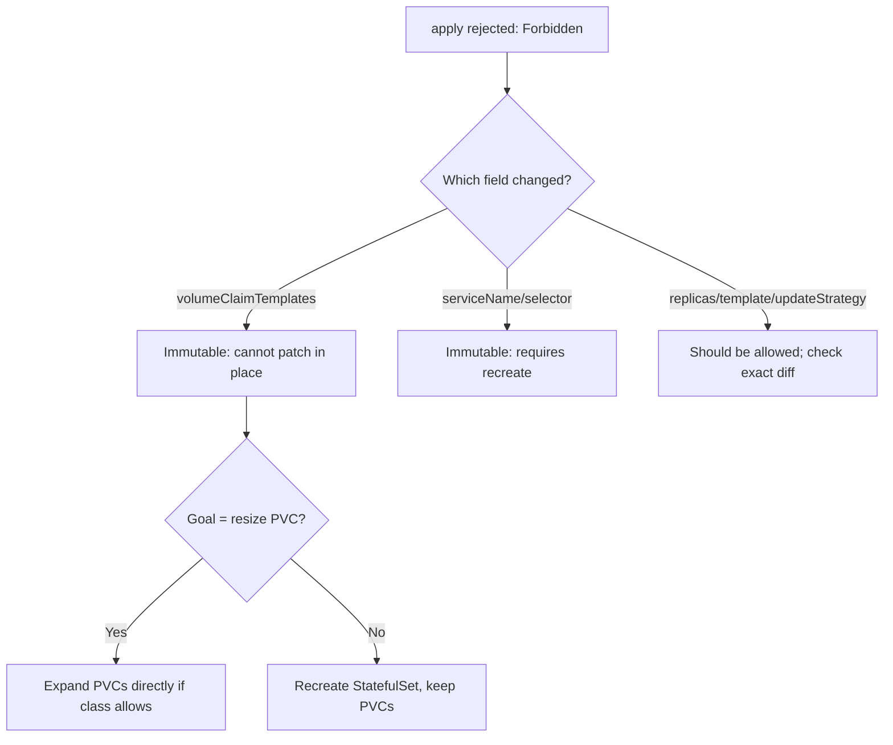

# volumeClaimTemplates Immutable

> **Severity:** Medium · **Typical recovery time:** 15–60 min · **Affected versions:** 1.20+

## Error Message

```text
The StatefulSet "postgres" is invalid: spec: Forbidden: updates to statefulset spec for fields other than 'replicas', 'ordinals', 'template', 'updateStrategy', 'persistentVolumeClaimRetentionPolicy' and 'minReadySeconds' are forbidden
```

## Description

Most of a StatefulSet's spec is immutable after creation. In particular,
`volumeClaimTemplates`, `serviceName`, `selector`, and `podManagementPolicy`
cannot be changed with `kubectl apply`/`edit`. The API server rejects the update
with a `Forbidden` error listing the only fields you are allowed to mutate.

During an incident this surfaces when someone tries to grow a PVC's requested
size, change its StorageClass, or rename the headless service via the manifest and
the change is refused. Kubernetes enforces this because the templates define
stable, per-pod identities and storage that already exist as bound PVCs.

## Affected Kubernetes Versions

Applies to all supported versions (1.20+). The mutable-field list has grown over
time: `minReadySeconds` (1.25), `persistentVolumeClaimRetentionPolicy` (1.27 GA),
and `ordinals.start` (1.27+). Older clusters list fewer allowed fields, so the
exact error text varies by version — but `volumeClaimTemplates` is immutable in
every version.

## Likely Root Causes

- Editing `volumeClaimTemplates[].spec.resources.requests.storage` directly
- Changing `storageClassName` inside the template
- Modifying `serviceName`, `selector`, or `podManagementPolicy` post-creation
- A GitOps tool (Argo/Flux) repeatedly trying to reconcile an immutable diff

## Diagnostic Flow



## Verification Steps

Confirm the rejected field is in the immutable set by diffing the applied
manifest against the live object. The error text itself lists the only mutable
fields — anything else triggers the `Forbidden`.

## kubectl Commands

```bash
kubectl get statefulset <name> -n <namespace> -o yaml
kubectl describe statefulset <name> -n <namespace>
kubectl explain statefulset.spec.volumeClaimTemplates
kubectl get pvc -l app=<name> -n <namespace>
kubectl get storageclass
kubectl get events -n <namespace> --sort-by=.lastTimestamp
```

## Expected Output

```text
error: ... is invalid: spec: Forbidden: updates to statefulset spec for fields
other than 'replicas', 'ordinals', 'template', 'updateStrategy',
'persistentVolumeClaimRetentionPolicy' and 'minReadySeconds' are forbidden
```

## Common Fixes

1. To grow storage, do **not** edit the template — expand each existing PVC
   directly (if the StorageClass has `allowVolumeExpansion: true`).
2. To change `storageClassName` or other immutable fields, recreate the
   StatefulSet while preserving its PVCs.
3. In GitOps, exclude immutable fields from sync or use a replace strategy so the
   tool stops looping on the rejected diff.

## Recovery Procedures

1. For a resize, expand the PVCs first (non-disruptive on most CSI drivers), then
   update the template value so future pods match — see PVC Resize Pending.
2. For a true immutable change, recreate the StatefulSet without deleting data:
   **Disruptive: delete the StatefulSet with `--cascade=orphan` (pods and PVCs
   survive), then create the corrected StatefulSet which adopts the existing pods.
   Blast radius: brief control-plane gap; no data loss because PVCs are retained.**
3. Validate that the adopted pods keep their original names/PVCs before resuming
   any rollout.

## Validation

`kubectl apply` succeeds, `kubectl get statefulset` shows the expected spec, and
each pod is still bound to its original PVC (`data-<name>-0`, etc.).

## Prevention

- Decide storage class and size before first deploy; templates cannot change later.
- Enable `allowVolumeExpansion` on classes used by StatefulSets.
- Configure GitOps to ignore immutable StatefulSet fields to avoid sync loops.

## Related Errors

- [StatefulSet Update Forbidden](./statefulset-update-forbidden.md)
- [PVC Resize Pending](./statefulset-pvc-resize-pending.md)
- [StatefulSet Pod Pending (PVC)](./statefulset-pod-pending-pvc.md)

## References

- [StatefulSet update strategies](https://kubernetes.io/docs/concepts/workloads/controllers/statefulset/#update-strategies)
- [StatefulSet limitations](https://kubernetes.io/docs/concepts/workloads/controllers/statefulset/#limitations)
- [Expanding Persistent Volumes Claims](https://kubernetes.io/docs/concepts/storage/persistent-volumes/#expanding-persistent-volumes-claims)

## Further Reading

- [DevOps AI ToolKit — Kubernetes guides](https://devopsaitoolkit.com/blog/)
