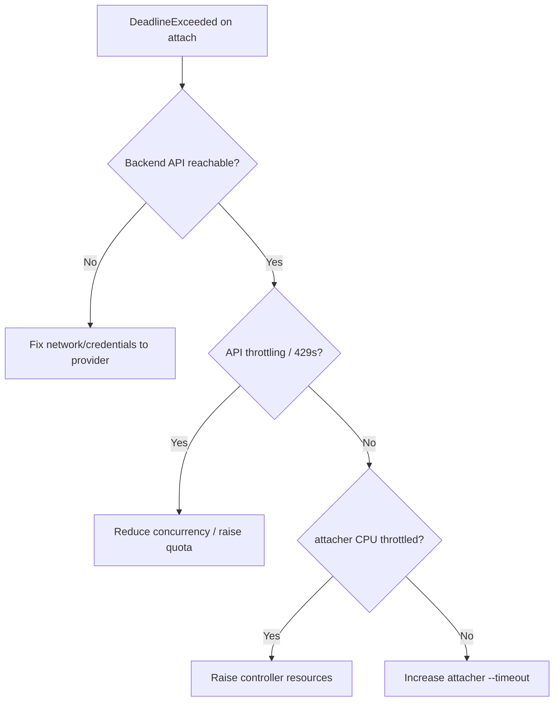

# CSI Attacher DeadlineExceeded

> **Severity:** High · **Typical recovery time:** 10–45 min · **Affected versions:** 1.20+

## Error Message

```text
Warning  FailedAttachVolume  attachdetach-controller
AttachVolume.Attach failed for volume "pvc-3f1a":
rpc error: code = DeadlineExceeded desc = context deadline exceeded
(ControllerPublishVolume)
```

## Description

The external-attacher sidecar calls the CSI controller's `ControllerPublishVolume`
(attach) RPC, and the call did not return before the gRPC deadline. The storage
backend is slow or unresponsive — the request may even be progressing on the
backend, but the control plane gave up waiting and will retry. The pod stays in
`ContainerCreating` and `VolumeAttachment` status shows the DeadlineExceeded
error.

This is a *latency* failure, distinct from an outright rejection. It usually
means backend API throttling, a saturated control plane, or a network partition
between the CSI controller and the storage provider. Retries with backoff often
succeed once load drops.

## Affected Kubernetes Versions

All 1.20+ running CSI drivers. The attacher's `--timeout` flag (default often
15s) sets the RPC deadline; busy clouds frequently need a higher value. After
CSI migration (1.23+), in-tree volumes also flow through this path.

## Likely Root Causes

- Cloud/storage API throttling under high attach/detach volume
- Backend control plane degraded or unreachable (network partition)
- attacher `--timeout` set too low for the backend's real latency
- CSI controller resource-starved (CPU throttling) causing slow RPCs
- Per-account attach concurrency limits being hit

## Diagnostic Flow



## Verification Steps

Confirm the error is `DeadlineExceeded` (not `Internal`/`InvalidArgument`) and
that the attacher is retrying, then check backend latency and throttling.

## kubectl Commands

```bash
kubectl describe pod <pod> -n <namespace>
kubectl describe volumeattachment <name>
kubectl logs -n kube-system <csi-controller-pod> -c csi-attacher --tail=120
kubectl get pods -n kube-system -l app=<csi-controller> -o wide
kubectl top pod -n kube-system <csi-controller-pod>
kubectl get events -n kube-system --sort-by=.lastTimestamp
```

## Expected Output

```text
$ kubectl logs ... -c csi-attacher
I0629 ... Started VA processing "csi-3f1a"
W0629 ... ControllerPublishVolume: rpc error: code = DeadlineExceeded
E0629 ... Retrying with exponential backoff (attempt 4)

$ kubectl describe volumeattachment csi-3f1a
Status:
  Attach Error:
    Message: context deadline exceeded
```

## Common Fixes

1. Wait out backend throttling; attacher retries usually succeed.
2. Increase the external-attacher `--timeout` for slow backends.
3. Raise cloud attach quota or reduce concurrent attach operations.

## Recovery Procedures

1. Check provider status and the attacher logs for repeated 429/throttle errors.
2. If the controller pod is CPU-throttled, raise its CPU limits and restart the
   CSI controller Deployment. **Blast radius: brief pause of all attach/detach
   operations cluster-wide.**
3. If the backend is partitioned, restore connectivity/credentials before
   retrying; do not force-delete VolumeAttachments while the backend may still
   complete the attach (risk of inconsistent state).
4. Increase `--timeout` and roll the controller if deadlines are chronically
   too short. **Blast radius: cluster-wide attacher restart.**

## Validation

`kubectl describe volumeattachment` shows `Attached: true` with no error, the
pod reaches `Running`, and attacher logs stop showing DeadlineExceeded retries.

## Prevention

- Right-size CSI controller CPU/memory and avoid limit throttling.
- Set the attacher `--timeout` to match observed backend p99 latency.
- Monitor cloud attach throttling and spread large batch operations over time.

## Related Errors

- [FailedAttachVolume](./failedattachvolume.md)
- [FailedMount Timeout](./failedmount-timeout.md)
- [CSI Driver Not Registered](./csi-driver-not-registered.md)

## References

- [CSI Volume Plugins](https://kubernetes.io/docs/concepts/storage/volumes/#csi)
- [Persistent Volumes](https://kubernetes.io/docs/concepts/storage/persistent-volumes/)

## Further Reading

- [DevOps AI ToolKit — Kubernetes guides](https://devopsaitoolkit.com/blog/)
