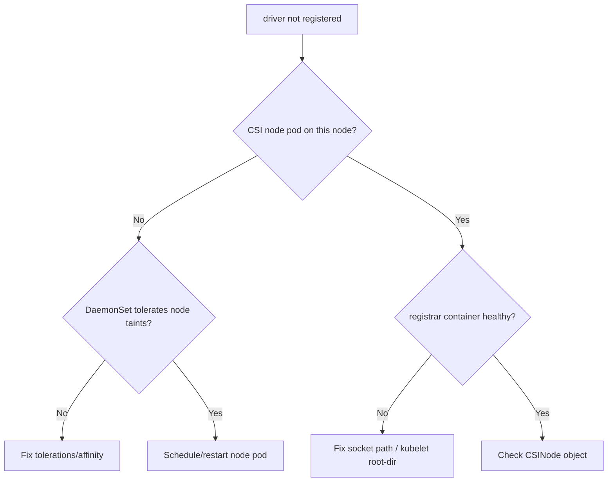

# CSI Driver Not Registered

> **Severity:** High · **Typical recovery time:** 10–40 min · **Affected versions:** 1.20+

## Error Message

```text
Warning  FailedMount  kubelet  MountVolume.MountDevice failed for volume
"pvc-9a8b": kubernetes.io/csi: attacher.MountDevice failed to create
newCsiDriverClient: driver name ebs.csi.aws.com not found in the list of
registered CSI drivers
```

## Description

The kubelet learns about CSI drivers through the node-registrar sidecar, which
registers the driver's unix socket and creates a `CSINode` entry. This error
means the kubelet tried to call a driver that is not registered on *this* node —
the node plugin pod is missing, crashlooping, or its registrar never completed.
The pod stays in `ContainerCreating`; events show `FailedMount` referencing the
driver name.

In an incident this is node-scoped: the same volume may mount fine on other
nodes. The fix is almost always about getting the CSI node DaemonSet healthy on
the affected node, not about the volume or backend itself.

## Affected Kubernetes Versions

All 1.20+. Registration uses the kubelet plugin registration directory
(`/var/lib/kubelet/plugins_registry`). Hostpath/socket-path mismatches after a
driver upgrade, or a custom kubelet root-dir, are common breakers across all
versions.

## Likely Root Causes

- CSI node DaemonSet pod not scheduled or crashlooping on the node
- node-driver-registrar sidecar failing (wrong socket path / kubelet root-dir)
- Driver newly installed but rollout incomplete; CSINode not yet created
- Taints/affinity preventing the DaemonSet from running on the node
- Driver name mismatch between StorageClass `provisioner` and the deployed driver

## Diagnostic Flow



## Verification Steps

Confirm the driver name in the event matches your StorageClass provisioner, then
check whether a `CSINode` entry and a healthy node plugin pod exist on the node.

## kubectl Commands

```bash
kubectl describe pod <pod> -n <namespace>
kubectl get csidrivers
kubectl get csinode <node-name> -o yaml
kubectl get pods -n kube-system -l app=<csi-driver> -o wide
kubectl describe pod -n kube-system <csi-node-pod>
kubectl logs -n kube-system <csi-node-pod> -c node-driver-registrar --tail=80
```

## Expected Output

```text
$ kubectl get csinode node-7 -o yaml
spec:
  drivers: []        # <-- driver missing; should list ebs.csi.aws.com

$ kubectl get pods -n kube-system -l app=ebs-csi-node -o wide
ebs-csi-node-abcde   2/3   CrashLoopBackOff   node-7
```

## Common Fixes

1. Restore the CSI node DaemonSet pod on the affected node.
2. Correct the registrar's `--kubelet-registration-path` / socket hostPath.
3. Add the node's taints to the DaemonSet `tolerations`.

## Recovery Procedures

1. Confirm `kubectl get csidrivers` lists the driver cluster-wide and the
   StorageClass provisioner name matches exactly.
2. If the node plugin pod is crashlooping, read the registrar logs and fix the
   socket/kubelet-root-dir, then delete the pod to recreate it.
   **Blast radius: that node only; mounts on the node pause until re-registered.**
3. If tolerations/affinity exclude the node, patch the DaemonSet and let it roll.
   **Blast radius: CSI node pods restart cluster-wide.**
4. Once `CSINode` lists the driver, delete the stuck workload pod to retry mount.
   **Blast radius: the single pod.**

## Validation

`kubectl get csinode <node>` lists the driver, the node plugin pod is `Running`
(all containers ready), and the workload pod mounts and reaches `Running`.

## Prevention

- Deploy CSI node plugins with broad tolerations and PriorityClass.
- Pin/verify the kubelet root-dir used by the registrar after node image changes.
- Alert on CSINode missing expected drivers and on registrar restart counts.

## Related Errors

- [FailedMount Timeout](./failedmount-timeout.md)
- [FailedAttachVolume](./failedattachvolume.md)
- [CSI Attacher DeadlineExceeded](./csi-attacher-deadline-exceeded.md)

## References

- [CSI Volume Plugins](https://kubernetes.io/docs/concepts/storage/volumes/#csi)
- [CSI Node objects](https://kubernetes.io/docs/concepts/storage/volumes/)

## Further Reading

- [DevOps AI ToolKit — Kubernetes guides](https://devopsaitoolkit.com/blog/)
