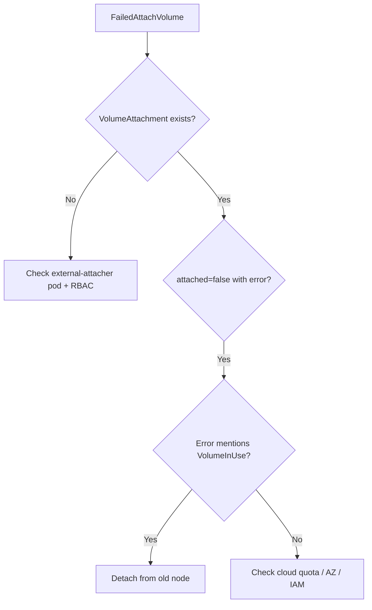

# FailedAttachVolume

> **Severity:** High · **Typical recovery time:** 10–45 min · **Affected versions:** 1.20+

## Error Message

```text
Warning  FailedAttachVolume  attachdetach-controller
AttachVolume.Attach failed for volume "pvc-1a2b3c"
rpc error: code = Internal desc = Could not attach volume
"vol-0abc" to node "i-0def": VolumeInUse
```

## Description

`FailedAttachVolume` is raised by the kube-controller-manager's attach/detach
controller (or the external-attacher sidecar under CSI) when the cloud or
storage API rejects the request to attach a block volume to the target node.
Unlike a mount failure, this happens *before* the volume ever reaches the
kubelet — the device is not yet visible on the node. The pod sits in
`ContainerCreating` and a `VolumeAttachment` object exists with `attached:
false`.

In production this points to the storage control plane: the backend says no
(volume busy, quota exceeded, zone mismatch, IAM/credentials), or the attacher
itself is degraded. Because attachment is cluster-scoped, the error often
follows node failures where the old attachment was never cleaned up.

## Affected Kubernetes Versions

All 1.20+. With in-tree plugins the controller calls the cloud SDK directly;
after CSI migration (default 1.23+) the same failure surfaces from the
`external-attacher` sidecar via gRPC, so check that container's logs.

## Likely Root Causes

- Volume still attached to another (often failed) node
- Cloud/storage API rejection: quota, throttling, or wrong availability zone
- Missing/expired IAM role or CSI controller credentials
- external-attacher sidecar crashlooping or RBAC-blocked
- Maximum volumes-per-node limit already reached on the target node

## Diagnostic Flow



## Verification Steps

Confirm the pod is stuck before mount and a `VolumeAttachment` exists showing
`attached: false` with the backend error in its status or controller logs.

## kubectl Commands

```bash
kubectl describe pod <pod> -n <namespace>
kubectl get volumeattachment
kubectl describe volumeattachment <name>
kubectl get pv <pv-name> -o yaml
kubectl logs -n kube-system <csi-controller-pod> -c csi-attacher --tail=100
kubectl get csinode -o wide
```

## Expected Output

```text
$ kubectl describe volumeattachment csi-abc
Status:
  Attached:  false
  Attach Error:
    Message: rpc error: code = Internal desc = VolumeInUse:
             vol-0abc is already attached to i-0old
    Time:    2026-06-29T12:01:14Z
```

## Common Fixes

1. Detach the volume from the stale node so it can attach to the new one.
2. Raise the cloud volume quota or schedule the pod into the volume's zone.
3. Repair external-attacher RBAC/credentials and restart the controller.

## Recovery Procedures

1. Identify the node currently holding the volume from the attach error.
2. If that node is dead, delete the Node object so the controller force-detaches
   after the grace period. **Blast radius: all attachments on that node.**
3. If the attacher is broken, restart the CSI controller Deployment.
   **Blast radius: pauses all attach/detach operations cluster-wide briefly.**
4. For zone mismatches, delete the pod and let the scheduler place it in the
   correct zone. **Blast radius: the single pod.**

## Validation

`kubectl describe volumeattachment` shows `Attached: true` with no error, the
pod advances past `ContainerCreating`, and the device appears on the node.

## Prevention

- Use topology-aware provisioning (`WaitForFirstConsumer`) to avoid AZ mismatch.
- Alert on volumes-per-node nearing the driver limit.
- Monitor cloud volume quota and external-attacher restart counts.

## Related Errors

- [FailedMount Timeout](./failedmount-timeout.md)
- [Multi-Attach Error](./multi-attach-error.md)
- [CSI Attacher DeadlineExceeded](./csi-attacher-deadline-exceeded.md)

## References

- [Storage / Persistent Volumes](https://kubernetes.io/docs/concepts/storage/persistent-volumes/)
- [CSI Volume Plugins](https://kubernetes.io/docs/concepts/storage/volumes/#csi)

## Further Reading

- [DevOps AI ToolKit — Kubernetes guides](https://devopsaitoolkit.com/blog/)
