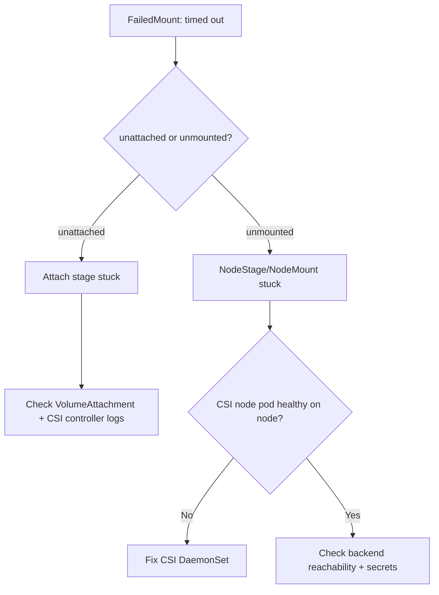

# FailedMount Timeout

> **Severity:** High · **Typical recovery time:** 10–40 min · **Affected versions:** 1.20+

## Error Message

```text
Warning  FailedMount  kubelet  Unable to attach or mount volumes:
unmounted volumes=[data], unattached volumes=[data kube-api-access-xxxxx]:
timed out waiting for the condition
```

## Description

This event is emitted by the kubelet's volume manager when a pod cannot reach
the `ContainerCreating` stage because at least one volume never became ready
within the mount timeout (default 2 minutes per reconcile, repeated). The
kubelet distinguishes *unattached* volumes (the controller has not finished the
attach/ControllerPublish step) from *unmounted* volumes (attach succeeded but
the node-level mount/NodeStage failed). Reading which list a volume falls into
is the single most useful clue.

During an incident this almost always means a stuck CSI operation, an
unreachable storage backend, or a volume still held by another node. The pod
stays `Pending`/`ContainerCreating` and the workload is fully unavailable.

## Affected Kubernetes Versions

Applies to all in-tree and CSI volume plugins on 1.20+. Since CSI migration
became default (1.23–1.25 depending on provider), the same symptom now flows
through the external attacher/provisioner sidecars rather than in-tree code, so
logs live in the CSI controller pods.

## Likely Root Causes

- CSI node plugin (DaemonSet) not running or crashlooping on the target node
- Storage backend unreachable (network, credentials, API throttling)
- Volume still attached to a previous node (RWO) blocking NodeStage
- Wrong/missing `nodeStageSecretRef` or expired mount credentials
- Slow recursive `fsGroup` chown on a very large volume (looks like a timeout)

## Diagnostic Flow



## Verification Steps

Confirm the pod is blocked on a volume (not image pull or scheduling) and
identify the exact volume name and whether it is unattached vs unmounted.

## kubectl Commands

```bash
kubectl describe pod <pod> -n <namespace>
kubectl get events -n <namespace> --sort-by=.lastTimestamp
kubectl get pvc -n <namespace>
kubectl get volumeattachment
kubectl get pods -n kube-system -l app=<csi-driver> -o wide
kubectl logs -n kube-system <csi-node-pod> -c csi-driver --tail=100
```

## Expected Output

```text
Events:
  Warning  FailedMount  2m (x12)  kubelet  Unable to attach or mount volumes:
  unmounted volumes=[data], unattached volumes=[data ...]:
  timed out waiting for the condition

$ kubectl get volumeattachment
NAME       ATTACHER          PV       NODE      ATTACHED   AGE
csi-9f3..  ebs.csi.aws.com   pvc-12   node-7    false      6m
```

## Common Fixes

1. Restart or reschedule a crashlooping CSI node pod on the affected node.
2. Restore backend connectivity or fix the `nodeStageSecretRef` credentials.
3. Clear a stale attachment from the prior node (see Recovery) for RWO volumes.

## Recovery Procedures

1. Inspect `kubectl get volumeattachment` and CSI controller logs to locate the
   stuck operation.
2. If the CSI node DaemonSet pod is unhealthy, delete it so it is recreated —
   **blast radius: that node only**, briefly pauses other mounts on the node.
3. If the volume is still attached to a dead/other node, drain or cordon that
   node and let the attach-detach controller force-detach after
   `--node-monitor-grace-period`. **Blast radius: every pod on the old node.**
4. As a last resort, delete the stuck pod so the scheduler retries the volume
   lifecycle. **Blast radius: the single workload pod.**

## Validation

Pod reaches `Running`, `kubectl get volumeattachment` shows `ATTACHED=true`, and
the application can read/write its mount path.

## Prevention

- Run CSI node plugins as a DaemonSet with health probes and PodDisruptionBudgets.
- Monitor backend latency/quota and CSI sidecar restart counts.
- Use `volumeBindingMode: WaitForFirstConsumer` to co-locate volume and pod.

## Related Errors

- [FailedAttachVolume](./failedattachvolume.md)
- [Multi-Attach Error](./multi-attach-error.md)
- [CSI Attacher DeadlineExceeded](./csi-attacher-deadline-exceeded.md)

## References

- [Kubernetes Storage / Volumes](https://kubernetes.io/docs/concepts/storage/volumes/)
- [Debug Running Pods](https://kubernetes.io/docs/tasks/debug/debug-application/debug-running-pod/)

## Further Reading

- [DevOps AI ToolKit — Kubernetes guides](https://devopsaitoolkit.com/blog/)
