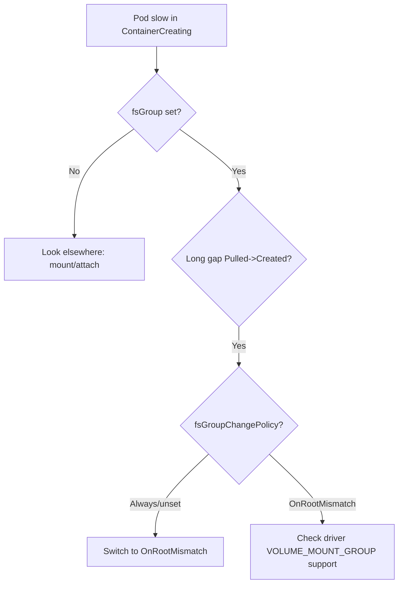

# fsGroup Permission Change Slow

> **Severity:** Medium · **Typical recovery time:** 5–25 min · **Affected versions:** 1.23+

## Error Message

```text
# No explicit error string; symptom is a long ContainerCreating:
Normal  Pulled   kubelet  Container image already present on machine
# ...then a multi-minute gap before:
Normal  Created  kubelet  Created container app
# Pod stuck in ContainerCreating while kubelet recursively chowns the volume.
```

## Description

When `securityContext.fsGroup` is set, the kubelet (or CSI driver) recursively
changes group ownership and permissions of every file on the volume before
starting the container. On a volume with millions of files this recursive chown
can take minutes to hours, and the pod sits in `ContainerCreating` the entire
time with no obvious error — just a long, unexplained gap between "Pulled" and
"Created". This is especially painful for large data volumes and on every pod
restart if the policy forces a full walk each time.

In an incident this looks like a hung mount, but the volume *is* mounting — the
kubelet is busy chowning. The fix is to stop forcing a full recursive walk on
every start.

## Affected Kubernetes Versions

`fsGroupChangePolicy` is GA in 1.23 with two values: `Always` (chown every file
every time) and `OnRootMismatch` (only chown if the top-level dir ownership
differs from the expected fsGroup, skipping the walk on subsequent starts).
Drivers advertising `VOLUME_MOUNT_GROUP` can delegate the operation and avoid the
walk entirely.

## Likely Root Causes

- `fsGroupChangePolicy: Always` (or default) on a volume with huge file counts
- Large pre-existing dataset being chowned on first attach
- Driver does not support delegated fsGroup, forcing kubelet-side recursion
- Repeated full chown on every pod restart/reschedule
- fsGroup set unnecessarily on a volume the app could own at the root

## Diagnostic Flow



## Verification Steps

Confirm a long gap between the `Pulled` and `Created` events on a pod that sets
`fsGroup`, and that the volume holds a large number of files.

## kubectl Commands

```bash
kubectl describe pod <pod> -n <namespace>
kubectl get events -n <namespace> --sort-by=.lastTimestamp
kubectl get pod <pod> -n <namespace> -o jsonpath='{.spec.securityContext}'
kubectl get pod <pod> -n <namespace> -o jsonpath='{.spec.securityContext.fsGroupChangePolicy}'
kubectl get csidrivers <driver> -o jsonpath='{.spec.fsGroupPolicy}'
kubectl exec <pod> -n <namespace> -- sh -c 'ls -lR /data | wc -l'
```

## Expected Output

```text
$ kubectl describe pod app
  Normal  Pulled   8m   kubelet  Container image already present
  Normal  Created  2m   kubelet  Created container app
  # ~6 minute gap = recursive chown

$ kubectl get pod app -o jsonpath='{.spec.securityContext.fsGroupChangePolicy}'
            # empty -> defaults to Always-style full walk
```

## Common Fixes

1. Set `securityContext.fsGroupChangePolicy: OnRootMismatch`.
2. Use a CSI driver/StorageClass that delegates fsGroup (`fsGroupPolicy: File`).
3. Drop `fsGroup` where the app already owns the volume root.

## Recovery Procedures

1. Confirm the slow start is the recursive chown via the event gap.
2. Set `fsGroupChangePolicy: OnRootMismatch` on the pod template so subsequent
   starts skip the full walk. Applying triggers a rollout. **Blast radius: the
   workload's pods restart; the first start may still be slow as the root is
   normalized.**
3. For chronically large volumes, switch to a driver that supports delegated
   fsGroup (`CSIDriver.spec.fsGroupPolicy: File`) and re-deploy. **Blast radius:
   driver/StorageClass change affecting new mounts.**
4. Avoid killing the pod mid-chown — interrupting forces a restart and another
   full walk.

## Validation

Subsequent pod starts show a small gap between `Pulled` and `Created`, the pod
reaches `Running` quickly, and file ownership at the mount root matches fsGroup.

## Prevention

- Default to `fsGroupChangePolicy: OnRootMismatch` in pod templates.
- Choose CSI drivers that support delegated fsGroup for large data volumes.
- Keep volumes from accumulating millions of tiny files where avoidable.

## Related Errors

- [Volume Mount Permission Denied](./volume-mount-permission-denied.md)
- [FailedMount Timeout](./failedmount-timeout.md)
- [Volume Expansion Node Failed](./volume-expand-node-failed.md)

## References

- [Configure fsGroupChangePolicy](https://kubernetes.io/docs/tasks/configure-pod-container/security-context/#configure-volume-permission-and-ownership-change-policy-for-pods)
- [Delegating fsGroup to CSI drivers](https://kubernetes.io/docs/concepts/storage/volumes/#csi)

## Further Reading

- [DevOps AI ToolKit — Kubernetes guides](https://devopsaitoolkit.com/blog/)
