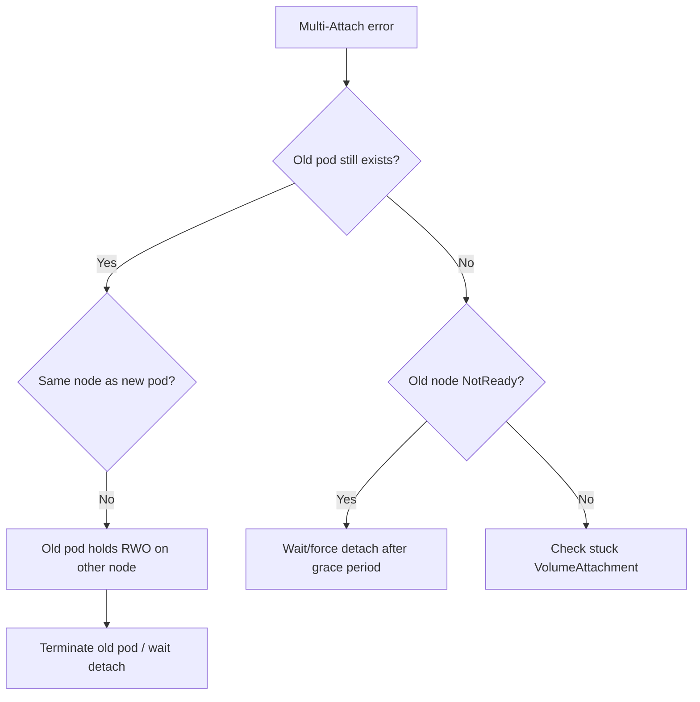

# Multi-Attach Error

> **Severity:** High · **Typical recovery time:** 5–30 min · **Affected versions:** 1.20+

## Error Message

```text
Warning  FailedAttachVolume  attachdetach-controller
Multi-Attach error for volume "pvc-7c9d" Volume is already exclusively
attached to one node and can't be attached to another
```

## Description

A `ReadWriteOnce` (RWO) volume can be attached to exactly one node at a time.
The Multi-Attach error means Kubernetes wants to attach the volume to a new node
while it is still attached to another — typically the old pod's node has not
released it. This is the classic *failover during node loss* symptom: the new
pod is scheduled elsewhere, but the dead node's attachment lingers until the
detach grace period expires.

It is most common with StatefulSets and Deployments that have a single RWO PVC
when a node goes `NotReady` ungracefully, or when a rolling update places the
new pod on a different node before the old one terminates cleanly.

## Affected Kubernetes Versions

All 1.20+. The default `RollingUpdate` for Deployments can momentarily run two
pods, so single-replica RWO Deployments are prone to this; StatefulSets avoid it
via ordered termination. Force-detach timing is governed by the controller
manager's node-monitor settings.

## Likely Root Causes

- Old node went `NotReady`; attachment not yet released (grace period)
- Deployment rolling update tries to start a new pod before the old detaches
- Two pods (old + new) both reference the same RWO PVC across nodes
- Stuck `VolumeAttachment` object after a failed detach

## Diagnostic Flow



## Verification Steps

Confirm the PVC access mode is `ReadWriteOnce` and that a `VolumeAttachment`
still binds the volume to a different node than where the new pod is scheduled.

## kubectl Commands

```bash
kubectl describe pod <pod> -n <namespace>
kubectl get pvc <pvc> -n <namespace> -o jsonpath='{.spec.accessModes}'
kubectl get volumeattachment | grep <pv-name>
kubectl get pods -n <namespace> -o wide -l app=<app>
kubectl get nodes
kubectl describe node <old-node>
```

## Expected Output

```text
$ kubectl get volumeattachment | grep pvc-7c9d
csi-44e..  ebs.csi.aws.com  pvc-7c9d  node-old   true   18m

$ kubectl get pods -o wide
web-0   Pending   node-new   (Multi-Attach)
web-0   Running   node-old   Terminating
```

## Common Fixes

1. Let the old pod terminate so the volume detaches, then the new pod attaches.
2. After ungraceful node loss, wait out (or trigger) force-detach.
3. Switch single-replica RWO Deployments to `Recreate` strategy.

## Recovery Procedures

1. Identify which node currently holds the attachment and where the new pod is
   scheduled.
2. If the old pod is healthy, delete it to release the volume cleanly.
   **Blast radius: that single pod's downtime until reschedule.**
3. If the old node is dead, delete the Node object to let the controller
   force-detach after the grace period. **Blast radius: every workload on that
   node is force-detached and rescheduled.**
4. If a `VolumeAttachment` is stuck after the node is gone, escalate to clear it;
   never edit it casually while the volume could still be mounted (risk of data
   corruption from dual writers).

## Validation

`kubectl get volumeattachment` shows the volume attached to the new node only,
the new pod reaches `Running`, and no second pod mounts the same volume.

## Prevention

- Use `Recreate` (not `RollingUpdate`) for single-replica RWO Deployments.
- Prefer StatefulSets for RWO-backed stateful apps (ordered termination).
- Use RWX/ReadWriteOncePod where the workload truly needs it, deliberately.

## Related Errors

- [FailedAttachVolume](./failedattachvolume.md)
- [RWO Volume Multi-Node Conflict](./rwo-multinode-conflict.md)
- [FailedMount Timeout](./failedmount-timeout.md)

## References

- [Access Modes](https://kubernetes.io/docs/concepts/storage/persistent-volumes/#access-modes)
- [StatefulSets](https://kubernetes.io/docs/concepts/workloads/controllers/statefulset/)

## Further Reading

- [DevOps AI ToolKit — Kubernetes guides](https://devopsaitoolkit.com/blog/)
