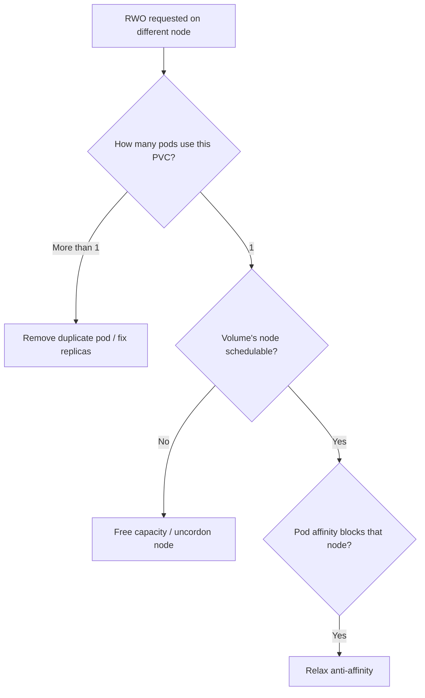

# RWO Volume Multi-Node Conflict

> **Severity:** High · **Typical recovery time:** 5–30 min · **Affected versions:** 1.22+

## Error Message

```text
Warning  FailedScheduling  default-scheduler
0/5 nodes are available: 1 node(s) had volume node affinity conflict,
4 node(s) had a ReadWriteOnce volume requested on a different node than
where the volume is currently attached.
```

## Description

An RWO (or `ReadWriteOncePod`) volume is already attached to one node, and the
scheduler is being asked to place a pod that needs the same volume on a different
node. Because RWO restricts a volume to a single node, the scheduler filters out
every node except the one holding the volume — and if that node cannot take the
pod, scheduling fails. This differs from the Multi-Attach error (an *attach-time*
failure): here the scheduler refuses up front.

In production this surfaces when two pods share one RWO PVC (often an accidental
second replica), or when a node holding a volume is full/cordoned so the pod must
go elsewhere but cannot.

## Affected Kubernetes Versions

1.22+ introduced scheduler awareness of volume access modes and the
`ReadWriteOncePod` access mode (GA 1.29). On 1.22+ the scheduler proactively
rejects cross-node RWO placement instead of failing later at attach time.

## Likely Root Causes

- Two pods reference the same RWO PVC (extra replica / leftover pod)
- Node holding the volume is full, cordoned, or tainted
- Deployment with `replicas > 1` sharing one RWO PVC
- Pod anti-affinity forces placement away from the volume's node

## Diagnostic Flow



## Verification Steps

Confirm the PVC is `ReadWriteOnce`, find which node holds it, and count how many
pods reference the PVC.

## kubectl Commands

```bash
kubectl describe pod <pod> -n <namespace>
kubectl get pvc <pvc> -n <namespace> -o jsonpath='{.spec.accessModes}'
kubectl get volumeattachment | grep <pv-name>
kubectl get pods -n <namespace> -o wide \
  -o custom-columns=NAME:.metadata.name,NODE:.spec.nodeName
kubectl describe node <volume-node>
kubectl get deploy <name> -n <namespace> -o jsonpath='{.spec.replicas}'
```

## Expected Output

```text
$ kubectl get pvc data -o jsonpath='{.spec.accessModes}'
["ReadWriteOnce"]

$ kubectl get volumeattachment | grep pvc-bb22
csi-77a..  pd.csi.storage.gke.io  pvc-bb22  node-3   true

$ kubectl get pods -o wide
app-0   Running   node-3
app-1   Pending   <none>   # second pod can't share RWO on node-3
```

## Common Fixes

1. Scale the workload to a single replica or give each pod its own PVC.
2. Free capacity or uncordon the node currently holding the volume.
3. Relax pod anti-affinity that blocks the volume's node.

## Recovery Procedures

1. Determine whether the conflict is duplicate consumers or a full/cordoned node.
2. If a duplicate pod exists, delete it so the volume is used by one pod.
   **Blast radius: that pod's downtime.**
3. If the node is cordoned, uncordon it; if full, free capacity or scale the node
   group. **Blast radius: low (uncordon) to added cost (scale-up).**
4. For shared-PVC misconfigurations, switch to a StatefulSet with
   `volumeClaimTemplates` so each replica gets its own RWO volume. **Blast
   radius: rollout of the workload.**

## Validation

The pending pod schedules onto the node holding its RWO volume (or a single pod
owns the PVC), reaches `Running`, and no other pod contends for the volume.

## Prevention

- Use StatefulSet `volumeClaimTemplates` for per-replica RWO storage.
- Use `ReadWriteOncePod` to make accidental sharing fail loudly and early.
- Keep one consumer per RWO PVC; reserve RWX for genuinely shared data.

## Related Errors

- [Multi-Attach Error](./multi-attach-error.md)
- [Volume Node Affinity Conflict](./volume-node-affinity-conflict.md)
- [FailedAttachVolume](./failedattachvolume.md)

## References

- [Access Modes](https://kubernetes.io/docs/concepts/storage/persistent-volumes/#access-modes)
- [StatefulSet volumeClaimTemplates](https://kubernetes.io/docs/concepts/workloads/controllers/statefulset/)

## Further Reading

- [DevOps AI ToolKit — Kubernetes guides](https://devopsaitoolkit.com/blog/)
