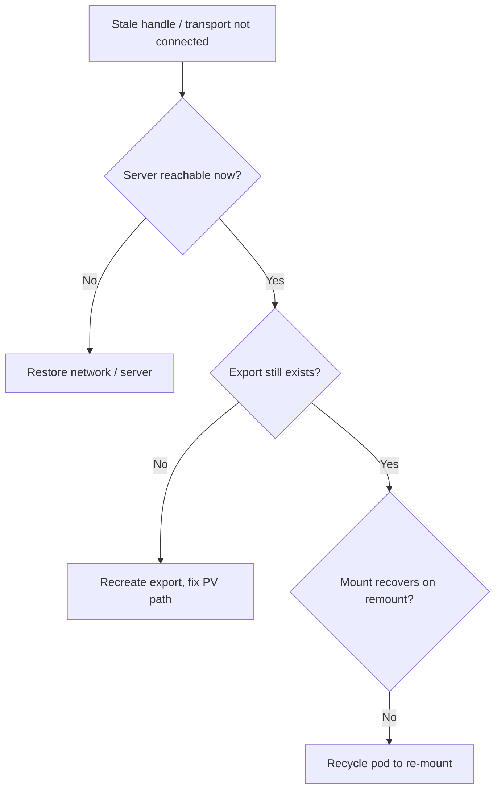

# Stale Volume Handle

> **Severity:** High · **Typical recovery time:** 10–40 min · **Affected versions:** 1.20+

## Error Message

```text
# Application / container log:
ls: cannot access '/data': Stale file handle
# or:
bash: /data/app.log: Transport endpoint is not connected
# Pod events may show:
Warning  FailedMount  kubelet  mount failed: exit status 32
mount.nfs: Stale file handle
```

## Description

A network filesystem mount (NFS, iSCSI, CephFS, GlusterFS) that was previously
working has gone bad at the OS level. "Stale file handle" means the server-side
inode the client cached no longer exists (the export was recreated, the file was
deleted server-side, or the server rebooted). "Transport endpoint is not
connected" means the kernel mount is broken because the connection dropped. The
pod is often still `Running`, but every I/O to the path returns errors.

Unlike attach/scheduling failures, this is a *live mount degradation*. The
kernel mount must be re-established; the kubelet/CSI driver cannot always heal it
without recycling the mount or the pod.

## Affected Kubernetes Versions

All 1.20+. Behavior is driven by the underlying NFS/iSCSI kernel client and the
CSI driver, not by Kubernetes version. NFS soft vs hard mount options and CSI
driver remount behavior dominate the outcome.

## Likely Root Causes

- NFS server rebooted or export was removed/recreated (handle invalidated)
- Network partition dropped the iSCSI/NFS session (transport endpoint)
- Server-side file/directory deleted out from under the client
- Storage appliance failover changed the underlying handle
- Soft-mount timeout converting transient outage into permanent errors

## Diagnostic Flow



## Verification Steps

Confirm the path errors with "Stale file handle" / "Transport endpoint" while
the backend export still exists and is reachable from the node.

## kubectl Commands

```bash
kubectl describe pod <pod> -n <namespace>
kubectl exec <pod> -n <namespace> -- mount | grep /data
kubectl exec <pod> -n <namespace> -- ls -la /data
kubectl get pv <pv-name> -o yaml
kubectl get events -n <namespace> --sort-by=.lastTimestamp
kubectl logs -n kube-system <csi-node-pod> -c csi-driver --tail=80
```

## Expected Output

```text
$ kubectl exec <pod> -- ls -la /data
ls: reading directory '/data': Stale file handle

$ kubectl exec <pod> -- mount | grep /data
10.0.0.5:/exports/data on /data type nfs4 (rw,relatime,...)
# mount present but I/O fails -> stale handle
```

## Common Fixes

1. Restore server/network connectivity, then recycle the pod to remount.
2. Recreate the missing export and correct the PV server path if it changed.
3. Switch NFS to hard mounts so transient outages block instead of erroring.

## Recovery Procedures

1. From the node, confirm the server is reachable and the export exists.
2. If the export was recreated, update the PV/StorageClass to the correct
   server path. **Blast radius: requires recreating the PV; plan data continuity.**
3. Delete the affected pod so the kubelet performs a fresh mount.
   **Blast radius: the single pod's downtime during reschedule.**
4. If many pods on a node share the broken mount, drain the node to force clean
   remounts elsewhere. **Blast radius: every pod on that node restarts.**

## Validation

`kubectl exec <pod> -- ls /data` succeeds without "Stale file handle", the
application resumes I/O, and no further transport-endpoint errors appear.

## Prevention

- Use NFS hard mounts (with `intr` where supported) for critical data.
- Avoid deleting/recreating exports while clients are mounted.
- Monitor NFS/iSCSI session health and appliance failover events.

## Related Errors

- [FailedMount Timeout](./failedmount-timeout.md)
- [Volume Mount Permission Denied](./volume-mount-permission-denied.md)
- [Volume Expansion Node Failed](./volume-expand-node-failed.md)

## References

- [Storage / Volumes](https://kubernetes.io/docs/concepts/storage/volumes/)
- [NFS volume](https://kubernetes.io/docs/concepts/storage/volumes/#nfs)

## Further Reading

- [DevOps AI ToolKit — Kubernetes guides](https://devopsaitoolkit.com/blog/)
