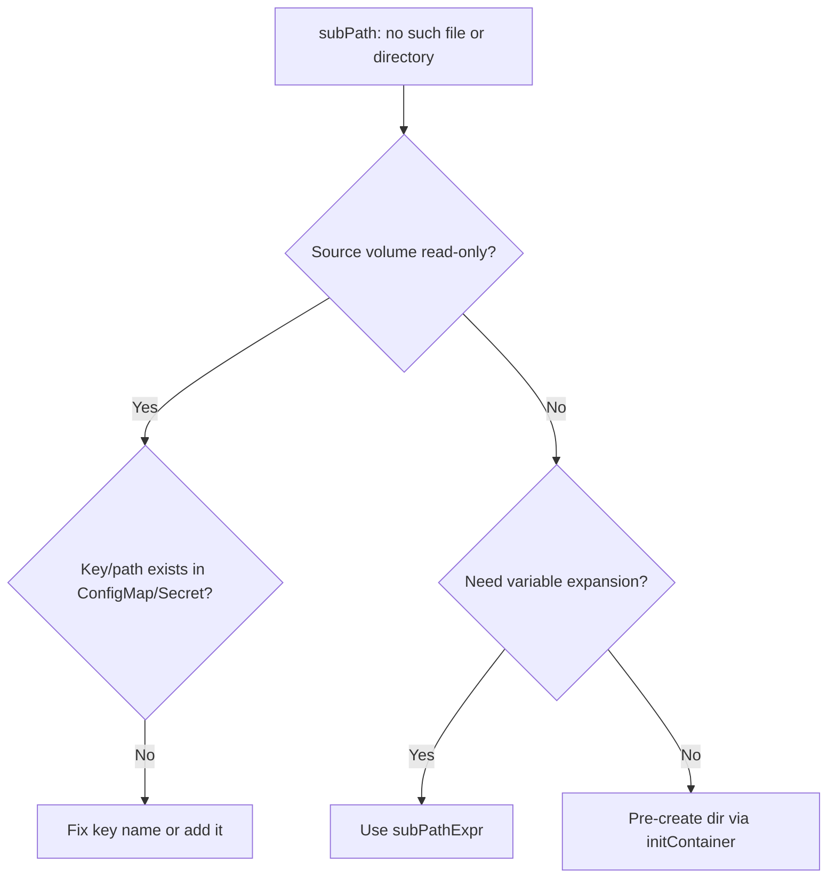

# SubPath Does Not Exist

> **Severity:** Medium · **Typical recovery time:** 5–20 min · **Affected versions:** 1.20+

## Error Message

```text
Warning  Failed  kubelet  Error: failed to create subPath directory
for volumeMount "config" of container "app":
mkdir /var/lib/kubelet/pods/.../config/app: no such file or directory
# or:
failed to prepare subPath for volumeMount "data": lstat
/var/lib/kubelet/.../data/sub: no such file or directory
```

## Description

A `volumeMount.subPath` references a path *inside* the volume that does not
exist, and the kubelet cannot create or bind it. SubPath mounts a single file or
subdirectory from a volume rather than the whole volume. For most volume types
the kubelet will create a missing subdirectory, but it cannot create a subPath
under a read-only source (like a ConfigMap/Secret) or when the parent chain is
missing — and it never invents a file subPath.

The pod fails to start and cycles in `ContainerCreating` / `CreateContainerError`.
This is a configuration error, not a backend failure: the volume mounts fine, but
the requested sub-location is wrong.

## Affected Kubernetes Versions

All 1.20+. `subPath` cannot use volume-expanded environment variables — that
requires `subPathExpr` (GA 1.17+). ConfigMap/Secret/projected volumes are
read-only, so a non-existent key used as a subPath always fails.

## Likely Root Causes

- subPath points to a file/dir that does not exist in the volume
- subPath under a read-only ConfigMap/Secret key that is not present
- Typo or wrong case in the subPath value
- Expecting variable substitution; needs `subPathExpr`, not `subPath`
- Empty/freshly provisioned volume that the app expected to be pre-populated

## Diagnostic Flow



## Verification Steps

Confirm the failing mount uses `subPath`, identify the exact value, and check
whether the source is a writable volume or a read-only ConfigMap/Secret.

## kubectl Commands

```bash
kubectl describe pod <pod> -n <namespace>
kubectl get pod <pod> -n <namespace> -o jsonpath='{range .spec.containers[*].volumeMounts[*]}{.name}{" subPath="}{.subPath}{"\n"}{end}'
kubectl get pod <pod> -n <namespace> -o yaml | grep -A4 volumeMounts
kubectl get configmap <cm> -n <namespace> -o jsonpath='{.data}'
kubectl get secret <secret> -n <namespace> -o jsonpath='{.data}'
```

## Expected Output

```text
$ kubectl get pod app -o jsonpath='...subPath...'
config subPath=app.conf
data   subPath=cache/sessions

$ kubectl get configmap config -o jsonpath='{.data}'
{"settings.conf":"..."}   # key is settings.conf, not app.conf -> mismatch
```

## Common Fixes

1. Correct the subPath to an existing file/directory or ConfigMap/Secret key.
2. Pre-create the subdirectory with an initContainer for writable volumes.
3. Replace `subPath` with `subPathExpr` when you need variable expansion.

## Recovery Procedures

1. Compare the `subPath` value with the actual contents/keys of the source.
2. For ConfigMap/Secret mismatches, fix the key name in the pod spec (or add the
   key). Applying the change triggers a rollout. **Blast radius: the workload's
   pods restart.**
3. For writable volumes that should contain a directory, add an initContainer
   that runs `mkdir -p` on the path before the main container starts.
   **Blast radius: the workload's pods restart.**
4. Reapply and confirm the pod advances past `ContainerCreating`.

## Validation

The pod reaches `Running`, the container sees the expected file/dir at the mount
path, and no further `no such file or directory` subPath events appear.

## Prevention

- Validate subPath values against ConfigMap/Secret keys in CI.
- Prefer whole-volume mounts unless a single file/dir is truly required.
- Use `subPathExpr` for dynamic paths; document expected pre-existing layout.

## Related Errors

- [Volume Mount Permission Denied](./volume-mount-permission-denied.md)
- [FailedMount Timeout](./failedmount-timeout.md)
- [Stale Volume Handle](./stale-volume-handle.md)

## References

- [Using subPath](https://kubernetes.io/docs/concepts/storage/volumes/#using-subpath)
- [subPath with expanded variables](https://kubernetes.io/docs/concepts/storage/volumes/#using-subpath-expanded-environment)

## Further Reading

- [Free Kubernetes config validators](https://devopsaitoolkit.com/validators/)
