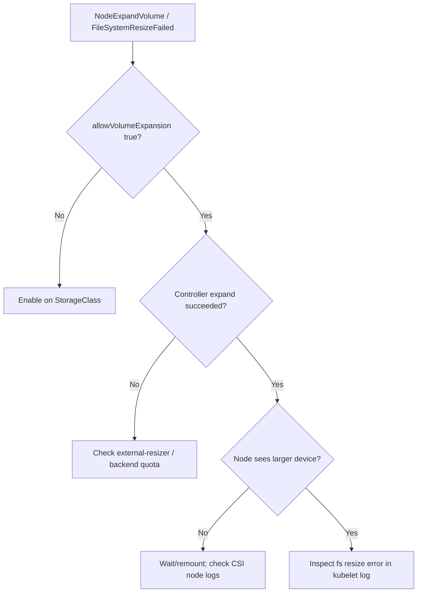

# Volume Expansion Node Failed

> **Severity:** High · **Typical recovery time:** 10–40 min · **Affected versions:** 1.24+

## Error Message

```text
Warning  VolumeResizeFailed  external-resizer
resize volume "pvc-5e6f" by resizer "ebs.csi.aws.com" failed:
rpc error: code = Internal desc = NodeExpandVolume failed
# or on the pod:
Warning  FileSystemResizeFailed  kubelet  MountVolume.NodeExpandVolume
failed: resize of volume failed: exit status 1
```

## Description

Volume expansion has two phases: the controller expands the backing volume
(`ControllerExpandVolume`), then the node grows the filesystem
(`NodeExpandVolume`) so the pod can use the new space. This error means the
controller-side grow succeeded but the *node-side filesystem resize* failed. The
PVC capacity may show the new size while the actual filesystem is still small,
and a `FileSystemResizePending` condition lingers.

In production this leaves a volume that "looks" bigger in the API but gives the
app no extra space — and the failed resize can block the pod from progressing
after a restart. Most node-resize failures are filesystem-level (xfs/ext4 tooling
errors, mount busy, or unsupported online resize).

## Affected Kubernetes Versions

Online expansion (`ExpandInUsePersistentVolumes`) is GA and default 1.24+.
Filesystems must support growth (ext4 and xfs grow online; some need a remount).
Shrinking is never supported. CSI driver and the external-resizer sidecar handle
the orchestration.

## Likely Root Causes

- Node-side `resize2fs`/`xfs_growfs` failed (filesystem error or wrong fs type)
- StorageClass `allowVolumeExpansion: false`, so the request is incomplete
- Filesystem does not support online growth on the running kernel
- Underlying device not actually grown on the node before fs resize
- Attempt to shrink (decrease) the PVC, which is rejected

## Diagnostic Flow



## Verification Steps

Confirm the PVC has a `FileSystemResizePending` condition and that the
controller-side expansion completed but the node-side resize errored.

## kubectl Commands

```bash
kubectl describe pvc <pvc> -n <namespace>
kubectl get pvc <pvc> -n <namespace> -o jsonpath='{.status.conditions}'
kubectl get storageclass <sc> -o jsonpath='{.allowVolumeExpansion}'
kubectl describe pod <pod> -n <namespace>
kubectl logs -n kube-system <csi-node-pod> -c csi-driver --tail=120
kubectl exec <pod> -n <namespace> -- df -h /data
```

## Expected Output

```text
$ kubectl describe pvc data
Conditions:
  Type                      Status
  FileSystemResizePending   True
Events:
  Warning  FileSystemResizeFailed  ... resize of volume failed: exit status 1

$ kubectl exec app -- df -h /data
/dev/nvme1n1  20G  19G  1G  95% /data   # still old size despite spec 50Gi
```

## Common Fixes

1. Enable `allowVolumeExpansion: true` on the StorageClass before requesting more.
2. Recycle the pod so the kubelet retries `NodeExpandVolume` cleanly.
3. Resolve the filesystem error (correct fs type / supported online growth).

## Recovery Procedures

1. Verify the StorageClass allows expansion and the controller phase finished.
2. Read the CSI node and kubelet logs for the exact `resize2fs`/`xfs_growfs`
   error.
3. Delete the pod so the kubelet re-runs `NodeExpandVolume` on next mount.
   **Blast radius: the single pod's downtime during reschedule.**
4. If online growth is unsupported, schedule a maintenance window: stop the
   workload, let the offline resize complete, then restart. **Blast radius: full
   downtime of the workload using that volume.**
5. Never attempt to shrink a PVC — it is rejected and can wedge the object.

## Validation

The PVC's `FileSystemResizePending` condition clears, `df -h` inside the pod
shows the new size, and the application has the additional space available.

## Prevention

- Set `allowVolumeExpansion: true` on StorageClasses up front.
- Use filesystems that support online growth (ext4/xfs) on supported kernels.
- Alert on PVC usage before it fills, so expansion is proactive, not emergency.

## Related Errors

- [FailedMount Timeout](./failedmount-timeout.md)
- [Stale Volume Handle](./stale-volume-handle.md)
- [fsGroup Permission Change Slow](./fsgroup-change-slow.md)

## References

- [Expanding Persistent Volumes Claims](https://kubernetes.io/docs/concepts/storage/persistent-volumes/#expanding-persistent-volumes-claims)
- [Storage Classes / Allow Volume Expansion](https://kubernetes.io/docs/concepts/storage/storage-classes/#allow-volume-expansion)

## Further Reading

- [DevOps AI ToolKit — Kubernetes guides](https://devopsaitoolkit.com/blog/)
