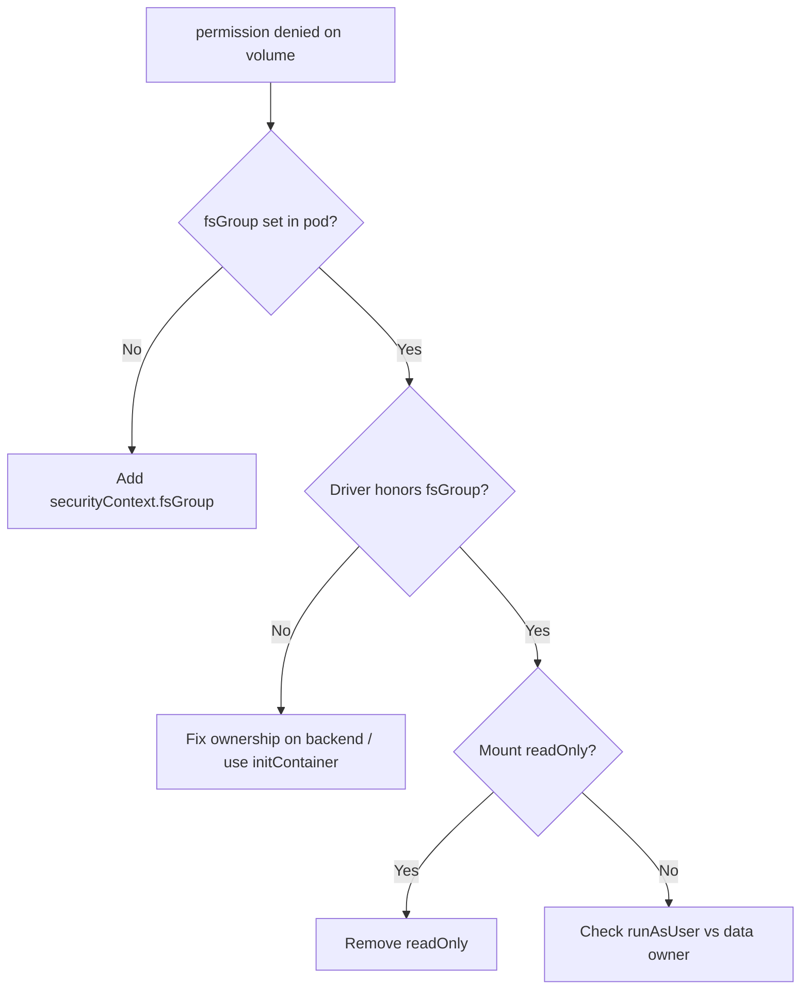

# Volume Mount Permission Denied

> **Severity:** Medium · **Typical recovery time:** 5–20 min · **Affected versions:** 1.20+

## Error Message

```text
Error: open /data/app.db: permission denied
# or from the application:
PermissionError: [Errno 13] Permission denied: '/data/cache'
```

## Description

The volume mounts successfully, but the container process cannot write to it
because the mounted filesystem is owned by a UID/GID the process does not have.
This is an ownership problem, not a mount problem: the pod is `Running`, yet the
app crashes or logs `EACCES`. The usual culprit is a mismatch between the
container's `runAsUser`/`runAsGroup` and the volume's on-disk ownership, which
Kubernetes only adjusts when `securityContext.fsGroup` is set.

When `fsGroup` is set, the kubelet/CSI driver makes the volume group-owned by
that GID and SGID-bits the directory so new files inherit it. Without `fsGroup`
(or with a driver that ignores it, like many NFS setups), a non-root container
hits permission denied on first write.

## Affected Kubernetes Versions

All 1.20+. The `fsGroupChangePolicy` field (`OnRootMismatch` / `Always`) is GA
since 1.23. Some CSI drivers advertise `VOLUME_MOUNT_GROUP` and apply fsGroup
themselves; network filesystems (NFS, CIFS) frequently honor neither and need
backend-side ownership.

## Likely Root Causes

- `fsGroup` not set, so a non-root container cannot write
- Backend filesystem (NFS/SMB) does not honor Kubernetes fsGroup
- Container `runAsUser` does not match pre-existing data ownership
- Read-only root filesystem or `readOnly: true` mount
- `subPath` directory created with root ownership

## Diagnostic Flow



## Verification Steps

Confirm the pod is `Running` and the failure is a write `EACCES` on the mount
path, then inspect the pod's securityContext and the on-disk ownership.

## kubectl Commands

```bash
kubectl get pod <pod> -n <namespace> -o jsonpath='{.spec.securityContext}'
kubectl get pod <pod> -n <namespace> -o jsonpath='{.spec.containers[*].securityContext}'
kubectl describe pod <pod> -n <namespace>
kubectl exec <pod> -n <namespace> -- id
kubectl exec <pod> -n <namespace> -- ls -ld /data
kubectl get pvc <pvc> -n <namespace> -o yaml
```

## Expected Output

```text
$ kubectl exec <pod> -- id
uid=1000(app) gid=1000(app) groups=1000(app)

$ kubectl exec <pod> -- ls -ld /data
drwxr-xr-x 2 root root 4096 Jun 29 12:00 /data
# /data owned by root:root, process is uid 1000 -> denied
```

## Common Fixes

1. Set `spec.securityContext.fsGroup` to the container's GID.
2. For NFS/SMB, pre-create the directory with the correct owner on the backend.
3. Align `runAsUser`/`runAsGroup` with existing data ownership.

## Recovery Procedures

1. Add `securityContext.fsGroup: <gid>` (and `fsGroupChangePolicy:
   OnRootMismatch` to keep restarts fast) to the pod template.
2. Apply the change, which triggers a rollout. **Blast radius: all pods in the
   workload restart; expect a brief data-path interruption.**
3. If the driver ignores fsGroup, run a one-time `initContainer` as root to
   `chown` the mount, or fix ownership directly on the storage backend.
4. Verify the new pod can write before scaling back to full replicas.

## Validation

`kubectl exec <pod> -- touch /data/.wtest` succeeds, the application stops
logging `EACCES`, and `ls -ld` shows the volume group-owned by the fsGroup GID.

## Prevention

- Standardize `runAsNonRoot`, `runAsUser`, and `fsGroup` in your pod templates.
- Add a CI policy check (OPA/Kyverno) requiring fsGroup on volume-mounting pods.
- Document which CSI drivers honor fsGroup for your platform.

## Related Errors

- [fsGroup Permission Change Slow](./fsgroup-change-slow.md)
- [SubPath Does Not Exist](./subpath-not-exist.md)
- [FailedMount Timeout](./failedmount-timeout.md)

## References

- [Configure a Security Context for a Pod](https://kubernetes.io/docs/tasks/configure-pod-container/security-context/)
- [Storage / Volumes](https://kubernetes.io/docs/concepts/storage/volumes/)

## Further Reading

- [Free Kubernetes config validators](https://devopsaitoolkit.com/validators/)
