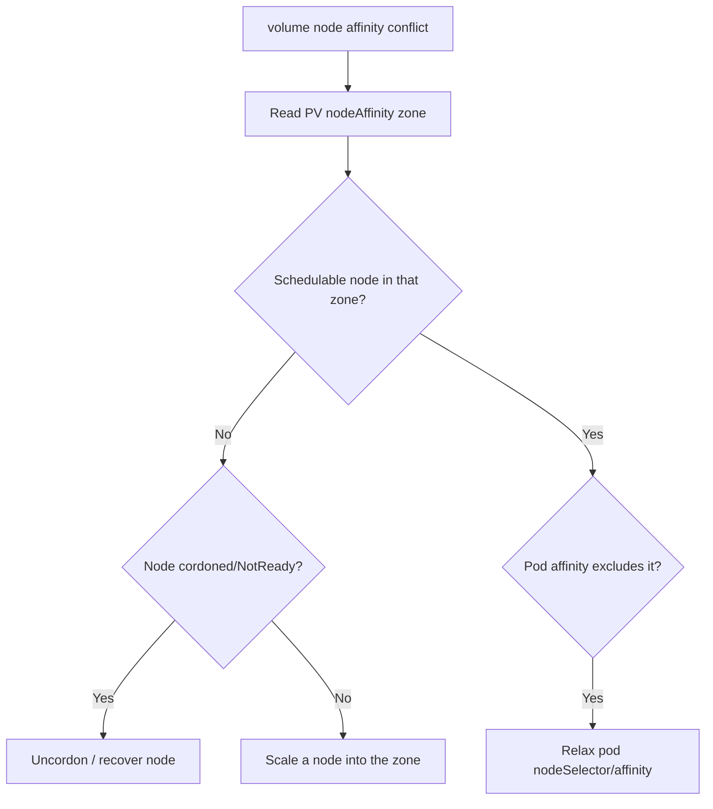

# Volume Node Affinity Conflict

> **Severity:** High · **Typical recovery time:** 10–30 min · **Affected versions:** 1.20+

## Error Message

```text
Warning  FailedScheduling  default-scheduler
0/6 nodes are available: 6 node(s) had volume node affinity conflict.
preemption: 0/6 nodes are available.
```

## Description

This is a *scheduling* failure, not a mount failure. The PersistentVolume has a
`nodeAffinity` constraint — almost always a topology label like
`topology.kubernetes.io/zone` — and no schedulable node satisfies both that
constraint and the pod's other requirements. Zonal block storage (EBS, GCE PD,
Azure Disk) can only be attached to nodes in the same zone, so a pod bound to a
us-east-1a volume cannot run on a us-east-1b node.

During an incident this typically appears after a zone outage, after the only
node in a volume's zone is cordoned/drained, or when a StatefulSet pod is forced
to a different zone than its existing PVC.

## Affected Kubernetes Versions

All 1.20+. PV `nodeAffinity` is set automatically by topology-aware CSI
provisioners. Using `volumeBindingMode: Immediate` (instead of
`WaitForFirstConsumer`) makes this far more likely because the volume's zone is
chosen before the pod is scheduled.

## Likely Root Causes

- Volume is in a zone with no available/schedulable node
- Only node in the volume's zone is cordoned, drained, or `NotReady`
- StorageClass uses `Immediate` binding, fixing zone before scheduling
- Pod nodeSelector/affinity conflicts with the volume's zone
- Cluster-autoscaler not configured to scale the volume's zone

## Diagnostic Flow



## Verification Steps

Read the PV's `nodeAffinity` zone and compare it to the zones of currently
schedulable nodes; the conflict is confirmed when no ready node matches.

## kubectl Commands

```bash
kubectl describe pod <pod> -n <namespace>
kubectl get pvc <pvc> -n <namespace>
kubectl get pv <pv-name> -o yaml | grep -A15 nodeAffinity
kubectl get nodes -L topology.kubernetes.io/zone
kubectl get nodes -o wide
kubectl get storageclass <sc> -o yaml
```

## Expected Output

```text
$ kubectl get pv pvc-aa11 -o yaml | grep -A6 nodeAffinity
  nodeAffinity:
    required:
      nodeSelectorTerms:
      - matchExpressions:
        - key: topology.kubernetes.io/zone
          values: [us-east-1a]

$ kubectl get nodes -L topology.kubernetes.io/zone
NAME      STATUS   ZONE
node-1    Ready    us-east-1b
node-2    Ready    us-east-1c   # no Ready node in 1a
```

## Common Fixes

1. Make a schedulable node available in the volume's zone.
2. Uncordon or recover the drained/NotReady node in that zone.
3. For new workloads, switch the StorageClass to `WaitForFirstConsumer`.

## Recovery Procedures

1. Read the PV's zone and confirm no Ready node matches it.
2. If a node in that zone is cordoned, uncordon it. **Blast radius: low; only
   re-enables scheduling on that node.**
3. If the zone has no node, scale the node group / autoscaler into that zone and
   wait for the node to register. **Blast radius: added node cost.**
4. If the data is reproducible, you may delete the pod and PVC and let a new
   `WaitForFirstConsumer` volume bind in an available zone. **Blast radius:
   destroys the old volume's data — confirm a backup first.**

## Validation

The pod leaves `Pending` and reaches `Running`, scheduled on a node whose zone
matches the PV's `nodeAffinity`.

## Prevention

- Use `volumeBindingMode: WaitForFirstConsumer` so volume and pod co-locate.
- Spread nodes across the zones your volumes live in; size for zone loss.
- Configure the autoscaler with node groups in every storage zone.

## Related Errors

- [RWO Volume Multi-Node Conflict](./rwo-multinode-conflict.md)
- [FailedAttachVolume](./failedattachvolume.md)
- [FailedMount Timeout](./failedmount-timeout.md)

## References

- [Storage Classes / Volume Binding Mode](https://kubernetes.io/docs/concepts/storage/storage-classes/#volume-binding-mode)
- [Allowed Topologies](https://kubernetes.io/docs/concepts/storage/storage-classes/#allowed-topologies)

## Further Reading

- [DevOps AI ToolKit — Kubernetes guides](https://devopsaitoolkit.com/blog/)
