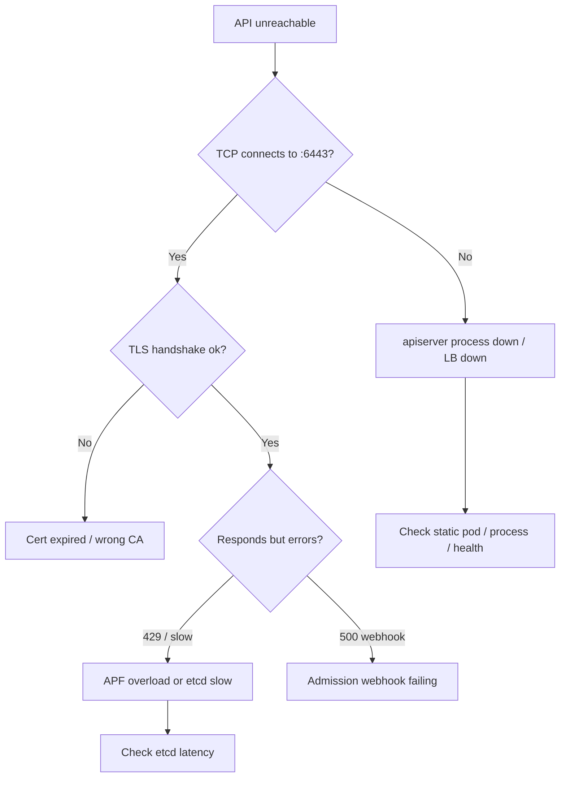

# Playbook: API Server Unavailable

## When to use this playbook

Use this playbook when `kubectl` and controllers cannot reach the Kubernetes API
server — connection refused, TLS handshake failures, timeouts, or 429/503
responses under load. A degraded API server stalls every controller, scheduler,
and CD pipeline, so this is a Critical incident. The goal is to determine whether
the fault is the API server process, its etcd backend, admission webhooks, TLS,
or overload — using read-only checks before any restart.

## Symptoms

- `kubectl` returns `connection refused`, `i/o timeout`, or `TLS handshake timeout`
- `The connection to the server <host>:6443 was refused`
- 429 `Too Many Requests` or `context deadline exceeded` from the API
- Controllers/kubelets log `Failed to list/watch` against the API
- `x509: certificate signed by unknown authority` from clients

## Triage flow



## Step-by-step

All commands are read-only. Some require node/SSH access if the API is fully down.

1. Check basic reachability and health endpoints:

   ```bash
   kubectl get --raw='/livez?verbose'
   kubectl get --raw='/readyz?verbose'
   ```

   Reveals which subsystem (etcd, informers, webhooks) is failing readiness.

2. If `kubectl` itself can't connect, check the process on a control-plane node:

   ```bash
   crictl ps -a | grep kube-apiserver
   crictl logs <apiserver-container-id> 2>&1 | tail -100
   ```

   Reveals crash loops, etcd dial failures, or flag/cert errors at startup.

3. Confirm the static pod manifest and kubelet are healthy:

   ```bash
   ls -l /etc/kubernetes/manifests/kube-apiserver.yaml
   systemctl status kubelet
   ```

   A missing manifest or stopped kubelet means the static pod never starts.

4. Verify serving certificates and CA validity:

   ```bash
   openssl x509 -in /etc/kubernetes/pki/apiserver.crt -noout -enddate -issuer
   ```

   Reveals expired serving certs causing handshake/x509 failures.

5. Check etcd health (the API server's hard dependency):

   ```bash
   ETCDCTL_API=3 etcdctl --endpoints=https://127.0.0.1:2379 \
     --cacert=/etc/kubernetes/pki/etcd/ca.crt \
     --cert=/etc/kubernetes/pki/etcd/server.crt \
     --key=/etc/kubernetes/pki/etcd/server.key endpoint health
   ```

   A slow/unhealthy etcd surfaces as API timeouts and 429s.

6. Identify overload via API Priority and Fairness:

   ```bash
   kubectl get --raw='/metrics' | grep apiserver_flowcontrol_rejected_requests_total
   ```

   Rising rejects indicate APF is shedding load.

7. Look for failing admission webhooks that block all writes:

   ```bash
   kubectl get validatingwebhookconfigurations,mutatingwebhookconfigurations
   ```

## Common root causes & fixes

| Root cause | Fix | Reference |
|---|---|---|
| Process down / refused | Restore static pod / process | [api-server-connection-refused.md](../errors/api-server/api-server-connection-refused.md) |
| TLS handshake timeout | Fix serving cert/LB | [api-server-tls-handshake-timeout.md](../errors/api-server/api-server-tls-handshake-timeout.md) |
| x509 unknown authority | Restore correct CA bundle | [api-server-x509-unknown-authority.md](../errors/api-server/api-server-x509-unknown-authority.md) |
| etcd request timeout | Recover etcd latency | [api-server-etcd-request-timed-out.md](../errors/api-server/api-server-etcd-request-timed-out.md) |
| Deadline exceeded | Reduce load / fix etcd | [api-server-context-deadline-exceeded.md](../errors/api-server/api-server-context-deadline-exceeded.md) |
| 429 overload (APF) | Tune flow schemas / scale | [api-server-too-many-requests-429.md](../errors/api-server/api-server-too-many-requests-429.md) |
| APF rejections | Adjust PriorityLevels | [api-server-apf-request-rejected.md](../errors/api-server/api-server-apf-request-rejected.md) |
| Webhook failing | Fix/loosen webhook | [api-server-failed-calling-webhook.md](../errors/api-server/api-server-failed-calling-webhook.md) |

## Recovery

1. Diagnose before restarting. Use `/livez` and `crictl logs` to identify the
   failing subsystem; a blind restart can mask an etcd or cert problem.
2. **Before touching certs or static-pod manifests on a control-plane node, back
   up `/etc/kubernetes/pki` and `/etc/kubernetes/manifests` and confirm an etcd
   snapshot exists** (`etcdctl snapshot save`). Cert/CA mistakes can lock every
   client out of the cluster.
3. If the static pod is wedged, the kubelet recreates it when the manifest is
   valid. Moving the manifest out and back restarts it. **Blast radius: the API
   is briefly fully unavailable on that node; in HA clusters route clients to
   healthy members first. Safer alternative: drain traffic via the LB to other
   control-plane nodes before restarting one.**
4. If a webhook with `failurePolicy: Fail` is blocking all writes, temporarily
   scoping or disabling it restores writes. **Blast radius: disables that policy
   cluster-wide; re-enable once its backend recovers.**
5. If etcd is the root cause, follow the etcd playbook before declaring the API
   recovered.

## Validation

- `kubectl get --raw='/readyz'` returns `ok`.
- `kubectl get nodes` and `kubectl get componentstatuses` respond normally.
- APF rejection and request-latency metrics return to baseline.
- Controllers and kubelets stop logging list/watch errors.

## Prevention

- Run a 3+ node HA control plane behind a health-checked load balancer.
- Monitor and auto-rotate API/etcd certificates well before expiry.
- Set realistic admission webhook timeouts and avoid `failurePolicy: Fail` for non-critical webhooks.
- Watch etcd latency and API request-duration SLOs.

## Related playbooks & errors

- [Playbook: etcd Unavailable](./etcd-unavailable.md)
- [Playbook: Certificate Expiration](./certificate-expiration.md)
- [api-server-unable-to-authenticate.md](../errors/api-server/api-server-unable-to-authenticate.md)
- [controller-manager-leaderelection-lost.md](../errors/controller-manager/controller-manager-leaderelection-lost.md)

## Further Reading

- [DevOps AI ToolKit — Kubernetes guides](https://devopsaitoolkit.com/blog/)
