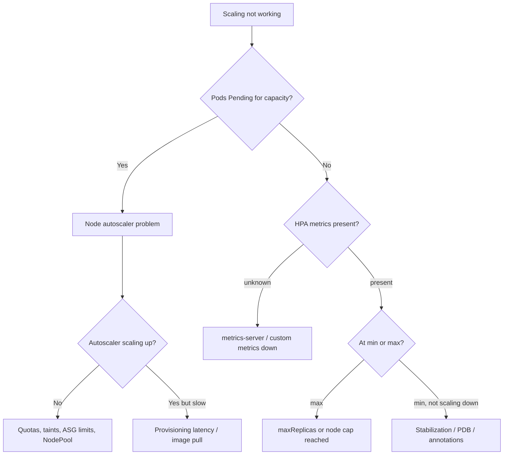

# Playbook: Autoscaler Failures

## When to use this playbook

Use this playbook when workloads are not scaling as expected — pods staying
`Pending` because no nodes are added, replicas not increasing under load, or
scaling that flaps or never scales down. It covers the three scaling layers:
the Horizontal Pod Autoscaler (HPA), the Vertical Pod Autoscaler (VPA), and
node-level autoscalers (Cluster Autoscaler / Karpenter). The goal is to find
which layer is stuck and why, using read-only inspection.

## Symptoms

- HPA shows `<unknown>` targets or `unable to get metrics`
- Replica count pinned at min/max despite obvious load
- Pods stuck `Pending` with "0/N nodes available" and no new nodes appear
- Scaling oscillates up and down (flapping)
- Cluster never scales down idle nodes, inflating cost

## Triage flow



## Step-by-step

All commands are read-only.

1. Inspect the HPA's current vs target metrics and conditions:

   ```bash
   kubectl get hpa -A
   kubectl describe hpa <name> -n <namespace>
   ```

   Reveals `<unknown>` targets, `ScalingLimited` reasons, and min/max bounds.

2. Confirm the metrics pipeline is alive:

   ```bash
   kubectl top pods -n <namespace>
   kubectl get apiservices | grep metrics
   ```

   A failing `v1beta1.metrics.k8s.io` APIService explains unknown metrics.

3. Verify target pods declare resource requests (required for utilization HPAs):

   ```bash
   kubectl get deploy <name> -n <namespace> -o jsonpath='{.spec.template.spec.containers[*].resources}'
   ```

   Missing requests makes utilization math impossible.

4. For capacity issues, check why pods cannot schedule:

   ```bash
   kubectl get pods -A --field-selector=status.phase=Pending
   kubectl describe pod <pending-pod> -n <namespace> | sed -n '/Events/,$p'
   ```

   Reveals "Insufficient cpu/memory" or taint/affinity blocks.

5. Read the node autoscaler's own logs/status:

   ```bash
   kubectl -n kube-system logs deploy/cluster-autoscaler --tail=100
   kubectl get configmap cluster-autoscaler-status -n kube-system -o yaml
   ```

   Reveals "max node group size reached", scale-down blocks, or unschedulable
   reasons the autoscaler computed.

6. For Karpenter, inspect provisioning resources and events:

   ```bash
   kubectl get nodepools,nodeclaims
   kubectl get events -A --field-selector reason=FailedScheduling --sort-by=.lastTimestamp
   ```

   Reveals NodePool limits or instance-type constraints.

7. Check for blockers to scale-down (PDBs, local storage, annotations):

   ```bash
   kubectl get pdb -A
   kubectl get nodes -o jsonpath='{range .items[*]}{.metadata.name}{"\t"}{.metadata.annotations.cluster-autoscaler\.kubernetes\.io/scale-down-disabled}{"\n"}{end}'
   ```

## Common root causes & fixes

| Root cause | Fix | Reference |
|---|---|---|
| HPA can't read metrics | Repair metrics-server | [hpa-unable-to-get-metrics.md](../errors/autoscaling/hpa-unable-to-get-metrics.md) |
| Custom metrics down | Fix adapter/Prometheus | [hpa-custom-metrics-unavailable.md](../errors/autoscaling/hpa-custom-metrics-unavailable.md) |
| No resource requests | Add CPU/memory requests | [hpa-missing-resource-requests.md](../errors/autoscaling/hpa-missing-resource-requests.md) |
| HPA not scaling up | Raise max / fix target | [hpa-not-scaling-up.md](../errors/autoscaling/hpa-not-scaling-up.md) |
| HPA not scaling down | Tune stabilization window | [hpa-not-scaling-down.md](../errors/autoscaling/hpa-not-scaling-down.md) |
| HPA flapping | Stabilization/behavior tuning | [hpa-flapping.md](../errors/autoscaling/hpa-flapping.md) |
| CA not scaling up | Check ASG/taints/limits | [cluster-autoscaler-not-scaling-up.md](../errors/autoscaling/cluster-autoscaler-not-scaling-up.md) |
| Max nodes reached | Raise node group max | [cluster-autoscaler-max-nodes-reached.md](../errors/autoscaling/cluster-autoscaler-max-nodes-reached.md) |
| Scale-down blocked | Adjust PDB/annotations | [cluster-autoscaler-scale-down-blocked.md](../errors/autoscaling/cluster-autoscaler-scale-down-blocked.md) |
| Karpenter idle | Fix NodePool/limits | [karpenter-not-provisioning.md](../errors/autoscaling/karpenter-not-provisioning.md) |
| VPA/HPA fight | Separate metrics | [vpa-hpa-conflict.md](../errors/autoscaling/vpa-hpa-conflict.md) |

## Recovery

1. Restore the metrics pipeline first — most HPA failures are downstream of a
   dead metrics-server or custom-metrics adapter. Recovering it lets HPAs resume
   without any manual replica changes.
2. If load is real and HPA is at `maxReplicas`, raising the max is low-risk.
   **Blast radius: more replicas consume node capacity and may trigger node
   scale-up costs. Safer alternative: confirm node headroom first.**
3. Raising a node group / NodePool maximum unblocks capacity-bound scheduling.
   **Blast radius: directly increases cloud spend; cap with budgets. Safer
   alternative: bin-pack or right-size requests before lifting caps.**
4. Avoid manually deleting "stuck" nodes to force the autoscaler — that can evict
   workloads abruptly. Prefer cordon/drain through normal scale-down paths.

## Validation

- `kubectl get hpa` shows real numeric targets and a stable replica count.
- Previously `Pending` pods schedule onto newly added nodes.
- Autoscaler logs show successful scale-up/down decisions, no recurring errors.
- Scale-down reclaims idle nodes after the stabilization window.

## Prevention

- Always set resource requests on autoscaled workloads.
- Tune `behavior` stabilization windows to stop flapping.
- Alert on HPA `AbleToScale=False` and on autoscaler max-reached conditions.
- Keep metrics-server HA and monitored; it is a scaling dependency.

## Related playbooks & errors

- [Playbook: Worker Node Unavailable](./worker-node-unavailable.md)
- [scheduler-insufficient-resources.md](../errors/scheduler/scheduler-insufficient-resources.md)
- [failedscheduling.md](../errors/scheduler/failedscheduling.md)
- [vpa-recommendations-not-applied.md](../errors/autoscaling/vpa-recommendations-not-applied.md)

## Further Reading

- [DevOps AI ToolKit — Kubernetes guides](https://devopsaitoolkit.com/blog/)
