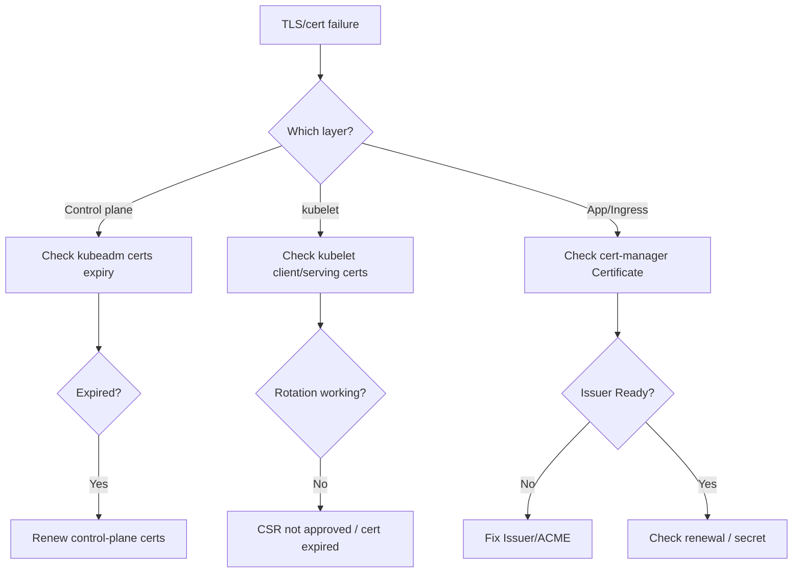

# Playbook: Certificate Expiration

## When to use this playbook

Use this playbook when expired or invalid TLS certificates break communication —
control-plane certs (API server, etcd, kubelet) lapsing, application/Ingress
certificates not renewing, or cert-manager `Certificate` resources stuck
`NotReady`. Expired control-plane certs can lock out the entire cluster, making
this Critical. The goal is to identify which certificate expired, in which trust
chain, and restore validity without breaking the CA that everything depends on.

## Symptoms

- `x509: certificate has expired or is not yet valid` from clients
- `kubectl` fails after a cluster has been idle past the 1-year cert window
- Kubelets log certificate rotation failures; nodes go `NotReady`
- cert-manager `Certificate` shows `Ready: False`; Ingress serves an expired cert
- Browsers warn of an expired or untrusted certificate at the edge

## Triage flow



## Step-by-step

All commands are read-only.

1. For control-plane certs (kubeadm clusters), list expirations:

   ```bash
   kubeadm certs check-expiration
   ```

   Reveals each component cert/key and its residual validity.

2. Inspect individual control-plane certs directly:

   ```bash
   openssl x509 -in /etc/kubernetes/pki/apiserver.crt -noout -enddate -subject -issuer
   openssl x509 -in /etc/kubernetes/pki/etcd/server.crt -noout -enddate
   ```

   Confirms which serving cert lapsed and which CA signed it.

3. Check kubelet certificates and rotation:

   ```bash
   ls -l /var/lib/kubelet/pki/
   openssl x509 -in /var/lib/kubelet/pki/kubelet-client-current.pem -noout -enddate 2>/dev/null
   kubectl get csr
   ```

   Pending CSRs block automatic kubelet cert rotation.

4. For cert-manager-managed certs, inspect the resource chain:

   ```bash
   kubectl get certificate -A
   kubectl describe certificate <name> -n <namespace>
   kubectl get certificaterequest,order,challenge -n <namespace>
   ```

   Reveals renewal failures, issuer problems, or ACME challenge errors.

5. Confirm the issuer is healthy:

   ```bash
   kubectl get clusterissuer,issuer -A
   kubectl describe clusterissuer <name>
   ```

   A `NotReady` issuer halts all renewals it backs.

6. Inspect the actual served certificate at the edge:

   ```bash
   echo | openssl s_client -connect <host>:443 -servername <host> 2>/dev/null | openssl x509 -noout -enddate -issuer
   ```

   Confirms whether the live endpoint serves an expired/wrong cert.

## Common root causes & fixes

| Root cause | Fix | Reference |
|---|---|---|
| cert-manager not renewing | Fix renewal/issuer | [certificate-expired-not-renewed.md](../errors/cert-manager/certificate-expired-not-renewed.md) |
| Certificate stuck NotReady | Resolve request chain | [certificate-not-ready.md](../errors/cert-manager/certificate-not-ready.md) |
| Issuer NotReady | Fix issuer config | [issuer-not-ready.md](../errors/cert-manager/issuer-not-ready.md) |
| ACME rate limited | Back off / staging | [acme-rate-limited.md](../errors/cert-manager/acme-rate-limited.md) |
| DNS-01 challenge fails | Fix DNS provider creds | [challenge-dns01-propagation-failed.md](../errors/cert-manager/challenge-dns01-propagation-failed.md) |
| Incomplete chain | Add intermediates | [incomplete-certificate-chain.md](../errors/cert-manager/incomplete-certificate-chain.md) |
| kubelet cert expired | Approve CSR / rotate | [kubelet-client-certificate-expired.md](../errors/kubelet/kubelet-client-certificate-expired.md) |
| kubelet rotation failed | Fix CSR approval | [kubelet-client-certificate-rotation-failed.md](../errors/nodes/kubelet-client-certificate-rotation-failed.md) |
| API x509 unknown CA | Restore CA bundle | [api-server-x509-unknown-authority.md](../errors/api-server/api-server-x509-unknown-authority.md) |
| Ingress fake/expired TLS | Wire valid TLS secret | [ingress-tls-fake-certificate.md](../errors/ingress/ingress-tls-fake-certificate.md) |

## Recovery

1. Identify exactly which cert expired and which CA signed it before renewing.
   Renewing the wrong layer (e.g., the CA) can invalidate everything downstream.
2. **For control-plane certs, back up `/etc/kubernetes/pki` first.** Then renew
   with `kubeadm certs renew all` (run on each control-plane node) and restart
   the static pods. **Blast radius: restarting kube-apiserver/etcd briefly
   interrupts the control plane on that node; in HA clusters renew one node at a
   time. Safer alternative: renew on a standby/least-loaded control-plane node
   first and verify before proceeding.**
3. Do NOT rotate the cluster CA unless it has truly expired — CA rotation
   re-issues every leaf cert and every kubeconfig, and **bricks all clients until
   trust is redistributed.** Treat it as a planned, documented operation.
4. For cert-manager, fixing the Issuer and letting the controller re-issue is the
   safe path; force a renewal only after the issuer is `Ready`.

## Validation

- `kubeadm certs check-expiration` shows healthy residual validity.
- `kubectl get nodes` returns and nodes are `Ready` (kubelet certs valid).
- cert-manager `Certificate` shows `Ready: True` with a future `Not After`.
- `openssl s_client` at the edge shows the renewed cert and full chain.

## Prevention

- Alert at 30/14/7 days before any cert expiry (control-plane and app certs).
- Keep clusters upgraded yearly — kubeadm renews control-plane certs on upgrade.
- Use cert-manager with monitored issuers and ACME staging for testing.
- Enable kubelet serving/client cert auto-rotation and auto-approve CSRs safely.

## Related playbooks & errors

- [Playbook: API Server Unavailable](./api-server-unavailable.md)
- [Playbook: Ingress Failures](./ingress-failures.md)
- [api-server-tls-handshake-timeout.md](../errors/api-server/api-server-tls-handshake-timeout.md)
- [etcd-tls-auth-failure.md](../errors/etcd/etcd-tls-auth-failure.md)

## Further Reading

- [DevOps AI ToolKit — Kubernetes guides](https://devopsaitoolkit.com/blog/)
