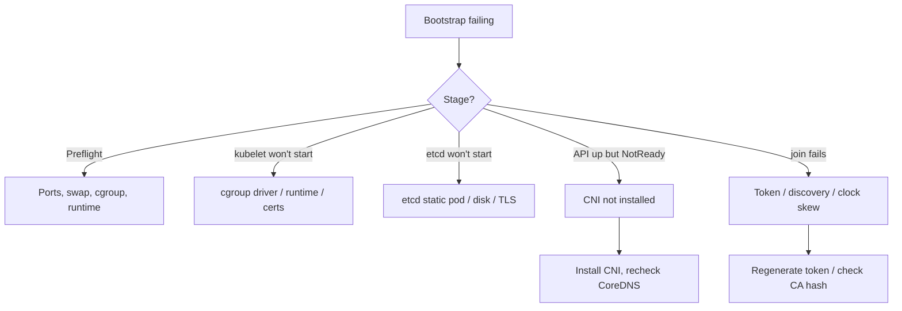

# Playbook: Cluster Bootstrap Failures

## When to use this playbook

Use this playbook when a brand-new cluster fails to come up, or a new node fails
to join: `kubeadm init`/`join` aborting at preflight or the kubelet/etcd phase,
the first control plane never reaching `Ready`, CoreDNS stuck `Pending` because
the CNI isn't installed, or join tokens/certs being rejected. Nothing works until
bootstrap completes, so this is Critical. The goal is to identify which bootstrap
phase failed using read-only checks on a not-yet-functional cluster.

## Symptoms

- `kubeadm init` hangs at "waiting for the kubelet to boot up the control plane"
- The first node stays `NotReady`; CoreDNS pods stay `Pending`
- `kubeadm join` fails with token expired, TLS bootstrap, or discovery errors
- etcd static pod crash-loops on first boot
- New nodes never register; CSRs never appear or are never approved

## Triage flow



## Step-by-step

All commands are read-only; most run on the bootstrapping node.

1. Re-run kubeadm preflight checks (dry-run does not modify state):

   ```bash
   kubeadm init phase preflight --dry-run 2>&1 | tail -40
   ```

   Reveals port conflicts, swap on, missing modules, or runtime issues.

2. Inspect the kubelet — the engine that launches the static pods:

   ```bash
   systemctl status kubelet
   journalctl -u kubelet --no-pager | tail -100
   ```

   Reveals cgroup-driver mismatch, missing CA, or runtime-not-ready.

3. Confirm the container runtime is up and using the expected cgroup driver:

   ```bash
   systemctl status containerd
   crictl info | grep -i cgroup
   ```

   A driver mismatch between kubelet and containerd blocks pod startup.

4. Check whether the control-plane static pods came up:

   ```bash
   crictl ps -a | grep -E 'kube-apiserver|etcd'
   crictl logs <etcd-container> 2>&1 | tail -60
   ```

   Reveals etcd disk/TLS failures or apiserver dial errors.

5. Once the API answers, check node readiness and CNI:

   ```bash
   kubectl --kubeconfig=/etc/kubernetes/admin.conf get nodes
   kubectl --kubeconfig=/etc/kubernetes/admin.conf get pods -n kube-system
   ls /etc/cni/net.d/
   ```

   A `NotReady` node with `Pending` CoreDNS and empty `/etc/cni/net.d` means no
   CNI is installed yet.

6. For join failures, verify token and CA hash validity:

   ```bash
   kubeadm token list
   kubectl get csr
   timedatectl status
   ```

   Reveals expired tokens, pending CSRs, or clock skew breaking TLS bootstrap.

## Common root causes & fixes

| Root cause | Fix | Reference |
|---|---|---|
| kubelet won't start | Fix cgroup/config | [kubelet-failed-to-start.md](../errors/kubelet/kubelet-failed-to-start.md) |
| cgroup driver mismatch | Align kubelet/runtime | [kubelet-cgroup-driver-mismatch.md](../errors/kubelet/kubelet-cgroup-driver-mismatch.md) |
| Runtime not running | Start/fix containerd | [containerd-connection-refused.md](../errors/container-runtime/containerd-connection-refused.md) |
| etcd won't bootstrap | Fix disk/TLS/data dir | [etcd-cluster-unavailable.md](../errors/etcd/etcd-cluster-unavailable.md) |
| No CNI → NotReady | Install CNI plugin | [cni-config-uninitialized.md](../errors/networking/cni-config-uninitialized.md) |
| Node NetworkUnavailable | Fix CNI/network | [node-networkunavailable.md](../errors/nodes/node-networkunavailable.md) |
| CoreDNS crash/pending | Fix after CNI up | [coredns-crashloopbackoff.md](../errors/networking/coredns-crashloopbackoff.md) |
| kubelet can't reach API | Fix endpoint/firewall | [kubelet-cannot-connect-apiserver.md](../errors/kubelet/kubelet-cannot-connect-apiserver.md) |
| Join CSR not approved | Approve node CSR | [node-registration-csr-pending.md](../errors/nodes/node-registration-csr-pending.md) |
| API refuses connections | Fix apiserver startup | [api-server-connection-refused.md](../errors/api-server/api-server-connection-refused.md) |

## Recovery

1. Fix in phase order: runtime → kubelet → etcd → apiserver → CNI → CoreDNS.
   Each later phase depends on the earlier one, so don't skip ahead.
2. Most early-bootstrap fixes (cgroup driver, swap, ports) are config-only and
   safe to reapply. After fixing, re-run the failed phase rather than wiping.
3. If `kubeadm init` partially completed and is unrecoverable, resetting the node
   gives a clean slate: `kubeadm reset`. **Blast radius: this deletes
   `/etc/kubernetes`, the etcd data dir, and CNI config on that node — on a
   first control-plane node it destroys all cluster state. Only reset during
   greenfield bootstrap, never on a node holding real data. Safer alternative:
   fix the specific failing phase and re-run it.**
4. For join issues, generate a fresh token and confirm the CA cert hash rather
   than disabling TLS verification.

## Validation

- `kubectl get nodes` shows the node(s) `Ready`.
- kube-system pods (apiserver, etcd, controller-manager, scheduler, CoreDNS, CNI)
  are `Running`.
- A test pod schedules and resolves DNS (`kubectl run` + `nslookup`).
- `kubeadm join` on a worker succeeds and the node registers.

## Prevention

- Pre-stake nodes with matching cgroup drivers, disabled swap, and open ports.
- Install the CNI immediately after `kubeadm init` (CoreDNS waits on it).
- Use automation (kubeadm config files, IaC) for reproducible bootstraps.
- Keep node clocks NTP-synced so TLS bootstrap and tokens validate.

## Related playbooks & errors

- [Playbook: Worker Node Unavailable](./worker-node-unavailable.md)
- [Playbook: etcd Unavailable](./etcd-unavailable.md)
- [Playbook: API Server Unavailable](./api-server-unavailable.md)
- [node-container-runtime-network-not-ready.md](../errors/nodes/node-container-runtime-network-not-ready.md)

## Further Reading

- [DevOps AI ToolKit — Kubernetes guides](https://devopsaitoolkit.com/blog/)
