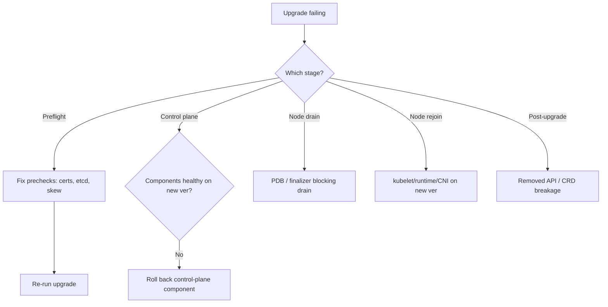

# Playbook: Cluster Upgrade Failures

## When to use this playbook

Use this playbook when a Kubernetes version upgrade stalls or breaks the cluster:
a control-plane upgrade aborts mid-way, components crash-loop on the new version,
nodes fail to drain or rejoin after upgrade, or deprecated APIs/CRDs break
workloads post-upgrade. Upgrades touch etcd, the API server, and every node, so a
failed one is Critical. The goal is to identify which upgrade stage failed and
restore a consistent, working version skew — backup-first throughout.

## Symptoms

- `kubeadm upgrade apply` aborts with a precheck or component error
- API server / controller-manager / scheduler crash-loop after the version bump
- Nodes won't drain (PDBs/finalizers) or won't rejoin on the new kubelet
- Workloads break on removed APIs (e.g., a `no matches for kind` after upgrade)
- Version skew violation between control plane and kubelets

## Triage flow



## Step-by-step

All commands are read-only.

1. Check current versions and skew:

   ```bash
   kubectl version --short
   kubectl get nodes -o wide
   ```

   Reveals control-plane vs kubelet skew and which nodes lag.

2. Inspect the upgrade plan and prechecks (kubeadm):

   ```bash
   kubeadm upgrade plan
   kubeadm certs check-expiration
   ```

   Reveals available targets and precheck blockers like expired certs.

3. Verify control-plane component health on the new version:

   ```bash
   kubectl get pods -n kube-system -o wide
   crictl logs <kube-apiserver-container> 2>&1 | tail -80
   ```

   Reveals flag/feature-gate removals or etcd incompatibility.

4. Confirm etcd is healthy before/after control-plane upgrade:

   ```bash
   ETCDCTL_API=3 etcdctl --endpoints=https://127.0.0.1:2379 \
     --cacert=/etc/kubernetes/pki/etcd/ca.crt \
     --cert=/etc/kubernetes/pki/etcd/server.crt \
     --key=/etc/kubernetes/pki/etcd/server.key endpoint health
   ```

   A degraded etcd will fail the upgrade and the API.

5. Diagnose node drain failures:

   ```bash
   kubectl get pdb -A
   kubectl describe node <node> | sed -n '/Non-terminated Pods/,$p'
   ```

   Reveals PDBs or stuck pods blocking the drain.

6. Find workloads on removed APIs before/after upgrade:

   ```bash
   kubectl get --raw='/metrics' | grep apiserver_requested_deprecated_apis
   kubectl api-resources | grep -i <kind>
   ```

   Reveals usage of deprecated/removed APIs.

## Common root causes & fixes

| Root cause | Fix | Reference |
|---|---|---|
| Expired certs block upgrade | Renew certs first | [certificate-expired-not-renewed.md](../errors/cert-manager/certificate-expired-not-renewed.md) |
| etcd unhealthy mid-upgrade | Recover etcd | [etcd-cluster-unavailable.md](../errors/etcd/etcd-cluster-unavailable.md) |
| API server fails on new ver | Fix flags / roll back | [api-server-connection-refused.md](../errors/api-server/api-server-connection-refused.md) |
| Controller-manager crash | Fix feature gates | [controller-manager-crashloopbackoff.md](../errors/controller-manager/controller-manager-crashloopbackoff.md) |
| Scheduler not running | Fix scheduler config | [scheduler-not-running.md](../errors/scheduler/scheduler-not-running.md) |
| kubelet won't start on node | Fix cgroup/runtime | [kubelet-failed-to-start.md](../errors/kubelet/kubelet-failed-to-start.md) |
| Node NotReady after upgrade | Fix CNI/runtime | [nodenotready.md](../errors/nodes/nodenotready.md) |
| Removed CRD/API breaks chart | Migrate manifests | [helm-crd-no-matches-for-kind.md](../errors/helm/helm-crd-no-matches-for-kind.md) |
| Helm upgrade fails post-bump | Reconcile values | [helm-upgrade-failed.md](../errors/helm/helm-upgrade-failed.md) |

## Recovery

1. **Snapshot etcd and back up `/etc/kubernetes/pki` and manifests before any
   upgrade step.** These are your only true rollback for the control plane.
2. If a control-plane component fails on the new version, kubeadm keeps the prior
   static-pod manifests; reverting to them restores the old version. **Blast
   radius: pinning one control-plane node back creates version skew — keep the
   whole control plane on one version; don't leave a partial upgrade. Safer
   alternative: fix forward if etcd already migrated, since etcd schema changes
   are not always reversible.**
3. For node upgrades, upgrade one node at a time: drain, upgrade kubelet, rejoin,
   verify `Ready`, then proceed. **Blast radius: draining without capacity causes
   downtime — confirm replacements schedule first.**
4. For removed-API breakage, migrate manifests to the supported apiVersion rather
   than downgrading the whole cluster.

## Validation

- `kubectl get nodes` shows all nodes `Ready` at the target version, no skew.
- Control-plane pods are `Running` and `/readyz` returns `ok`.
- etcd reports healthy with a leader.
- Critical workloads pass healthchecks; no deprecated-API alerts fire.

## Prevention

- Upgrade one minor version at a time and read the release notes for removals.
- Run upgrades in staging first; snapshot etcd before each prod step.
- Audit deprecated API usage ahead of time (e.g., with pluto/kubent).
- Maintain HA control plane so single-node upgrades are non-disruptive.

## Related playbooks & errors

- [Playbook: etcd Unavailable](./etcd-unavailable.md)
- [Playbook: API Server Unavailable](./api-server-unavailable.md)
- [Playbook: Worker Node Unavailable](./worker-node-unavailable.md)
- [Playbook: Helm Release Failures](./helm-release-failures.md)

## Further Reading

- [DevOps AI ToolKit — Kubernetes guides](https://devopsaitoolkit.com/blog/)
