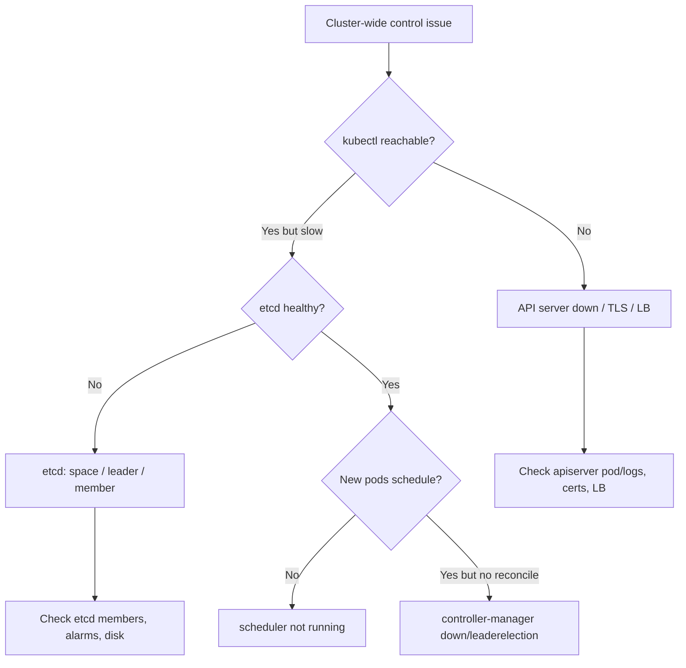

# Playbook: Control Plane Failures

## When to use this playbook

Use this when the cluster's brain is impaired: the API server is slow,
rejecting, or unreachable; etcd is unhealthy or out of space; the scheduler or
controller-manager has stopped reconciling. Symptoms are cluster-wide — kubectl
hangs, new pods never schedule, controllers stop acting — even though running
pods may keep serving. This is a Critical, all-hands incident. Triage is
read-only; recovery steps are explicitly gated by blast radius.

## Symptoms

- `kubectl` commands hang, time out, or return `Unable to connect to the server`.
- API latency/error spikes; `etcdserver: request timed out` / `leader changed`.
- New pods stay `Pending` forever (scheduler) or rollouts never progress (controller-manager).
- etcd alarm `NOSPACE` / `mvcc: database space exceeded`.
- API server `429 Too Many Requests` (APF) or TLS handshake timeouts.

## Triage flow



## Step-by-step

1. **Confirm reachability and component health.**

   ```bash
   kubectl get --raw='/readyz?verbose'
   kubectl get pods -n kube-system -o wide | grep -E "apiserver|etcd|scheduler|controller-manager"
   ```

   `/readyz?verbose` lists each subsystem's check, isolating which control-plane
   piece is failing.

2. **Check the static-pod control plane** (kubeadm-style) and its logs:

   ```bash
   kubectl logs -n kube-system kube-apiserver-<node> --tail=80
   kubectl logs -n kube-system kube-scheduler-<node> --tail=50
   kubectl logs -n kube-system kube-controller-manager-<node> --tail=50
   ```

   Look for etcd timeouts, cert errors, leader-election loss, or panics.

3. **Assess etcd health and space** (read-only metrics via API server):

   ```bash
   kubectl get --raw='/metrics' | grep -E "etcd_server_has_leader|apiserver_storage_size"
   kubectl get events -A --sort-by=.lastTimestamp | grep -i etcd
   ```

4. **Check API Priority & Fairness pressure** if you see 429s:

   ```bash
   kubectl get --raw='/metrics' | grep apiserver_flowcontrol_rejected_requests_total
   ```

5. **Verify scheduler/controller leadership** (only the leader acts):

   ```bash
   kubectl get lease -n kube-system kube-scheduler kube-controller-manager
   ```

## Common root causes & fixes

| Root cause | Fix | Error page |
| --- | --- | --- |
| API server unreachable | Restart/repair apiserver, fix LB | [api-server-connection-refused](../errors/api-server/api-server-connection-refused.md) |
| API server cert untrusted | Fix CA/cert chain | [api-server-x509-unknown-authority](../errors/api-server/api-server-x509-unknown-authority.md) |
| etcd over storage quota | Defrag + raise quota + disarm alarm | [etcd-mvcc-database-space-exceeded](../errors/etcd/etcd-mvcc-database-space-exceeded.md) |
| etcd has no leader | Restore quorum | [etcd-no-leader](../errors/etcd/etcd-no-leader.md) |
| etcd member unhealthy | Replace/rejoin member | [etcd-member-unhealthy](../errors/etcd/etcd-member-unhealthy.md) |
| etcd request timeouts | Fix slow disk / defrag | [api-server-etcd-request-timed-out](../errors/api-server/api-server-etcd-request-timed-out.md) |
| Scheduler not running | Restore scheduler pod | [scheduler-not-running](../errors/scheduler/scheduler-not-running.md) |
| Controller-manager lost lease | Restore leader/quorum | [controller-manager-leaderelection-lost](../errors/controller-manager/controller-manager-leaderelection-lost.md) |
| API server overloaded (429) | Tune APF / shed load | [api-server-apf-request-rejected](../errors/api-server/api-server-apf-request-rejected.md) |

## Recovery

1. **Stabilize etcd first** — nothing else recovers without it. If `NOSPACE`,
   compact and defragment, then disarm the alarm. **Blast radius: defrag briefly
   blocks that member's writes**; do members one at a time on an HA cluster.
   Safer alternative: defrag the non-leader members first.
2. **Restart a failed static-pod component** by moving/restoring its manifest in
   `/etc/kubernetes/manifests` (kubelet recreates it). **Blast radius: that one
   API server/scheduler instance**; on HA the others carry load.
3. **Never delete etcd data or `--force-new-cluster` casually** — that is
   **destructive to cluster state**. Safer alternative: restore from an etcd
   snapshot to a new member and rejoin quorum.
4. **For overload (429)**, shed load: pause noisy controllers/operators and fix
   hot loops before raising APF limits. Restarting the API server alone won't fix
   a client storming it.
5. Bring scheduler/controller-manager back last, once etcd and API are healthy.

## Validation

- `kubectl get --raw='/readyz?verbose'` returns all checks `ok`.
- `kubectl get componentstatuses` (where available) shows `Healthy`.
- New test pod schedules and runs; a Deployment scale reconciles promptly.
- etcd alarms cleared; API latency/error metrics back to baseline.

## Prevention

- Run etcd and the control plane HA (3+ members) on fast, dedicated disks.
- Take and test regular etcd snapshots; monitor DB size and defrag proactively.
- Set and tune API Priority & Fairness; rate-limit aggressive operators.
- Monitor cert expiry for API server / etcd / kubelet.
- Keep control-plane nodes isolated from heavy workloads.

## Related playbooks & errors

- [Playbook: Node Failures](./node-failures.md)
- [Playbook: TLS & Certificate Problems](./tls-certificate-problems.md)
- [Playbook: RBAC Problems](./rbac-problems.md)
- [etcd-cluster-unavailable](../errors/etcd/etcd-cluster-unavailable.md), [api-server-too-many-requests-429](../errors/api-server/api-server-too-many-requests-429.md)

## Further Reading

- [DevOps AI ToolKit — Kubernetes guides](https://devopsaitoolkit.com/blog/)
